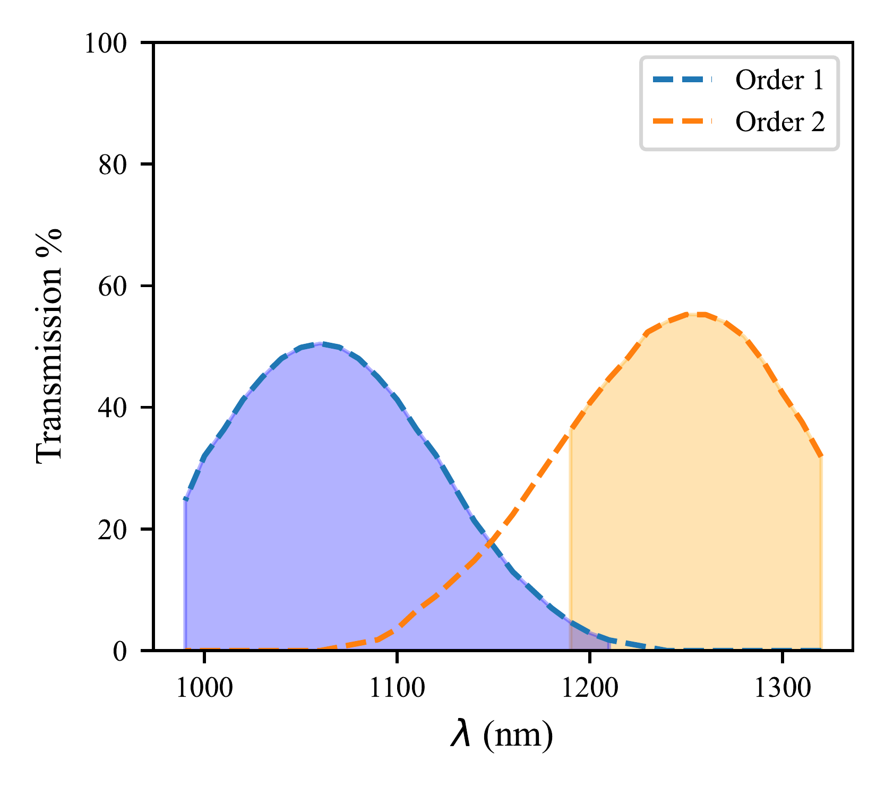
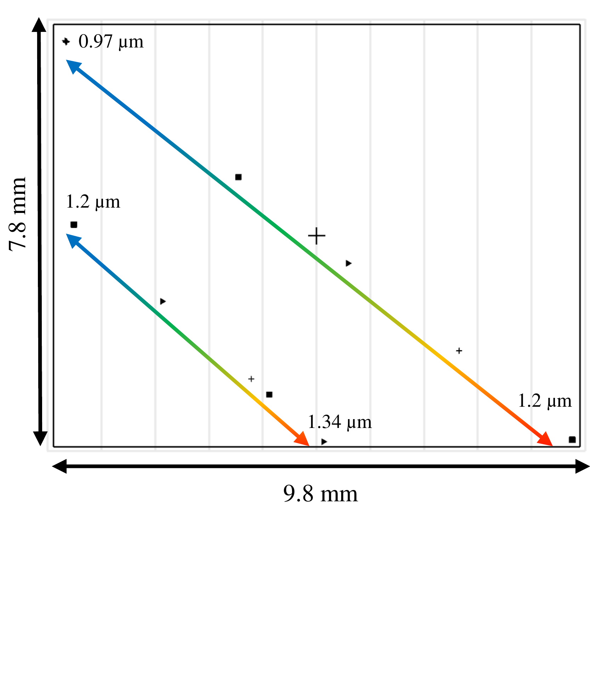

$\newcommand{\ensuremath}{}$
$\newcommand{\xspace}{}$
$\newcommand{\object}[1]{\texttt{#1}}$
$\newcommand{\farcs}{{.}''}$
$\newcommand{\farcm}{{.}'}$
$\newcommand{\arcsec}{''}$
$\newcommand{\arcmin}{'}$
$\newcommand{\ion}[2]{#1#2}$
$\newcommand{\textsc}[1]{\textrm{#1}}$
$\newcommand{\hl}[1]{\textrm{#1}}$
$\newcommand{\footnote}[1]{}$
$\newcommand{\thebibliography}{\DeclareRobustCommand{\VAN}[3]{##3}\VANthebibliography}$

# Little iLocater: paving the way for iLocater

<mark>Appeared on: 2024-12-11</mark> -  _13 pages, 17 figures, accepted for publication in MNRAS_

R. J. Harris, et al. -- incl., <mark>S. Barboza</mark>

**Abstract:** Diffraction-limited radial velocity instruments offer a pathway towards improved precision and stability, and the exploration of new parameter spaces at high spatial and spectral resolution. However, achieving the necessary performance requires careful instrument design and considerable on-sky testing. We describe the design and construction of "Little iLocater" (Lili), a compact spectrograph that has been used to validate the performance of the front-end fibre-injection system of the iLocater spectrograph. We present the design, assembly, and performance using on-sky data obtained at the Large Binocular Telescope (LBT), including extraction of spectra from standard stars, testing of the atmospheric dispersion corrector to elevations of $\qty{40}{◦ee}$ , and spatially resolved spectra from close companion systems. These results show the front-end fibre-injection system is performing as expected and is indicative of iLocater's capabilities once installed at the LBT.

**Figure 1. -** Shaded rendering of the optical design of the \ac{Lili} spectrograph, with the light path coloured by wavelength. From left to right, the light from the \ac{SMF}  is collimated by an \ac{OAP}, which feeds a \ac{VPH} grating. Light is then refocused onto the detector by a TTL200-S8 and AC-508-080-C lens. (*fig:Lili_optical_design*)

**Figure 5. -** Estimated spectrograph throughput based on commercially available values for lenses and theoretical values for the \ac{MCIFU} gratings. Individual efficiencies of the two spectrograph orders are plotted as dotted lines. The filled area underneath indicates the parts of the spectrum from each order incident on the \ac{CRED2} detector. (*fig:Lili_transmission*)

**Figure 3. -** Footprint of the two orders imaged onto the detector. The first order (\qtyrange{0.97}{1.2}{\micro\meter}) crosses the full detector area diagonally, while the second sits below (\qtyrange{1.2}{1.34}{\micro\meter}). Note that there is a difference in slope between the first and second orders due to the rotation of the diffraction gratings. (*fig:Lili_footprint*)

