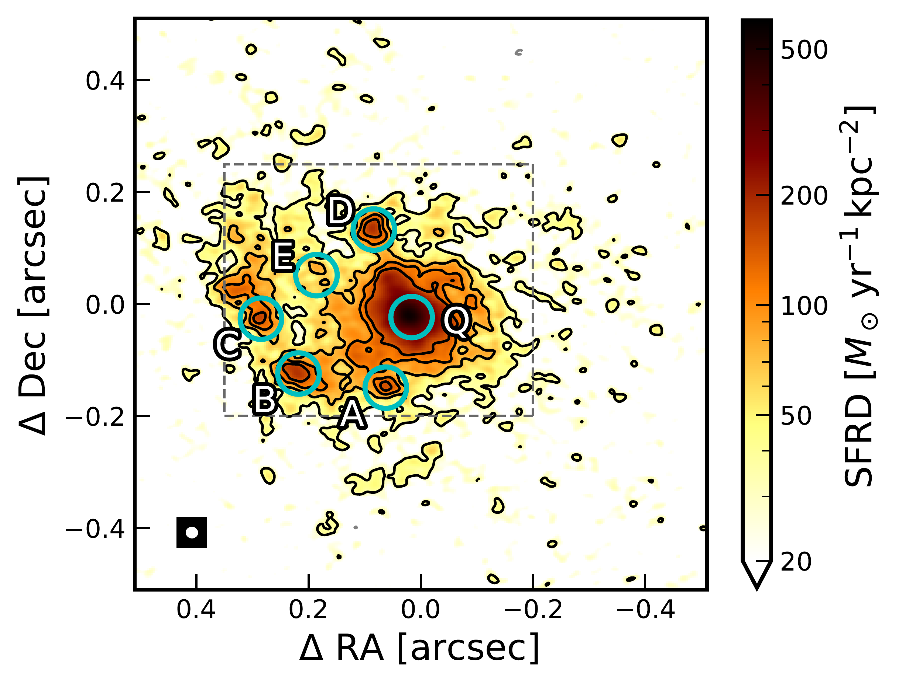
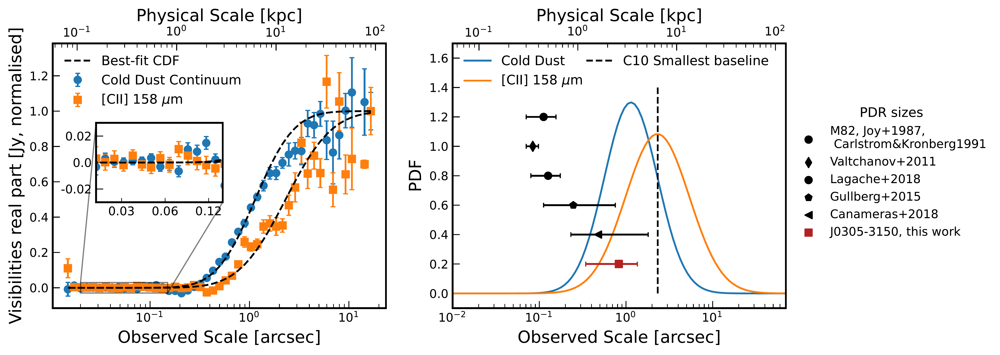

$\newcommand{\ensuremath}{}$
$\newcommand{\xspace}{}$
$\newcommand{\object}[1]{\texttt{#1}}$
$\newcommand{\farcs}{{.}''}$
$\newcommand{\farcm}{{.}'}$
$\newcommand{\arcsec}{''}$
$\newcommand{\arcmin}{'}$
$\newcommand{\ion}[2]{#1#2}$
$\newcommand{\textsc}[1]{\textrm{#1}}$
$\newcommand{\hl}[1]{\textrm{#1}}$
$\newcommand{\footnote}[1]{}$
$\newcommand{\vdag}{(v)^\dagger}$
$\newcommand$
$\newcommand$
$\newcommand$
$\newcommand$
$\newcommand$
$\newcommand\cii{[C\thinspace{\scriptsize II}]}$

# Pushing ALMA to the limit: 140 pc resolution observations of a z=6.6 quasar-galaxy merger resolve strikingly different morphologies of dust continuum and [$\ion{C}{2}$] 158$\mu\rm{m}$ emission

<mark>Appeared on: 2024-12-11</mark> -  _Accepted in ApJ. 15 pages + appendices_

R. A. Meyer, et al. -- incl., <mark>F. Walter</mark>

**Abstract:** We present $0\farcs026$ $(140 \rm{pc})$ resolution ALMA observations of [ $\ion{C}{2}$ ] $158 \mu\rm{m}$ and dust continuum emission of the $z=6.6$ quasar J0305--3150, resolved over $\sim 300-400$ independent resolution elements. The dust continuum emission is compact with $\sim 80\%$ recovered within $r<0\farcs3$ $(1.6 \rm{kpc})$ , whereas the [ $\ion{C}{2}$ ] emission profile is composed of a central Gaussian ( $r<0\farcs4$ , i.e. $<2.2 \rm{kpc}$ ) and an extended component (detected up to $\sim 10 \rm{kpc}$ at $>3\sigma$ ). We infer a direct contribution of the quasar to the observed 260 $\rm{GHz}$ continuum $S_{\nu,\rm{QSO}} / S_{\nu,\rm{QSO+Host}} \lesssim 1\%$ . We report the detection of FIR-detected star-forming clumps with $r<200  \rm{pc}$ and properties similar to that of rest-frame UV-optical clumps reported in the literature.The $200 \rm{pc}$ resolved [ $\ion{C}{2}$ ] /FIR ratio follows the global relation with the FIR surface brightness established in low- and high-redshift galaxies, even at the quasar location.We find that dust continuum is emitted in regions of $\sim0\farcs02-0\farcs04$ consistent with the size of photo-dissociation regions (PDR), whereas $50\%$ of the [ $\ion{C}{2}$ ] originates from larger physical scales ( $\theta \gtrsim 2"$ ). The large-scale [ $\ion{C}{2}$ ] emission presents a velocity gradient aligned with a nearby companion with perturbed kinematics, and misaligned with the kinematics of the small-scale emission. The absence of significant [ $\ion{C}{2}$ ] emission by structures with physical scale $\lesssim 1 \rm{kpc}$ implies that [ $\ion{C}{2}$ ] emission is not produced in dense PDR located at the boundary of Giant Molecular Clouds. We argue instead that [ $\ion{C}{2}$ ] is produced in low-density PDRs in the interstellar medium and diffuse $\ion{H}{1}$ gas tidally-stripped during the ongoing merger.

**Figure 9. -** Top: FIR continuum at $\sim 260 \rm{GHz}$ and velocity-integrated [$\ion${C}{2}] emission of the high--redshift quasar J0305--3150, based on all available ALMA observations, including earlier ‘lower'--resolution data published by Venemans2016, Venemans2019. The contours start at $\pm2\sigma$ and increase in powers of two. Positive contours are shown in full dark lines, and negative ones in dashed grey. The synthesized beam is plotted in the bottom left corner of each plot. The GAIA-corrected optical position of the quasar is shown with a star \citep[][]{Venemans2019}. Bottom: Mean velocity and velocity dispersion map of the [$\ion${C}{2}] emission, computed using a Gaussian fit in pixels where [$\ion${C}{2}] is detected at $>2\sigma$. The mask for the moment 1 and 2 maps is given by the moment 0 $2\sigma$ contours, with five rounds of binary erosion and binary dilation to remove small structures due to noise (see text for more details). (*fig:fig1*)

**Figure 3. -** Star-formation rate density ($\Sigma_{\rm{SFR}}$) map of J0305--3150 assuming a proportional relation between the dust emission and the $\Sigma_{\rm{SFR}}$. The contours start at $\pm2\sigma$ and increase in steps of $2\sigma$(up to $8\sigma$ only). The synthesized beam is plotted in the bottom left corner. The gray box shows the area tessellated with independent $r=0$\farcs$037 (200 \rm{pc}$  apertures used to study the resolved FIR properties (see further text and Fig. \ref{fig:resolved_CII_deficit}. The cyan circles show $r=0$\farcs$037$ apertures corresponding to regions of interest (see further text and Table \ref{tab:clumps_properties}).  (*fig:sfrd_map*)

**Figure 10. -** **Left panel:** Real part of the visibilities for the continuum and [$\ion${C}{2}] emission, averaged as a function of baseline length converted to physical scales. The errorbars represent the standard deviation in each bin, and the visibilities are normalised to the first datapoint (_uv_ distances $(15\pm1)\rm{m}$). The best-fit cumulative distribution functions are shown in dashed black. **Right panel:** Best-fit probability density function for the continuum and [$\ion${C}{2}] emission as a function of the logarithm of the physical scale observed. The maximum recoverable scale of the ALMA C10 observations is shown in dashed black. We also indicate the  photo-dissociation regions (PDR) sizes where [$\ion${C}{2}] is thought to originate found in simulations and observations at $0\lesssim z\lesssim 5$(black markers and errors), and provide a similar estimate for J0305--3150 in dark red.  \nocite{Carlstrom1991} (*fig:visiblities_scales*)

