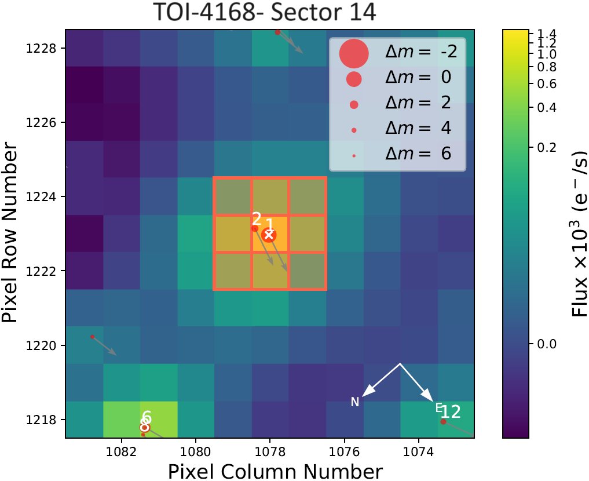
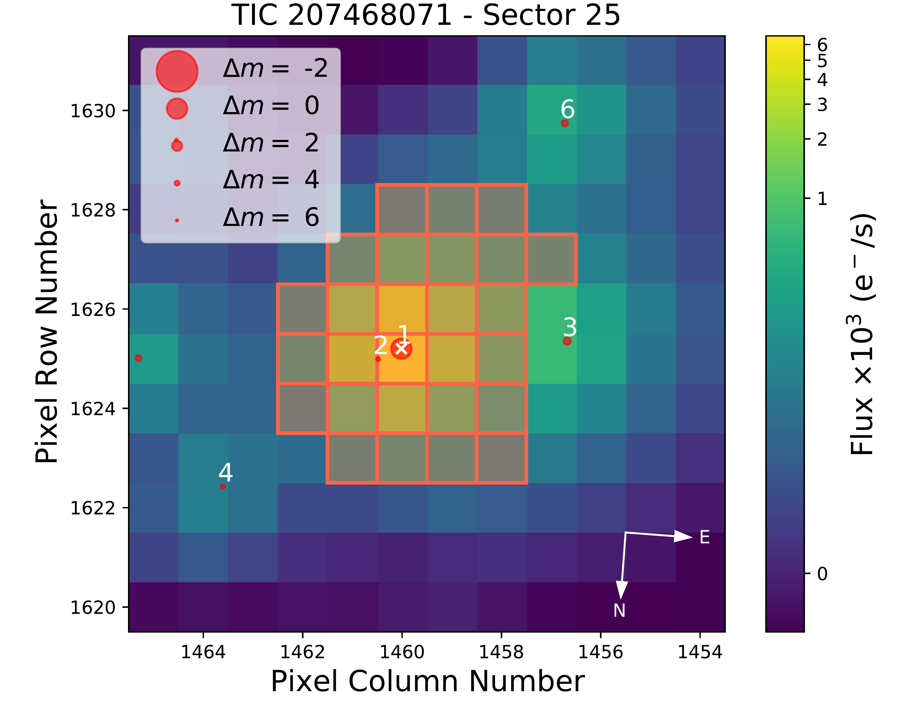
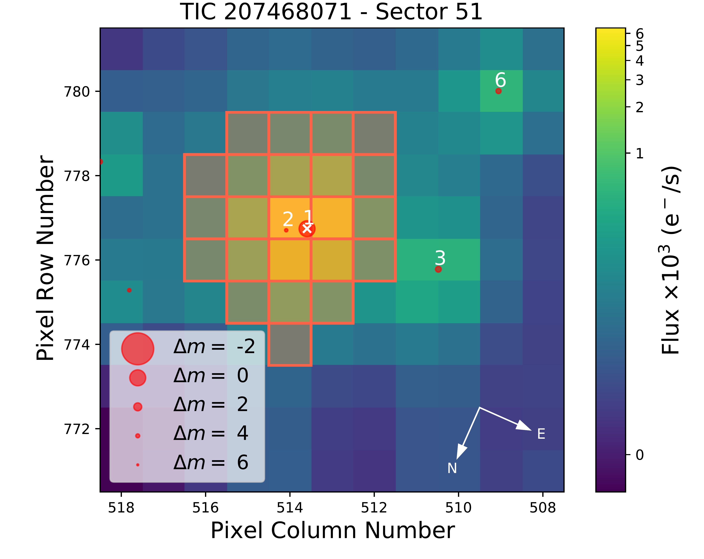
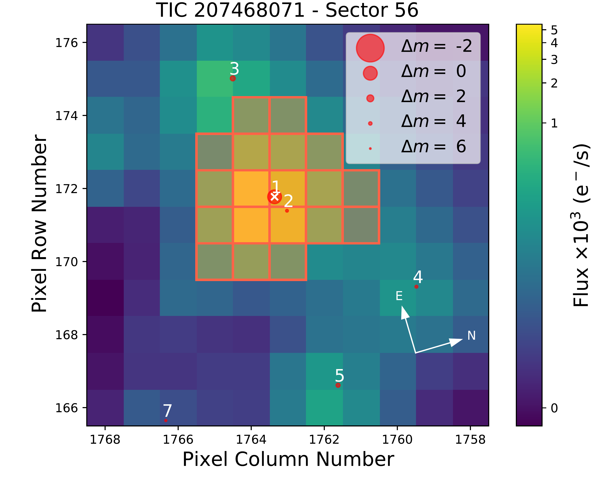
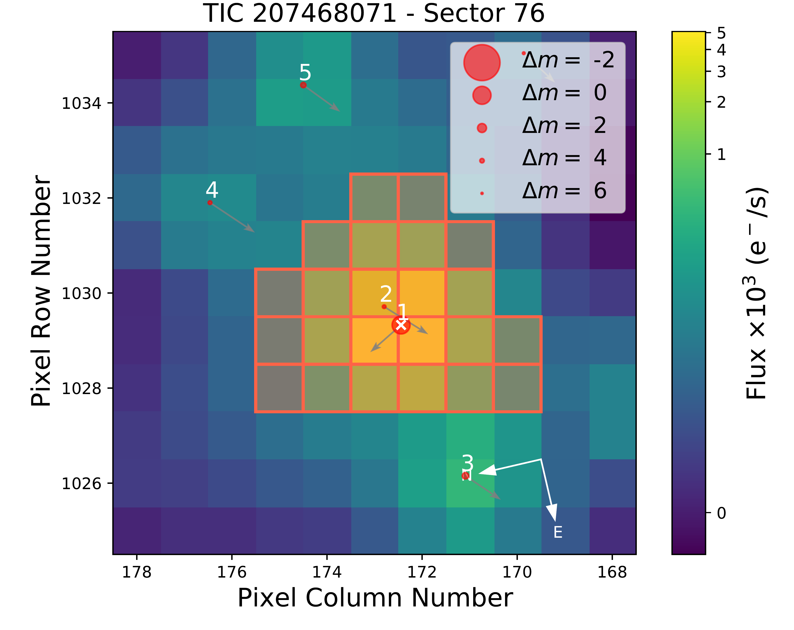
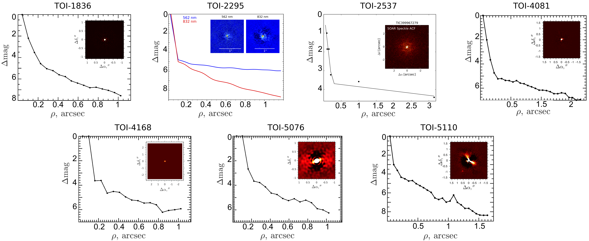

$\newcommand{\ensuremath}{}$
$\newcommand{\xspace}{}$
$\newcommand{\object}[1]{\texttt{#1}}$
$\newcommand{\farcs}{{.}''}$
$\newcommand{\farcm}{{.}'}$
$\newcommand{\arcsec}{''}$
$\newcommand{\arcmin}{'}$
$\newcommand{\ion}[2]{#1#2}$
$\newcommand{\textsc}[1]{\textrm{#1}}$
$\newcommand{\hl}[1]{\textrm{#1}}$
$\newcommand{\footnote}[1]{}$
$\newcommand{\Tau}{\mathrm{T}}$
$\newcommand$
$\newcommand{\exofasttwo}{{\tt EXOFASTv2}}$
$\newcommand{\bjdtdb}{\ensuremath{\rm{BJD_{TDB}}}}$
$\newcommand{\tjdtdb}{\ensuremath{\rm{TJD_{TDB}}}}$
$\newcommand{\msun}{\ensuremath{ M_\odot}}$
$\newcommand{\rsun}{\ensuremath{ R_\odot}}$
$\newcommand{\lsun}{\ensuremath{ L_\odot}}$
$\newcommand{\thefigure}{\arabic{figure}.}$
$\newcommand{\arraystretch}{1.2}$
$\newcommand{\arraystretch}{1.2}$

# Characterization of seven transiting systems including four warm Jupiters from SOPHIE and TESS

<mark>Appeared on: 2024-12-12</mark> -  _46 pages, 21 figures, accepted for publication in A&A_

N. Heidari, et al. -- incl., <mark>J. Eberhardt</mark>, <mark>T. Henning</mark>

**Abstract:** While several thousand exoplanets are now confirmed, the number of known transiting warm Jupiters ( $10  \text{d} < \text{period} < 200   \text{d}$ ) remains relatively small. These planets are generally believed to have formed outside the snowline and migrated to their current orbits. Because they are sufficiently distant from their host stars, they mitigate proximity effects and so offer valuable insights into planet formation and evolution. Here, we present the study of seven systems, three of which—TOI-2295, TOI-2537, and TOI-5110—are newly discovered planetary systems. Through the analysis of TESS photometry, SOPHIE radial velocities, and high-spatial resolution imaging, we found that TOI-2295b, TOI-2537b, and TOI-5110b are transiting warm Jupiters with orbital periods ranging from 30 to 94 d, masses between 0.9 and 2.9 $M_{\rm{J}}$ , and radii ranging from 1.0 to 1.5 $R_{\rm{J}}$ . Both TOI-2295 and TOI-2537 each harbor at least one additional, outer planet. Their outer planets —TOI-2295c and TOI-2537c— are characterized by orbital periods of 966.5 $^{+4.3}_{-4.2}$ and  1920 $^{+230}_{-140}$ d, respectively, and minimum masses of 5.61 $^{+0.23}_{-0.24}$ and 7.23 $^{+0.52}_{-0.45}$ $M_{\rm{J}}$ , respectively. We also investigated and characterized the two recently reported warm Jupiters TOI-1836b and TOI-5076b, which we independently detected in SOPHIE RVs. Our new data allow for further discussion of their nature and refinement of their parameters. Additionally, we study the planetary candidates TOI-4081.01 and TOI-4168.01. For TOI-4081.01, despite our detection in radial velocities, we cannot rule out perturbation by a blended eclipsing binary and thus exercise caution regarding its planetary nature. On the other hand, we identify TOI-4168.01 as a firm false positive; its radial velocity curve exhibits a large amplitude in an anti-phase relation with the transit ephemeris observed by TESS, indicating that the detected event is the eclipse of a secondary star rather than a planetary transit. Finally, we highlight interesting characteristics of these new planetary systems. The transits of TOI-2295b are highly grazing, with an impact parameter of 1.056 $^{+0.063}_{-0.043}$ . This leaves its radius uncertain but potentially makes it an interesting probe of gravitational dynamics in its two-planet system, as transit shapes for grazing planets are highly sensitive to even small variations in inclination. TOI-2537b, in turn, is a temperate Jupiter with an effective temperature of 307 $\pm$ 15 K and can serve as a valuable low-irradiation control for models of hot Jupiter inflation anomalies. We also detected significant transit timing variations (TTVs) for TOI-2537b, which are likely caused by gravitational interactions with the outer planet TOI-2537c. Further transit observations are needed to refine the analysis of these TTVs and enhance our understanding of the system’s dynamics. Finally, TOI-5110b stands out due to its orbital eccentricity of 0.745 $^{+0.030}_{-0.027}$ , one of the highest planetary eccentricities discovered thus far. We find no conclusive evidence for an external companion, but an unseen planet with a semi-amplitude smaller than 10 m/s could nonetheless still be exciting its eccentricity.

**Figure 19. -** Target Pixel Files (TPFs) images from the first observed TESS sector for the seven targets in our analysis, created by \texttt{tpfplotter} ([Aller, et. al 2020]()) . The images depict electron counts, with red-contoured pixels marking the SPOC aperture mask. Additionally, red circles highlight the primary target (numbered as 1) and nearby sources (rest of the numbers) at their Gaia DR3 positions. The area of these circles reflects the relative magnitudes of the sources in comparison to the target star. Arrows represent the proper motion of each star. (*tpfplotter*)

**Figure 23. -** The TPFs for TOI-1836, created by \texttt{tpfplotter} ([Aller, et. al 2020]()) . The images display electron counts, with the SPOC aperture mask outlined in red. Red circles are used to indicate the primary target (marked as 1) and nearby sources (rest of the numbers) based on their positions in Gaia DR3. The size of these circles corresponds to the relative magnitudes of the sources compared to the target star. Additionally, arrows illustrate the proper motion of each star. (*tpfplotter_1836*)

**Figure 20. -** Contrast curves for the speckle interferometry observations of TOI-1836, TOI-2295, TOI-2537, TOI-4081, TOI-4168, TOI-5076, and TOI-5110 are shown with black, blue, and red solid lines. The name of each star is indicated on the corresponding plot. TOI-1836, TOI-4081, TOI-4168, TOI-5076, and TOI-5110 were observed by SPP in 625 or 880 nm band. Meanwhile, TOI-2295 was observed using Gemini 'Alopeke, which provides simultaneous speckle imaging in two bands: 562 nm (blue line) and 832 nm (red line). Additionally, TOI-2537 was observed by SOAR in 880 nm band. Each plot includes the final reconstructed image inset in the upper right corner. (*spp*)

