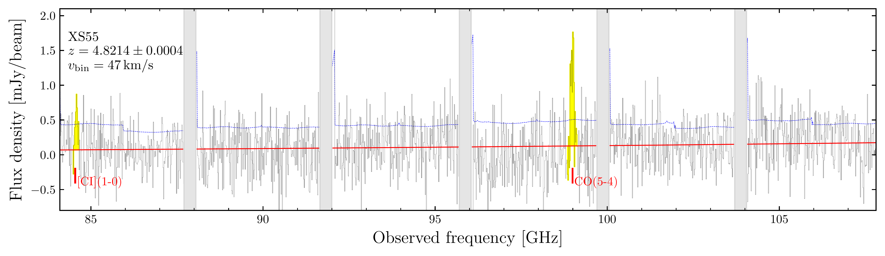
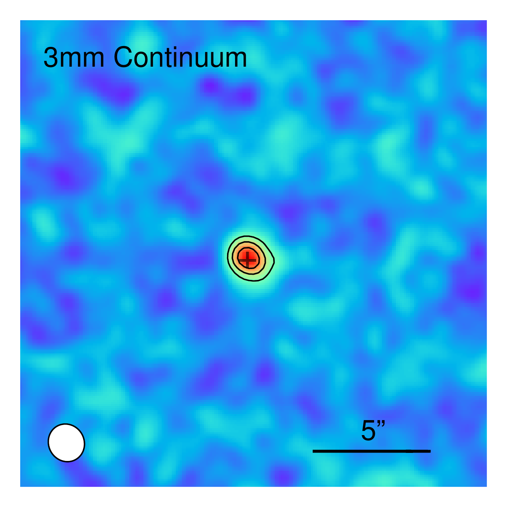
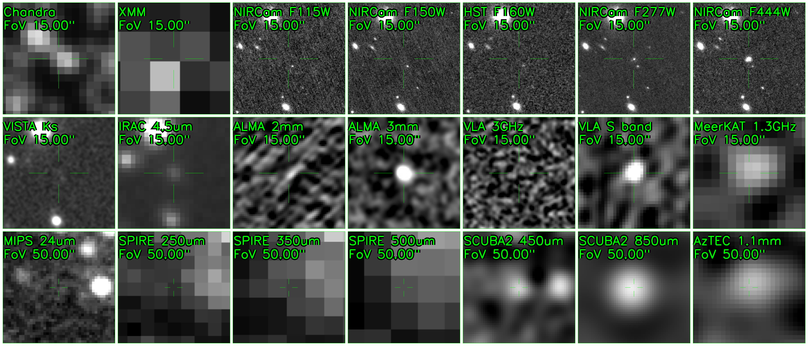

$\newcommand{\ensuremath}{}$
$\newcommand{\xspace}{}$
$\newcommand{\object}[1]{\texttt{#1}}$
$\newcommand{\farcs}{{.}''}$
$\newcommand{\farcm}{{.}'}$
$\newcommand{\arcsec}{''}$
$\newcommand{\arcmin}{'}$
$\newcommand{\ion}[2]{#1#2}$
$\newcommand{\textsc}[1]{\textrm{#1}}$
$\newcommand{\hl}[1]{\textrm{#1}}$
$\newcommand{\footnote}[1]{}$
$\newcommand{\changes}[1]{\textcolor{purple}{\bf #1}}$
$\newcommand{\nochanges}[1]{#1}$
$\newcommand$
$\newcommand$
$\newcommand$

# Behind the dust veil: A panchromatic view of an optically dark galaxy at z=4.82

<mark>Appeared on: 2024-12-13</mark> -  _11 pages, 7 figures, accepted in Astronomy & Astrophysics_

N. B. Sillassen, et al. -- incl., <mark>E. Schinnerer</mark>

**Abstract:** Optically dark dusty star-forming galaxies (DSFGs) play an essential role in massive galaxy formation at early cosmic time, however their nature remains elusive.Here we present a detailed case study of all the baryonic components of a $z=4.821$ DSFG, XS55. Selected from the ultra-deep COSMOS-XS 3GHz map with a red SCUBA-2 450 $\mu$ m/850 $\mu$ m colour, XS55 was followed up with ALMA 3mm line scans and spectroscopically confirmed to be at $z=4.821$ via detections of the CO(5-4) and [ C ${\tiny I}$ ] (1-0) lines.JWST/NIRCam imaging reveals that XS55 is a F150W-dropout with red F277W/F444W colour, and a complex morphology: a compact central component embedded in an extended structure with a likely companion.XS55 is tentatively detected in X-rays with both Chandra and XMM-Newton, suggesting an active galactic nucleus (AGN) nature. By fitting a panchromatic SED spanning NIR to radio wavelengths, we revealed that XS55 is a massive main-sequence galaxy with a stellar mass of $M_\ast=(5\pm1)\times10^{10} {\rm M_\odot}$ and a star formation rate of ${\rm SFR}=540\pm177 {\rm M_\odot yr^{-1}}$ . The dust of XS55 is optically thick in the far infrared (FIR) with a surprisingly cold dust temperature of $T_{\rm dust}=33\pm2 {\rm K}$ , making XS55 one of the coldest DSFGs at $z>4$ known to date. This work unveils the nature of a radio-selected F150W-dropout, suggesting the existence of a population of DSFGs hosting active black holes embedded in optically thick dust.

**Figure 3. -** ** Top:** ALMA 3mm spectrum of XS55. The red line shows the line-free continuum, and the blue dotted line indicates the flux error per channel at $1\sigma$ level. The spectroscopic redshift is shown in text, along with the velocity width of the channels. ** Bottom-left:** Velocity space spectrum of CO(5-4) (blue) and [C{\tiny I}](1-0) (red) at $z=4.8214$, the uncertainty per channel is shown as dashed lines. ** Bottom-right:** Continuum and continuum subtracted moment-0 line maps of XS55. Contour levels are 5, 8, and 11$\sigma$ for continuum, and 3, 4, 5$\sigma$ for the line maps. The beam size is shown as a white ellipse, and the peak JWST/F444W position is marked by a grey cross. (*fig:spectrum*)

**Figure 1. -** Morphological fit of XS55 in JWST/F444W (top and middle row) and JWST/F277W (bottom row). The different components of each fit are stated in the right column of each row. (*fig:morph*)

**Figure 2. -** Multi-wavelength cutout images of XS55. The instrument, wavelength and field of view (FoV) are shown in green text in each panel. (*fig:cutouts*)

