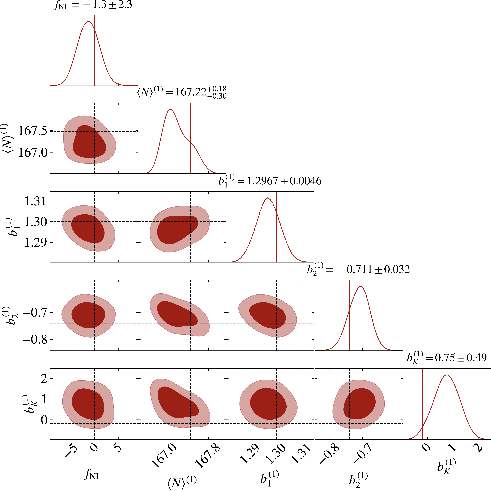
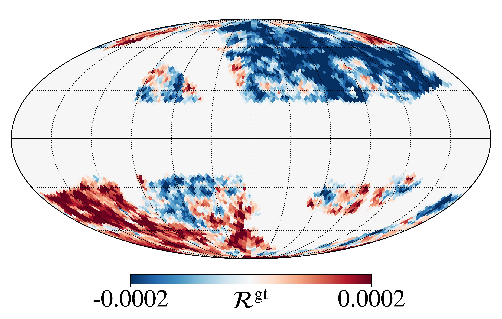
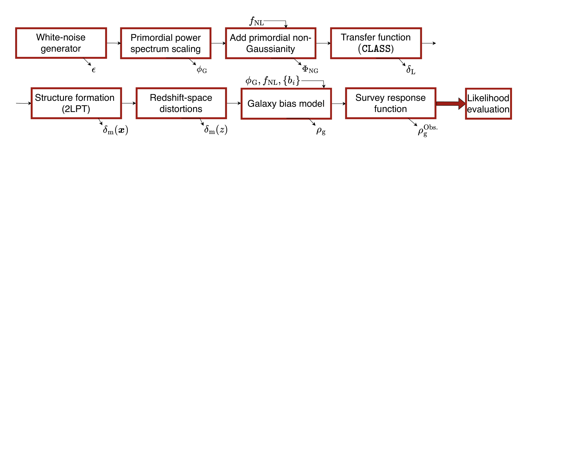

$\newcommand{\ensuremath}{}$
$\newcommand{\xspace}{}$
$\newcommand{\object}[1]{\texttt{#1}}$
$\newcommand{\farcs}{{.}''}$
$\newcommand{\farcm}{{.}'}$
$\newcommand{\arcsec}{''}$
$\newcommand{\arcmin}{'}$
$\newcommand{\ion}[2]{#1#2}$
$\newcommand{\textsc}[1]{\textrm{#1}}$
$\newcommand{\hl}[1]{\textrm{#1}}$
$\newcommand{\footnote}[1]{}$
$\newcommand{\borg}{\texttt{BORG}\xspace}$
$\newcommand{\fnl}{{f_\mathrm{NL}}}$
$\newcommand{\bpd}{{b_{\phi ,   \delta}}}$
$\newcommand{\euclid}{\textit{Euclid}}$
$\newcommand{\aanote}[1]{\textbf{\textcolor{purple}{\textbf{AA:} #1\\}}}$
$\newcommand{\fnll}{f_{\mathrm{NL}}^{\mathrm{local}}}$
$\newcommand{\Mpch}{\ensuremath{h^{-1} \text{Mpc}}}$
$\newcommand{\hMpc}{\ensuremath{h\;\text{Mpc}^{-1}}}$
$\newcommand{\mvec}[1]{{\mathbf{#1}}}$
$\newcommand{\GL}[1]{{\bf\color{darkgreen} #1}}$
$\newcommand{\GLrep}[2]{{\bf\color{darkgreen} [GL: \sout{#1} #2]}}$
$\newcommand{\replace}[2]{#2}$
$\newcommand{\new}[1]{#1}$
$\newcommand{\orcid}[1]$
$\newcommand\mb{#1}$
$\newcommand\MB{#1}$
$\newcommand{\UrlFont}{\rmfamily}$

# $\Euclid$: Field-level inference of primordial non-Gaussianity and cosmic initial conditions$\thanks{This paper is published on behalf of the Euclid Consortium.}$

<mark>Appeared on: 2024-12-17</mark> -  _31 pages and 26 figures, 3 tables. Comments are welcome!_

A. Andrews, et al. -- incl., <mark>K. Jahnke</mark>

**Abstract:** A primary target of the $\Euclid$ space mission is to constrain early-universe physics by searching for deviations from a primordial Gaussian random field. A significant detection of primordial non-Gaussianity would rule out the simplest models of cosmic inflation and transform our understanding of the origin of the Universe.  This paper forecasts how well field-level inference of galaxy redshift surveys can constrain the amplitude of local primordial non-Gaussianity ( $\fnll$ ), within a Bayesian hierarchical framework, in the upcoming $\Euclid$ data. We design and simulate mock data sets and perform Markov chain Monte Carlo analyses using a full-field forward modelling approach.  By including the formation history of the cosmic matter field in the analysis, the method takes into account all available probes of primordial non-Gaussianity, and goes beyond statistical summary estimators of $\fnll$ . Probes include, for example, two-point and higher-order statistics, peculiar velocity fields, and scale-dependent galaxy biases. Furthermore, the method simultaneously handles systematic survey effects, such as selection effects, survey geometries, and galaxy biases.  The forecast shows that the method can reach precision levels of up to $\sigma \left( \fnll \right) = 2.3$ (68.3 \% confidence interval, and at the grid resolution $\Delta L = 62.5 \Mpch$ ) with $\Euclid$ data. We also provide data products, including realistic $N$ -body simulations with nonzero values of $\fnll$ and maps of adiabatic curvature fluctuations.  The results underscore the feasibility and advantages of field-level inference to constrain $\fnll$ in galaxy redshift surveys. Our approach consistently captures all the information available in the large-scale structure to constrain $\fnll$ , and resolves the degeneracy between early-universe physics and late-time gravitational effects, while mitigating the impact of systematic and observational effects.

**Figure 18. -** Corner plot for $\fnl$ and bias parameters, for Run \#3, catalogue 1. The corner plot displays the joint distributions and marginal distributions of the variables in the multidimensional data set covered by $\fnl$ and the bias parameters. Each subplot captures the relationships between pairs of variables, offering an overview of the data set structure and dependencies. For the main run, there are few to no degeneracies in the bias parameters. (*fig:pyramid_3_1*)

**Figure 6. -** Mollweide projection of the **ground truth** adiabatic curvature fluctuation map. The projection is computed for a distance of $r=2250   $\Mpch$$, for an observer placed in the centre of the cube, and multiplied by the window selection function. (*fig:acf_projection_one*)

**Figure 10. -** Flow chart illustrating the forward model implemented into $\borg$\citep{jasche_bayesian_2013,andrews_bayesian_2023}. The forward model connects a set of initial conditions to a model prediction. This output can then be compared to the data at the field level through a likelihood evaluation. The parameter under each box represents the output of the box and what is provided to the next step of the forward model. The parameters above some boxes represent the additional input of each computation, especially highlighting the inclusion of the $f_{\mathrm{NL}}^{\mathrm{local}}$ parameter. (*fig:flowchart*)

