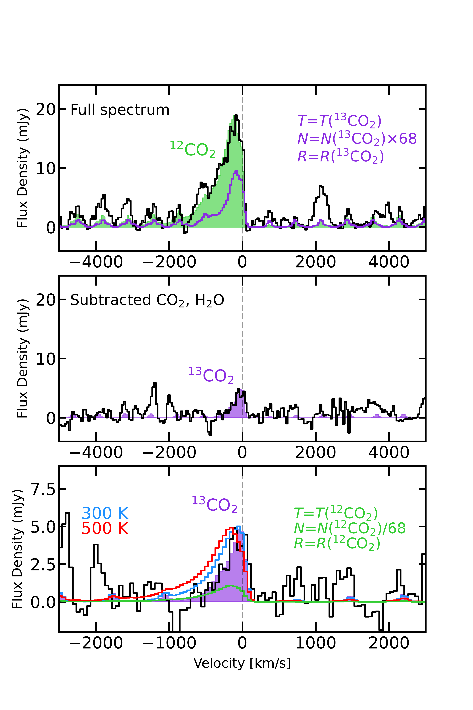

$\newcommand{\ensuremath}{}$
$\newcommand{\xspace}{}$
$\newcommand{\object}[1]{\texttt{#1}}$
$\newcommand{\farcs}{{.}''}$
$\newcommand{\farcm}{{.}'}$
$\newcommand{\arcsec}{''}$
$\newcommand{\arcmin}{'}$
$\newcommand{\ion}[2]{#1#2}$
$\newcommand{\textsc}[1]{\textrm{#1}}$
$\newcommand{\hl}[1]{\textrm{#1}}$
$\newcommand{\footnote}[1]{}$
$\newcommand{\mv}[1]{\textcolor{Thistle}{MV: #1}}$

# MINDS. JWST-MIRI reveals a peculiar $\ce{CO2}$-rich chemistry in the drift-dominated disk CX Tau

<mark>Appeared on: 2024-12-18</mark> -  _23 pages, 17 figures, accepted for publication in Astronomy & Astrophysics_

M. Vlasblom, et al. -- incl., <mark>T. Henning</mark>, <mark>G. Perotti</mark>, <mark>K. Schwarz</mark>

**Abstract:** Radial drift of icy pebbles can have a large impact on the chemistry of the inner regions of protoplanetary disks, where most terrestrial planets are thought to form. Disks with compact mm dust emission ( $\lesssim$ 50 au) are suggested to have a higher $\ce{H2O}$ flux than more extended disks, as well as show excess cold $\ce{H2O}$ emission, likely due to efficient radial drift bringing $\ce{H2O}$ -rich material to the inner disk, where it can be observed with IR facilities such as the _James Webb_ Space Telescope (JWST). We present JWST MIRI/MRS observations of the disk around the low-mass T Tauri star CX Tau (M2.5, 0.37 M $_\odot$ ) taken as a part of the Mid-INfrared Disk Survey (MINDS) GTO program, a prime example of a drift-dominated disk based on ALMA data. In the context of compact disks, this disk seems peculiar: the source possesses a bright $\ce{CO2}$ feature instead of the bright $\ce{H2O}$ that could perhaps be expected based on the efficient radial drift. We aim to provide an explanation for this finding in the context of radial drift of ices and the disk's physical structure. We model the molecular features in the spectrum using local thermodynamic equilibrium (LTE) 0D slab models, which allows us to obtain estimates of the temperature, column density and emitting area of the emission. We detect molecular emission from $\ce{H2O, ^12CO2, ^13CO2, C2H2, HCN}$ , and OH in this disk, and even demonstrate a potential detection of $\ce{CO^18O}$ emission. Analysis of the $\ce{^12CO2}$ and $\ce{^13CO2}$ emission shows the former to be optically thick and tracing a temperature of $\sim$ ${450}$ K at an (equivalent) emitting radius of $\sim$ 0.05 au. The optically thinner isotopologue traces significantly colder temperatures ( $\sim$ ${200}$ K) and a larger emitting area. Both the ro-vibrational bands ${of \ce{H2O}}$ at shorter wavelengths and ${its}$ pure rotational bands at longer wavelengths are securely detected. Both sets of lines are optically thick, tracing ${a similar temperature of $\sim$500-600 K and emitting area as the \ce{CO2} emission}$ . We also find evidence for an even colder, $\sim$ ${200}$ K $\ce{H2O}$ component at longer wavelengths, which is in line with this disk having strong radial drift. We also ${find evidence of}$ highly excited rotational OH ${emission}$ at 9-11 $\mu$ m, known as `prompt emission', caused by $\ce{H2O}$ photodissociation. Additionally, we firmly detect 4 pure rotational lines of $\ce{H2}$ , ${which show evidence of extended emission}$ . Finally, we also detect several H recombination lines and the [ Ne II ] line. The cold temperatures found for both the $\ce{^13CO2}$ and $\ce{H2O}$ emission at longer wavelengths indicate that radial drift of ices likely plays an important role in setting the chemistry of ${the inner disk of CX Tau}$ . Potentially, the $\ce{H2O}$ -rich gas has already advected onto the central star, which is now followed by an enhancement of comparatively $\ce{CO2}$ -rich gas reaching the inner disk, explaining the enhancement of $\ce{CO2}$ emission in CX Tau. ${The comparatively weaker \ce{H2O} emission can be explained by the source's low accretion luminosity. Alternatively, the presence of a small, inner cavity with a size of roughly 2 au in radius, outside the \ce{H2O} iceline, could explain the bright \ce{CO2} emission.}$ Higher angular resolution ALMA observations are needed to test this.

**Figure 10. -** A zoom-in of the {13.5-15.5}$\mu$m region of the CX Tau spectrum (black), where all individual slab model fits are shown. Horizontal bars indicate {which spectral windows were used} for the $\chi^2$ fit, and each panel indicates which other models were removed from the spectrum before the fit was performed, to avoid contamination from other molecules. {The final panel shows the residuals after all fits are subtracted, with the shaded region indicating that most residuals fall below 3$\sigma$. We note the difference in scale on the y axis between the top panel and the rest.} (*fig:slab_15um_ind_p1*)

**Figure 11. -** A zoom-in of the {15.5-17.5}$\mu$m region of the CX Tau spectrum (black), where all individual slab model fits are shown. Horizontal bars indicate {which spectral windows were used} for the $\chi^2$ fit, and each panel indicates which other models were removed from the spectrum before the fit was performed, to avoid contamination from other molecules. {The final panel shows the residuals after all fits are subtracted, with the shaded region indicating that most residuals fall below 3$\sigma$. {An artifact around 16.15 $\mu$m has been masked in all panels.} We {also} note the difference in scale on the y axis between the top panel and the rest.} (*fig:slab_15um_ind_p2*)

**Figure 2. -** A comparison of the \ce{^12CO2}(green) and \ce{^13CO2}(purple) $Q$ branch shapes. Top: {a zoom-in of the \ce{^12CO2} $Q$ branch with the best-fit slab model plotted in the green shaded region. A model {with} the derived \ce{^13CO2} parameters is plotted in purple (see text).} Middle: a zoom-in of the \ce{^13CO2}$Q$ branch on the same vertical scale as {the top panel}, where the emission from \ce{^12CO2} and \ce{H2O} has been subtracted. The best-fit slab model is plotted in the purple shaded region. Bottom: a further zoom-in of the middle panel {where the best-fit model (180 K;} purple shaded region) {and slab models of} 300 K (blue line) and 500 K (red line) are shown. The latter two models have their emitting radius scaled to {produce the same peak flux}. In green, a slab model {with} the derived \ce{^12CO2} parameters (see text) is shown. (*fig:slab_13CO2*)

