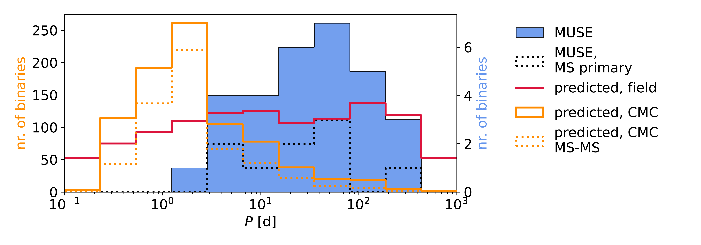

$\newcommand{\ensuremath}{}$
$\newcommand{\xspace}{}$
$\newcommand{\object}[1]{\texttt{#1}}$
$\newcommand{\farcs}{{.}''}$
$\newcommand{\farcm}{{.}'}$
$\newcommand{\arcsec}{''}$
$\newcommand{\arcmin}{'}$
$\newcommand{\ion}[2]{#1#2}$
$\newcommand{\textsc}[1]{\textrm{#1}}$
$\newcommand{\hl}[1]{\textrm{#1}}$
$\newcommand{\footnote}[1]{}$
$\newcommand{\aj}{Astronomical Journal}$
$\newcommand{\apj}{Astrophysical Journal}$
$\newcommand{\aap}{Astronomy \& Astrophysics}$
$\newcommand{\jcap}{Journal of Cosmology and Astroparticle Physics}$
$\newcommand{\aapr}{The Astronomy and Astrophysics Review}$
$\newcommand{\mnras}{Monthly Notices of the Royal Astronomical Society}$
$\newcommand{\araa}{Annual Review of Astronomy and Astrophysics}$
$\newcommand{\Msun}{\mathrm{M}_\odot}$

# Binary properties of the globular cluster 47 Tuc (NGC 104): A dearth of short-period binaries

<mark>Appeared on: 2024-12-18</mark> -  _Accepted for publication in Astronomy and Astrophysics, 18 pages, 20 figures_

<mark>J. Müller-Horn</mark>, et al.

**Abstract:** Spectroscopic observations of binary stars in globular clusters are essential to shed light on the poorly constrained period, eccentricity, and mass ratio distributions and to develop an understanding of the formation of peculiar stellar objects.   47 Tuc (NGC 104) is one of the most massive Galactic globular clusters, with a large population of blue stragglers and with many predicted but as-yet elusive stellar-mass black holes. This makes it an exciting candidate for binary searches.   We present a multi-epoch spectroscopic survey of 47 Tuc with the VLT/MUSE integral field spectrograph to determine radial velocity variations for 21,699 stars.   We find a total binary fraction in the cluster of $(2.4\pm1.0)\%$ , consistent with previous photometric estimates, and an increased binary fraction among blue straggler stars, approximately three times higher than the cluster average. We find very few binaries with periods below three days, and none with massive dark companions. A comparison with predictions from state-of-the-art models shows that the absence of such short-period binaries and of binaries with massive companions is surprising, highlighting the need to improve our understanding of stellar and dynamical evolution in binary systems.

**Figure 16. -** \textcolor{red}{I like this plot because it shows the substantial discrepancies wrt CMC very well but am not sure whether to include it because it's a bit redundant with the period dist plot}. (*fig:period_distribution*)

**Figure 24. -** Period distribution of binaries with well-constrained orbits in 47 Tuc (shown in blue). The dotted line represents the subset of binaries with MS primaries. For comparison, the orange lines depict the period distributions of hypothetically detectable binaries from the CMC simulation (stellar types as shown in Fig. \ref{fig:ktype_heatmap}), with the dashed line indicating the subset of simulated MS-MS binaries. The red curve illustrates the predicted observable distribution assuming an underlying field-like period distribution with $\overline{\log P} \approx 5.0$ and standard deviation $\sigma_{\log P} \approx 2.3$. It is scaled to the number of well-constrained MUSE binaries. For CMC and field binaries, we have forward-modeled our selection function to account for decreasing sensitivity at longer periods. The underlying period distributions of field and CMC binaries are shown for reference in the right-hand panel. (*fig:period_distribution*)

**Figure 27. -** Period distribution of binaries with well-constrained orbits in 47 Tuc (shown in blue). The dotted line represents the subset of binaries with MS primaries. For comparison, the orange lines depict the period distributions of binaries from the CMC simulation, with the dashed line indicating the subset of MS-MS binaries. The red curve illustrates the predicted observable distribution assuming an underlying field-like period distribution with $\overline{\log P} \approx 5.0$ and standard deviation $\sigma_{\log P} \approx 2.3$. It is scaled to the number of well-constrained MUSE binaries. For CMC and field binaries, we have forward-model our selection function to account for decreasing sensitivity at longer periods. (*fig:period_distribution*)

