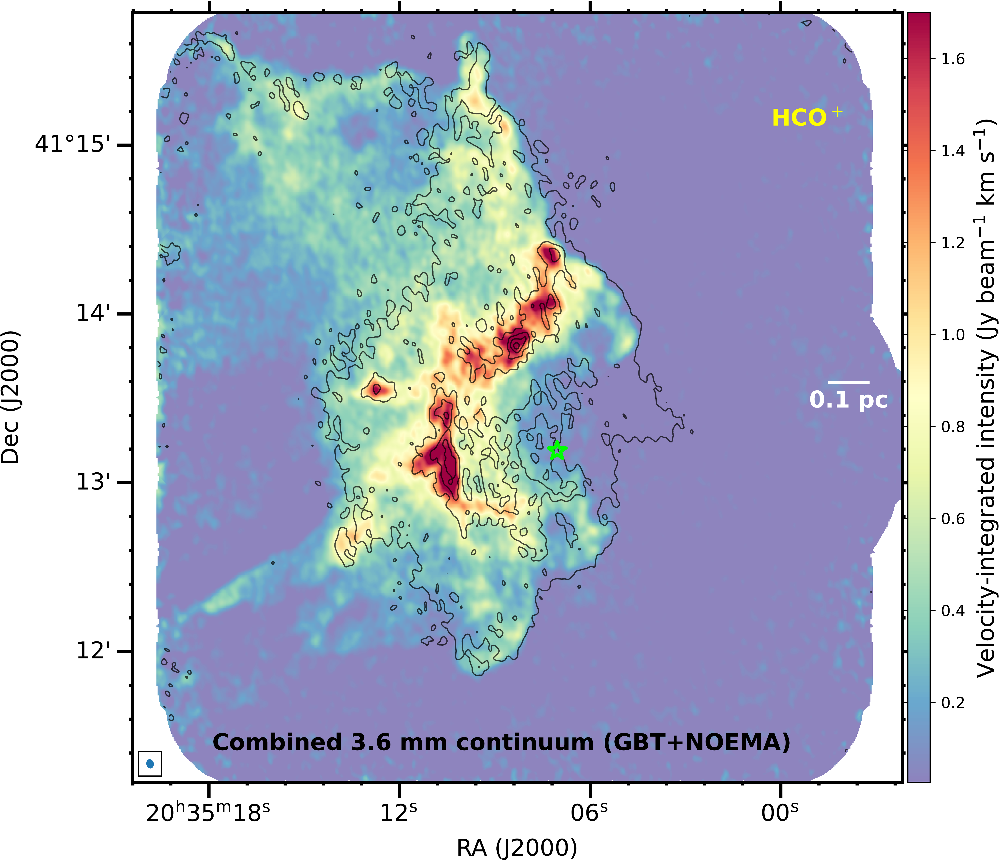

$\newcommand{\ensuremath}{}$
$\newcommand{\xspace}{}$
$\newcommand{\object}[1]{\texttt{#1}}$
$\newcommand{\farcs}{{.}''}$
$\newcommand{\farcm}{{.}'}$
$\newcommand{\arcsec}{''}$
$\newcommand{\arcmin}{'}$
$\newcommand{\ion}[2]{#1#2}$
$\newcommand{\textsc}[1]{\textrm{#1}}$
$\newcommand{\hl}[1]{\textrm{#1}}$
$\newcommand{\footnote}[1]{}$
$\newcommand{\kms}{\mbox{km s^{-1}}}$
$\newcommand{\hi}{H{\sc i}}$
$\newcommand{\hii}{H{\sc ii}}$

# The Cygnus Allscale Survey of Chemistry and Dynamical Environments: CASCADE: IV. Unveiling the hidden structures in DR18

<mark>Appeared on: 2025-01-09</mark> -  _25 pages, 21 figures, and 4 tables. Accepted for publication in A&A_

W.-J. Kim, et al. -- incl., <mark>H. Beuther</mark>, <mark>D. Semenov</mark>

**Abstract:** The Cygnus-X complex is a massive (a few $10^6$ M $_{\odot}$ molecular gas mass), nearby (1.4 kpc) star-forming region with several OB associations. Of these, Cyg OB2 is the largest,  with at least 169 OB stars. DR18 is the largest globule near the OB2 association, making it a perfect target for investigating the influence of ultraviolet radiation on molecular clouds. By analyzing emission from different molecular species, we aim to study the molecular gas structures toward DR18 using high angular-resolution molecular line observations. As part of the Cygnus Allscale Survey of Chemistry and Dynamical Environments (CASCADE) program,  we carried out 3.6 millimeter (mm) continuum and spectral line high-resolution observations ( $\sim$ 3 -- 4 $"$ ) toward DR18, covering several molecular species (e.g., HCN, HNC, $\ce{H2CO}$ , $\ce{N2H+}$ , SiO, $\ce{C2H}$ , deuterated species, etc.) with the Northern Extended Millimeter Array (NOEMA) and the Institut de Radioastronomie Millimétrique (IRAM) 30 m telescope. In addition, multi-wavelength archival datasets from mid-infrared (MIR) to centimeter (cm) wavelengths were used to provide a comprehensive analysis of the region. The spectral index analysis shows significant contamination of the 3.6  mm continuum by free-free emission from ionized gas. A comparison of the 3.6 mm and 6 cm continuum emission confirms that a B2 star (DR18-05) shapes the cometary $\hii$ region in the DR18 cavity, with ionized gas escaping toward the OB2 association. On the other hand, the extended 3.6 mm and 6 cm continuum emission are likely to trace photoevaporating ionized gas from ultraviolet radiation from the Cyg OB2 association --  not from DR18-05. To study the feedback of the B2 star and the OB2 association on surrounding molecular regions, we analyzed the $\ce{HCO+}$ , HCN, HNC, $\ce{N2H+}$ , and SiO emission lines. The shell structure around DR18-05 indicates photodissociation regions (PDRs) formed by the expanding $\hii$ region and photo-erosion from DR18-05 and OB2 stars. We also identified 18 compact cores with $\ce{N2H+}$ emission, half of which are gravitationally bound (virial parameter, $\alpha_{\rm vir}$ , $\lesssim$ 2.0), and mostly located in colder regions ( $T_{\rm HCN/HNC}$ $<$ 30 K) behind the PDRs. The SiO emission is found only in PDRs, with narrow-line widths ( $\sim$ 0.8 -- 2.0 $\kms$ ) and lower abundances (X(SiO) $\sim 5\times10^{-11} - 1 \times10^{-10}$ ). Comparing with the UV irradiated shock models, we suggest that the SiO emission partially encompassing the $\hii$ region arises from the molecular gas region, marginally compressed by low-velocity shocks with $\sim$ 5 $\kms$ , irradiated by external UV radiation ( $G_{\rm 0} \sim 10^2 - 10^3$ ), as they traverse through a medium with $n_{\rm H} \sim 10^4$ to $10^5$ cm $^{-3}$ . These shocks can be generated by the initial expansion of the $\hii$ region and potentially by stellar winds.

**Figure 15. -** Velocity-integrated intensity maps of \ce{HCO+}(6 $\kms$ to 15.6 $\kms$), \ce{N2H+}($-$1.2 $\kms$ to 17.2 $\kms$ spanning all the hfs transitions) in the upper row and SiO (8 $\kms$ to 10 $\kms$) and \ce{NH2D}(0 $\kms$ to 15.2 $\kms$ covering all the hfs transitions) in the lower row. The black contours represent the GBT+NOEMA combined 3.6 mm continuum emission, and the bright green marker indicates the position of the ionizing source, DR18-05. The contour levels of the mm continuum are the same as shown in Fig. \ref{fig:mm_cm_images}. The horizontal white scale bar has a size of 0.1 pc at a given distance of 1.4 kpc. The beam of the maps of each species is displayed on the left corner of each image panel.  (*fig:mom0_maps*)

**Figure 17. -** Different emission distributions toward DR18. _Left_: Three-color composite image of DR18; \ce{HCO+} emission in red, 8 $\mu$m emission in green, and the GLOSTAR 6 cm radio continuum emission in blue. The 6 cm emission represents a combination VLA D- and B-configuration data from the GLOSTAR survey. The synthesized beam size of the GLOSTAR data is $4"$,  comparable to that of NOEMA data ($\sim 3-4"$). The pixel size,  of the _Spitzer_/IRAC 8 $\mu$m data is $0\rlap{.}"6$. The black dashed lines indicate the cuts for intensity profiles of different emission tracers, presented in Fig. \ref{fig:intensity_profile}. The white rectangles represent the areas of the East and North shells, as well as the Ridge. _Right_: Flux difference image of Br$\gamma$ and \ce{H2} 1--0 $S$(1) emission lines obtained from [Comerón, Schneider and Djupvik (2022)](). The black and yellow contours show the 5$\sigma$ level of \ce{N2H+} velocity-integrated intensity and a 3.0$\sigma$ level of SiO velocity-integrated intensity, respectively. In both images, the bright green star indicates DR18-05, the ionizing source in DR18.  (*fig:dr18_pdr_image*)

**Figure 13. -** Millimeter (left) and centimeter (right) continuum emission maps. The mm continuum emission map represents the combination of the GBT MUSTANG2 and NOEMA data sets, whereas the cm continuum emission map is generated by combining the VLA D and B configuration observations. The FWHM synthetic beams of these maps are displayed in the lower left corners. The contour levels of the mm continuum emission are 0.46, 0.96, 1.38, 1.80, 4.14, 5.33, and 6.51 mJy beam$^{-1}$, whereas for the cm emission, the levels are 0.35, 0.70, 1.05, 1.40, 1.75, 2.10, 2.45, 2.80, 3.15, and 3.50 mJy beam$^{-1}$. The star symbol indicates the position of the B2 star. (*fig:mm_cm_images*)

