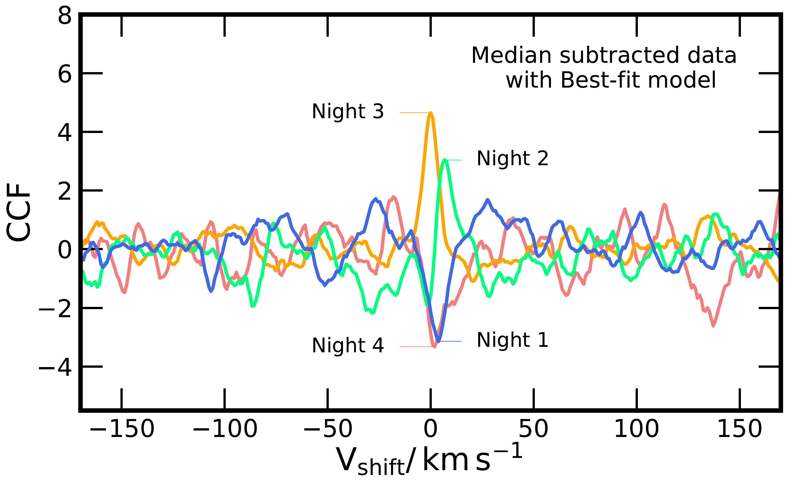
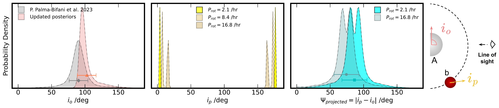

$\newcommand{\ensuremath}{}$
$\newcommand{\xspace}{}$
$\newcommand{\object}[1]{\texttt{#1}}$
$\newcommand{\farcs}{{.}''}$
$\newcommand{\farcm}{{.}'}$
$\newcommand{\arcsec}{''}$
$\newcommand{\arcmin}{'}$
$\newcommand{\ion}[2]{#1#2}$
$\newcommand{\textsc}[1]{\textrm{#1}}$
$\newcommand{\hl}[1]{\textrm{#1}}$
$\newcommand{\footnote}[1]{}$
$\newcommand{\thebibliography}{\DeclareRobustCommand{\VAN}[3]{##3}\VANthebibliography}$
$\newcommand{\arraystretch}{1.5}$
$\newcommand{\arraystretch}{1.5}$

# The ESO SupJup Survey V: Exploring Atmospheric Variability and Orbit of the Super-Jupiter AB Pictoris b with CRIRES+

<mark>Appeared on: 2025-01-10</mark> -  _22 pages, 17 figures, 4 tables, accepted for publication in MNRAS_

S. Gandhi, et al. -- incl., <mark>G. Chauvin</mark>

**Abstract:** A growing number of directly-imaged companions have been recently characterised, with robust constraints on carbon-to-oxygen ratios and even isotopic ratios. Many companions and isolated targets have also shown spectral variability. In this work we observed the super-Jupiter AB Pictoris b across four consecutive nights using VLT/CRIRES+ as part of the ESO SupJup survey, exploring how the constraints on chemical composition and temperature profile change over time using spectral line shape variations between nights. We performed atmospheric retrievals of the high-resolution observations and found broadly consistent results across all four nights, but there were differences for some parameters. We clearly detect $H_2$ O, $^{12}$ CO and $^{13}$ CO in each night, but abundances varied by $\sim2\sigma$ , which was correlated to the deep atmosphere temperature profiles. We also found differences in the $^{12}$ C $/^{13}$ C ratios in each night by up to $\sim3\sigma$ , which seemed to be correlated with the cloud deck pressure. Our combined retrieval simultaneously analysing all nights together constrained broadly the average of each night individually, with the C/O $=0.59\pm0.01$ , consistent with solar composition, and $^{12}$ C $/^{13}$ C $ = 102\pm8$ , slightly higher than the ISM and Solar System values. We also find a low projected rotational velocity, suggesting that AB Pictoris b is either intrinsically a slow rotator due to its young age or that the spin axis is observed pole-on with a $\sim90^\circ$ misalignment with its orbit inclination. Future observations will be able to further explore the variability and orbit of AB Pictoris b as well as for other companions.

**Figure 2. -** Cross-correlation function (CCF) of the high-pass filtered data for each night subtracted by the median over all nights against the best fit model from the combined retrieval. We divide the the values by the standard deviation away from the peak and hence they act as a proxy for the signal-to-noise. Positive correlation indicates the night had higher line depths/stronger features over the others. (*fig:ccf_med_subtract*)

**Figure 15. -** Constraints on the parameters for the combined retrieval of AB Pic b simultaneously analysing all four nights. For the isotopic ratio, we show the Solar System value with the blue dotted line and the ISM value and 1$\sigma$ uncertainty with the red line and shaded region  ([ and Wilson 1999](https://ui.adsabs.harvard.edu/abs/1999RPPh...62..143W), [Milam, et. al 2005](https://ui.adsabs.harvard.edu/abs/2005ApJ...634.1126M)) , and for the C/O ratio we show the the solar value with the blue dotted line  ([Asplund, Amarsi and Grevesse 2021](https://ui.adsabs.harvard.edu/abs/2021A&A...653A.141A)) . The right panel shows the P-T profile and cloud deck constraints, along with the CO-$CH_4$ equilibrium, and the condensation curves for $CaTiO_3$, Fe and $Mg_2$$SiO_4$ ([Visscher, Lodders and Fegley 2010](https://ui.adsabs.harvard.edu/abs/2010ApJ...716.1060V), [Wakeford, et. al 2017](https://ui.adsabs.harvard.edu/abs/2017MNRAS.464.4247W)) . (*fig:combined_nights*)

**Figure 17. -** (Left panel) The orbital inclination from [ and Palma-Bifani (2023)](https://ui.adsabs.harvard.edu/abs/2023A&A...670A..90P) and the updated distribution from this work in grey and light pink respectively. (Center panel) The probability density distributions for the inclination of AB Pic b for the reported period of 2.1 hour and for a period 4 and 8 times larger. (Right panel) The revised projected obliquity calculated with a period of 2.1 and 16.8 hours. On the far right, a schematic view of the system is shown, highlighting the inclination vectors of the orbit and the companion. (*fig:obliquity*)

