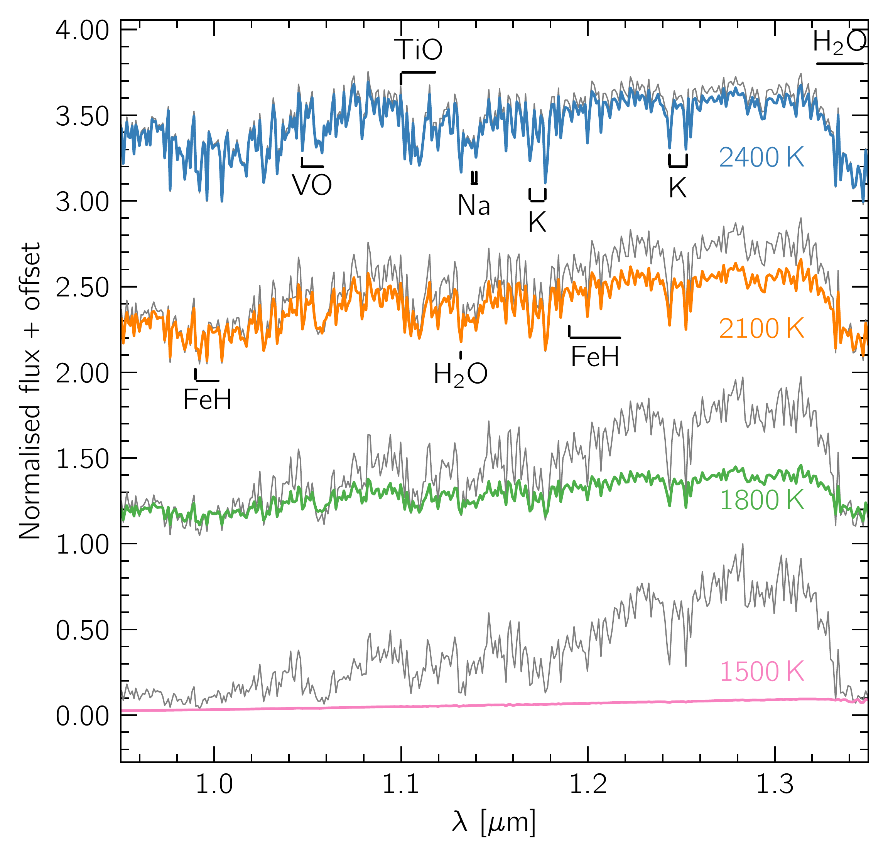

$\newcommand{\ensuremath}{}$
$\newcommand{\xspace}{}$
$\newcommand{\object}[1]{\texttt{#1}}$
$\newcommand{\farcs}{{.}''}$
$\newcommand{\farcm}{{.}'}$
$\newcommand{\arcsec}{''}$
$\newcommand{\arcmin}{'}$
$\newcommand{\ion}[2]{#1#2}$
$\newcommand{\textsc}[1]{\textrm{#1}}$
$\newcommand{\hl}[1]{\textrm{#1}}$
$\newcommand{\footnote}[1]{}$
$\newcommand{\dal}[1]{\textcolor{purple}{#1^{(DAL)}}}$
$\newcommand{\Teff}{T_{\rm{eff}}}$
$\newcommand{\PT}{P_{\mathrm{gas}}-T_{\mathrm{gas}}}$
$\newcommand{\arraystretch}{1.2}$
$\newcommand{\arraystretch}{1.2}$
$\newcommand{\arraystretch}{1.2}$

# The \texttt{MSG} model for cloudy substellar atmospheres:: A grid of self-consistent substellar atmosphere models with microphysical cloud formation

<mark>Appeared on: 2025-01-13</mark> -  _Accepted for publication in A&A_

<mark>B. C. Estrada</mark>, et al.

**Abstract:** State-of-the-art JWST observations are unveiling unprecedented views into the atmospheres of substellar objects in the infrared, further highlighting the importance of clouds. Current forward models struggle to fit the silicate clouds absorption feature at $\sim10 \mu$ m observed in substellar atmospheres. In the \texttt{MSG} model, we aim to couple the \texttt{MARCS} 1D radiative-convective equilibrium atmosphere model with the 1D kinetic, stationary, non-equilibrium, cloud formation model \texttt{DRIFT} , also known as \texttt{StaticWeather} , to create a new grid of self-consistent cloudy substellar atmosphere models with microphysical cloud formation. We aim to test if this new grid is able to reproduce the silicate cloud absorption feature at $\sim10 \mu$ m. We model substellar atmospheres with effective temperatures in the range $T_{\rm{eff}}$ = 1200-2500 K and with $\log(g)=4.0$ . We compute atmospheric structures that self-consistently account for condensate cloud opacities based on microphysical properties. We present an algorithm based on control theory to help converge such self-consistent models. Synthetic atmosphere spectra are computed for each model to explore the observable impact of the cloud microphysics. We additionally explore the impact of choosing different nucleation species ( $\ce{TiO2}$ or $\ce{SiO}$ ) and the effect of less efficient atmospheric mixing on these spectra. The new \texttt{MSG} cloudy grid using $\ce{TiO2}$ nucleation shows spectra which are redder in the near-infrared compared to the currently known population of substellar atmospheres. We find the models with $\ce{SiO}$ nucleation, and models with reduced mixing efficiency are less red in the near-infrared. We present a new grid of \texttt{MSG} models for cloudy substellar atmospheres that include cloud-radiative feedback from microphysical clouds. The grid is unable to reproduce the silicate features similar to those found in recent JWST observations and _Spitzer_ archival data. We thoroughly discuss further work that may better approximate the impact of convection in cloud-forming regions and steps that may help resolve the silicate cloud feature.

**Figure 8. -** **Left:** The optical depth of the cloud (orange), gas (blue), and the total (green) throughout the atmosphere at $\lambda \approx 1.1  \mu$m (solid curves) and $\lambda \approx 10.0  \mu$m (dashed curves), for a \texttt{MSG} model with $TiO_2$ nucleation, at 1500 K and $\log(g)=4.0$. The $\tau=1.0$ level is shown for reference (dot-dash red curve). **Middle and right:** Composition of the cloud particles in units of volume fractions $V_s/V_{\mathrm{tot}}$(middle) and the relative gas-phase element depletions $\epsilon_i/ \epsilon_i^0$(right) for the same model as in the left panel.  (*fig:cloud_comp_TiO2*)

**Figure 9. -** Synthetic spectra of \texttt{MSG} models with $TiO_2$ nucleation at $T_{\rm{eff}}$$=$ 2400 K (blue), 2100 K (orange), 1800 K (green) and 1500 K (pink), with $\log(g)=4.0$, and the respective cloud-free spectra at the same $T_{\rm{eff}}$ and $\log(g)$ in grey. The emergent fluxes are normalised with respect to the cloud-free \texttt{MSG} spectra, i.e. $F_{\mathrm{norm}}(\lambda) = F_{\mathrm{cloudy}}(\lambda) / F^{\mathrm{max}}_{\mathrm{cloud-free}}$, where $F_{\mathrm{norm}}$ is the normalised flux, $F_{\mathrm{cloudy}}$ the flux from the cloudy model, and $F^{\mathrm{max}}_{\mathrm{cloud-free}}$ the maximum flux from the cloud-free model within the full wavelength range considered ($\sim$ 0.4$ \mu$m - 20.0$ \mu$m). An arbitrary offset is added for clarity. In the top-left plots we show the NIR range, in the top-right the Y and J bands, in the bottom-left the MIR and the bottom-right the thermal infrared. Important absorbers are respectively labelled. (*fig:spectra_TiO2*)

**Figure 11. -** **Left**: Pressure-temperature profiles for \texttt{MSG} models at $T_{\rm{eff}}=$ 1500 K and $\log(g)=4.0$ with \ce{TiO2} nucleation (blue dashed curve) and \ce{SiO} nucleation (orange solid curve). Convective zones are plotted with thicker lines while radiative zones are plotted with thinner lines. **Middle:** The average cloud particle size (solid curves) and the cloud particle number density (dashed curves) for the models shown on the left. **Right:** The nucleation rates for \texttt{MSG} models at $T_{\rm{eff}}$$=$ 1500 K and $\log(g)=4.0$ with \ce{TiO2} nucleation (blue curve) and \ce{SiO} nucleation (orange curve). (*fig:pt_SiO*)

