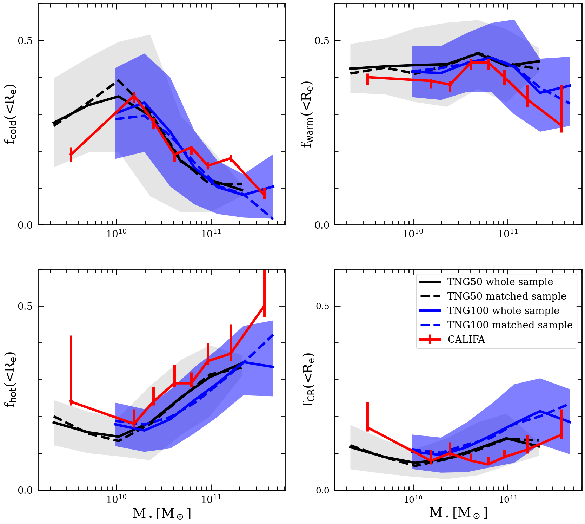
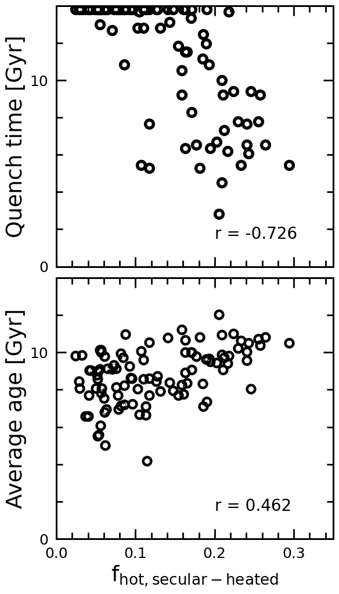

$\newcommand{\ensuremath}{}$
$\newcommand{\xspace}{}$
$\newcommand{\object}[1]{\texttt{#1}}$
$\newcommand{\farcs}{{.}''}$
$\newcommand{\farcm}{{.}'}$
$\newcommand{\arcsec}{''}$
$\newcommand{\arcmin}{'}$
$\newcommand{\ion}[2]{#1#2}$
$\newcommand{\textsc}[1]{\textrm{#1}}$
$\newcommand{\hl}[1]{\textrm{#1}}$
$\newcommand{\footnote}[1]{}$
$\newcommand{\LZ}[1]{{\color{red} #1}}$
$\newcommand{\revision}[1]{{\color{black} #1}}$
$\newcommand{\ap}[1]{{\color{cyan} #1}}$
$\newcommand{\kms}{km s^{-1}}$
$\newcommand{\dgr}{^\circ}$
$\newcommand{\kmsM}{km s^{-1} Mpc^{-1}}$
$\newcommand{\Msun}{M_\odot}$
$\newcommand{\Msunpcsq}{M_\odot pc^{-2}}$
$\newcommand{\Msunpccube}{M_\odot pc^{-3}}$
$\newcommand{\Lsun}{L_\odot}$
$\newcommand{\Lsunpcsq}{L_\odot pc^{-2}}$
$\newcommand{\Lsunpccube}{L_\odot pc^{-3}}$
$\newcommand{\MLsun}{M_\odot/L_\odot}$
$\newcommand{\magarcsq}{\mathrm{mag arcsec^{-2}}}$

# The diverse physical origins of stars in the dynamically hot bulge: CALIFA vs. IllustrisTNG

<mark>Appeared on: 2025-01-14</mark> -  _18 pages, 15 figures_

L. Zhang, et al. -- incl., <mark>A. Pillepich</mark>

**Abstract:** We compare the internal stellar structures of central galaxies in the TNG50 and TNG100 simulations and field galaxies in the CALIFA survey. The luminosity fractions of the dynamically cold, warm, and hot components in both TNG50 and TNG100 galaxies exhibit general consistency with those observed in CALIFA galaxies. For example, they all exhibit a minimum luminosity fraction ( $f_{\rm hot} \sim$ 0.18) of the dynamically hot component in galaxies with stellar masses of $M_*\sim 1-2 \times 10^{10}$ $\Msun$ , and the morphology of each orbital component in the TNG50 and TNG100 galaxies closely resembles that found in the CALIFA galaxies. We therefore use the simulations to quantify the physical origins of the different components, focusing on the dynamically hot component in TNG50. We identify three primary regimes and thus physical processes: (1) in low mass galaxies ( $M_*\lesssim 10^{10}$ $\Msun$ ) that have not experienced major mergers, stars are born with a wide range of circularity distributions and have remained relatively unchanged until the present day. Consequently, hot stars in such galaxies at redshift $z = 0$ are predominantly born hot. (2) In higher mass galaxies ( $M_*\gtrsim 10^{10}$ $\Msun$ ) lacking major mergers, most stars are initially born cold but are subsequently heated through secular evolution. (3) In galaxies across the entire mass range, mergers, if they occurred, significantly increased the hot orbital fraction. As a result, the dynamically hot bulge within $R_e$ of present-day galaxies does not indicate their past merger histories; instead, the hot stars in the outer regions are mostly heated or accreted by mergers, thus indicating galaxy merger history. Massive galaxies are initially born with cold, rotationally supported structures, consistent with recent observations from the James Webb Space Telescope (JWST) regarding high-redshift galaxies.

**Figure 7. -** Comparison of luminosity fractions of four orbital components among CALIFA, TNG50, and TNG100 galaxies at $z\sim 0$. The trend across the four panels each represents the luminosity fraction of the cold, warm, hot, and CR components as functions of stellar mass. Each red solid curves represent the CALIFA galaxies from [ and Zhu (2018)](), and the associated error bars represent the $1 \sigma$ uncertainties. The black and blue curves represent the mean values of luminosity fraction as a function of stellar mass for TNG50 and TNG100 galaxies, respectively. The solid lines are for the whole sample and the dashed lines for the sample matched CALIFA in mass, size, and sSFR. The shaded areas represent the corresponding 1$\sigma$ scatters, indicating that $68\%$ of the galaxies fall within these regions. Both TNG50 and TNG100 broadly replicate the luminosity fractions of the four components and their dependence on stellar mass, as observed in the CALIFA galaxies. (*fig:Flum*)

**Figure 3. -** The luminosity fraction of hot orbits heated by secular evolution $f_{\rm hot,secular-heated}$ vs. the cosmic time when the galaxy quenched (upper panel), and vs. the average stellar age of this group of stars (lower panel). All TNG50 massive galaxies (stellar mass $M_*\ge 10^{10.5}$\Msun) with quiescent histories (merger ratio of < 1:10) are included. For galaxies that are still with star formation at $z=0$, we set quench time to be the age of the universe (13.8 Gyr). The Pearson correlation coefficients of the two panels are labeled. Galaxies quenched at an earlier stage are more significantly heated by secular processes, while the average ages of their stars exhibit a weaker correlation. (*fig:qt_y_age*)

**Figure 8. -** The intrinsic flattening ($q_{\rm R_e}$) of each component as functions of the galaxy's stellar mass $M_*$. The three columns, from left to right, represent the cold, warm, and hot components, respectively. Line styles and colors are same as \ref{fig:Flum}. (*fig:qe*)

