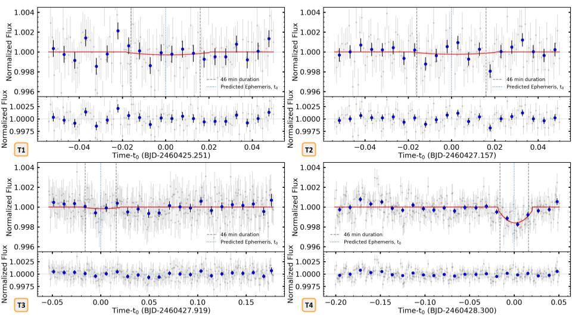
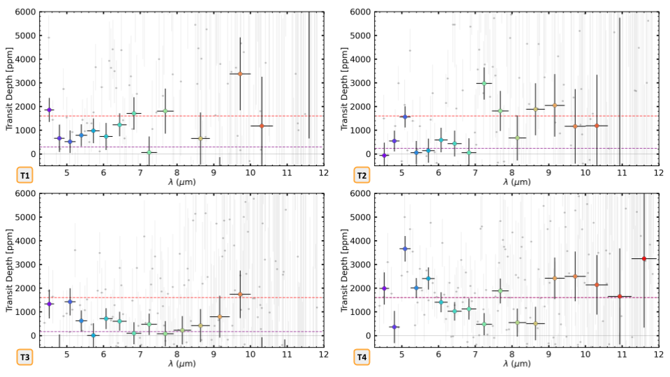
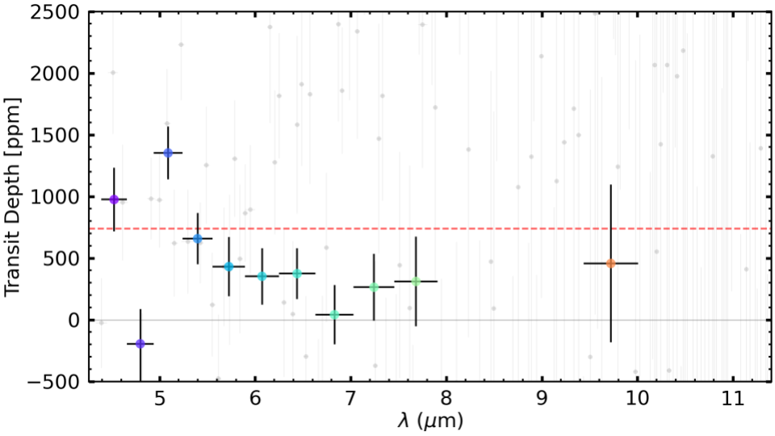

$\newcommand{\ensuremath}{}$
$\newcommand{\xspace}{}$
$\newcommand{\object}[1]{\texttt{#1}}$
$\newcommand{\farcs}{{.}''}$
$\newcommand{\farcm}{{.}'}$
$\newcommand{\arcsec}{''}$
$\newcommand{\arcmin}{'}$
$\newcommand{\ion}[2]{#1#2}$
$\newcommand{\textsc}[1]{\textrm{#1}}$
$\newcommand{\hl}[1]{\textrm{#1}}$
$\newcommand{\footnote}[1]{}$
$\newcommand{\vdag}{(v)^\dagger}$
$\newcommand$
$\newcommand$
$\newcommand{\red}{\textcolor{red}}$
$\newcommand{\NTT}[1]{\textcolor{NTT}{\bf[NTT: #1]}}$
$\newcommand{\PSUAA}{Department of Astronomy and Astrophysics, The Pennsylvania State University, University Park, PA, 16802, USA}$
$\newcommand{\PSUGS}{Department of Geosciences, The Pennsylvania State University, University Park, PA, 16802, USA}$
$\newcommand{\CEHW}{Center for Exoplanets and Habitable Worlds, The Pennsylvania State University, University Park, PA, 16802, USA}$
$\newcommand{\Wisc}{Department of Astronomy, University of Wisconsin-Madison, Madison, WI, USA}$
$\newcommand{\NASA}{NASA Goddard Space Flight Center, Greenbelt, MD, 20771, USA}$
$\newcommand{\ASU}{School of Earth and Space Exploration, Arizona State University, PO Box 876004, Tempe, 85287-6004, Arizona, USA}$
$\newcommand{\IMP}{Astrophysics Group, Imperial College London, Blackett Laboratory, Prince Consort Road, London SW7 2AZ, UK}$
$\newcommand{\Ox}{University of Oxford, Oxford, UK}$
$\newcommand{\MaxP}{Max-Planck-Institut für Astronomie, Königstuhl 17, D-69117 Heidelberg, Germany}$
$\newcommand{\Bern}{University of Bern}$
$\newcommand{\Dminn}{Department of Physics and Astronomy, University of Minnesota Duluth, Duluth, Minnesota 55812, USA}$
$\newcommand{\NOIR}{U.S. National Science Foundation National Optical-Infrared Astronomy Research Laboratory, 950 N. Cherry Ave., Tucson, AZ 85719, USA}$
$\newcommand{\columnsep}{5pt}$
$\newcommand{\arraystretch}{1.2}$

# A Disintegrating Rocky World Shrouded in Dust and Gas: Mid-IR Observations of K2-22b using JWST

<mark>Appeared on: 2025-01-15</mark> - 

N. Tusay, et al. -- incl., <mark>B. C. Estrada</mark>

**Abstract:** The disintegrating ultra-short period rocky exoplanet K2-22b periodically emits dusty clouds in a dynamically chaotic process resulting in a variable transit depth from 0--1.3 \% . The effluents that sublimate off the surface and condense out in space are probably representative of the formerly interior layers convectively transported to the molten surface. Transmission spectroscopy of these transiting clouds reveal spectral fingerprints of the interior composition of this rocky world. We used JWST’s Mid-Infrared Instrument (MIRI) as a low-resolution slitless spectrograph to observe four predicted transit windows for K2-22b. For each observation, we extracted a transmission spectrum over the spectral range of 4.3--11.8 $\mu$ m. We detect one transit at high significance and two at low significance. We find that the data 1) disfavor featureless, iron-dominated core material, 2) are consistent with some form of magnesium silicate minerals, likely from mantle material, and 3) show a distinct and unexpected feature at $\sim$ 5 $\mu$ m. The unexpected feature, also seen weakly in the low-significance transits, is consistent with some gas features, possibly NO and/or $CO_2$ . These findings warrant further study to improve the constraints on the composition of this disintegrating rocky world.

**Figure 4. -** MIRI LRS lightcurves for all 4 transit observations listed in Table \ref{tab:obs}. The unbinned data are greyed out in the background. The blue points are binned to a time resolution of 8 minutes. The red line is a 2nd order polynomial fit to transit 4 and scaled to the best fit value in each window. Multiple transit models were fit, including the original _K2_ lightcurve and a boxcar, with no significant difference. The 46 min transit duration calculated by [ and è (2015)]() is included as vertical gray dashed lines for reference. The uncertainties in the data points as reported by \texttt{Eureka!} were inflated to match the actual standard deviation in the baseline flux.
             (*fig:all4LCs*)

**Figure 2. -** \justifying Results from JWST Cycle 2 GO Program 3315.
\\\hspace{\textwidth}***Top***: Lightcurve of the second half of the phase curve, collected on April 28, 2024, showing a clear transit at the predicted ephemeris. The unbinned time series data is plotted in grey in the background. The blue points are binned to a time resolution of 8 minutes. The average 46-minute duration drawn from [ and è (2015)]() is shown as vertical dashed grey lines for reference. Since the transit duration incorporating the cloud of material is not precisely known and potentially variable with wavelength, the baseline flux was calculated from data outside the baseline boundaries set at $1.5\times$ the average 46-minute duration, centered at the ephemeris and shown as vertical dashed green lines. The red line is a 2nd order polynomial model fit to the data during transit and set to zero elsewhere. The residuals of the lightcurve model are shown in the bottom panel.
\\\hspace{\textwidth}\ ***Middle***: JWST MIRI spectrum showing a clear detection of a transit from 4.3-7 $\mu$m *except* at 4.8$\mu$m.
The unbinned JWST data for each channel is plotted in grey in the background. The binned JWST spectrum in the foreground has a constant spectral resolution of R=17.
The horizontal red dashed line shows the overall transit depth from the MIRI lightcurve in the top panel. The dotted curves show the spectra models of plausible gas species from the DACE database  ([Grimm, Malik and Kitzmann 2021]()) . The dashed curves show representative combinations of iron-magnesium-silicate species predicted by bodman2018inferring, [Owen, et. al (2024)](). The solid purple line shows a total opacity model representing a combination of these minerals and gases with features that plausibly correspond to features in the data.
CHEOPS photometry is also shown over its 0.33-1.1 $\mu$m bandpass. The measured CHEOPS transit depth is consistent with the overall transit depth from the MIRI lightcurve.
\\\hspace{\textwidth}\ ***Bottom Insets***: The lightcurve and transit models in two channels that illustrate an unexpected spectrum feature with the most significance at $\sim$5 $\mu$m. A flat spectrum is disfavored ($\Delta \chi_\nu^2 = 2.98$, or $3.7\sigma$). The unexpected feature at 5.1$\mu$m, consistent with nitric oxide (NO) gas is clearly detected, in contrast to a clear non-detection at 4.8$\mu$m (see Figure \ref{fig:Ices}).
 (*spectrum*)

**Figure 7. -** MIRI spectra during all four expected transits using the 2-degree transit model from transit 4, scaled to the optimal depth in each channel for each transit.
            \\\hspace{\textwidth}*Top:* Individual spectra during each transit window. The red dashed line marks the overall transit depth in T4. The purple dashed line indicates the overall transit depth in each observation as measured from the white-light lightcurves. The white-light time series of transit 4 shows a clear signal, while the others do not (see Figure \ref{fig:all4LCs}).
            However, the most or second most significant detections in T1, T2 and T3 are in the 4.5 and 5.1 $\mu$m channels, supporting the reality of these narrow features observed at modest significance in T4.
            \\\hspace{\textwidth}*Bottom:* Combined spectra of all four transits. The 4.5 and 5.1 $\mu$m features are clearly evident.
             (*fig:4spectra*)

