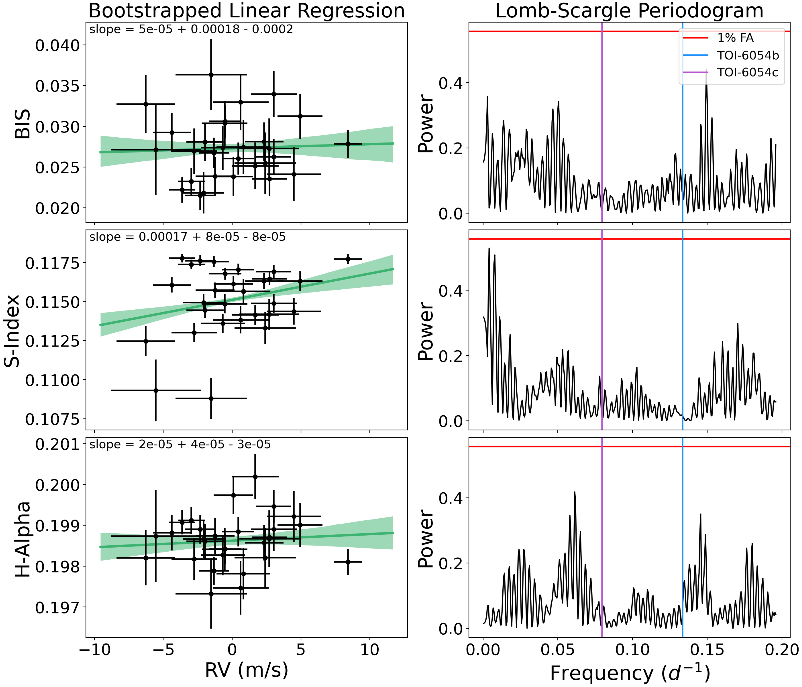
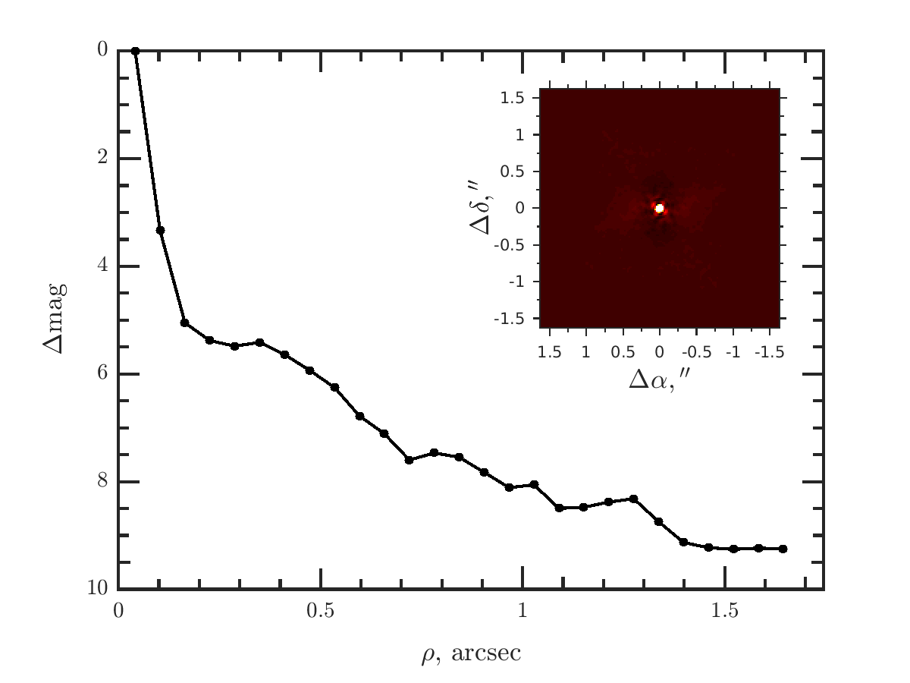
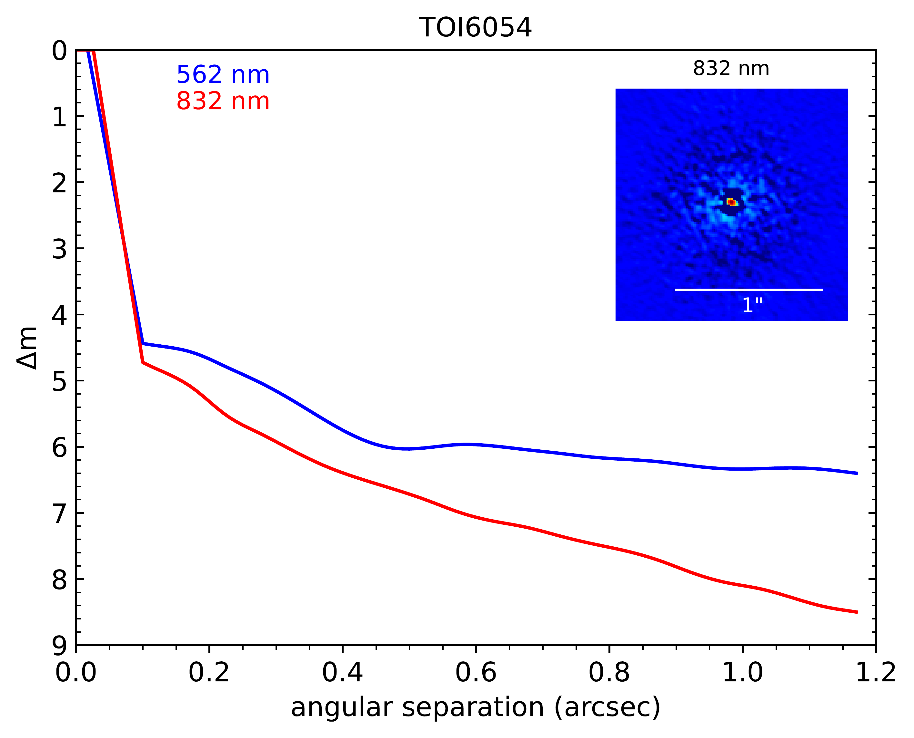

$\newcommand{\ensuremath}{}$
$\newcommand{\xspace}{}$
$\newcommand{\object}[1]{\texttt{#1}}$
$\newcommand{\farcs}{{.}''}$
$\newcommand{\farcm}{{.}'}$
$\newcommand{\arcsec}{''}$
$\newcommand{\arcmin}{'}$
$\newcommand{\ion}[2]{#1#2}$
$\newcommand{\textsc}[1]{\textrm{#1}}$
$\newcommand{\hl}[1]{\textrm{#1}}$
$\newcommand{\footnote}[1]{}$
$\newcommand{\um}{\mum}$
$\newcommand{\water}{H_2O}$
$\newcommand{\methane}{CH_4}$
$\newcommand{\ammonia}{NH_3}$
$\newcommand{\carbondiox}{CO_2}$

# A Pair of Dynamically Interacting Sub-Neptunes Around TOI-6054

<mark>Appeared on: 2025-01-17</mark> -  _23 pages, 11 figures, submitted to AJ, partially updated with referee's comments_

M. A. Kroft, et al. -- incl., <mark>I. J. M. Crossfield</mark>, <mark>L. Kreidberg</mark>

**Abstract:** We confirm the planetary nature of a pair of transiting sub-Neptune exoplanets orbiting the bright F-type sub-giant star TOI-6054 ( $V=8.02$ , $K=6.673$ ) as a part of the OrCAS radial velocity survey using WIYN/NEID observations. We find that TOI-6054b and TOI-6054c have radii of $2.65 \pm 0.15$ $R_{\oplus}$ and $2.81 \pm 0.18$ $R_{\oplus}$ , respectively, and masses of $12.4 \pm 1.7$ $M_{\oplus}$ and $9.2 \pm 2.0$ $M_{\oplus}$ . The planets have zero-albedo equilibrium temperatures of $1360 \pm 33$ K and $1144 \pm 28$ K. The host star has expanded and will evolve off of the Main Sequence within the next $\sim$ 500 Myr, and the resulting increase in stellar luminosity has more than doubled the stellar flux the two planets receive compared to the start of the host star's main sequence phase. Consequently, TOI-6054b may be losing some of its primordial H/He atmosphere -- if it has one. Based on dynamical simulations performed using the orbital parameters of the two planets, TOI-6054b, and TOI-6054c are very likely in a 5:3 mean motion resonance. The TOI-6054 system thus has the potential to be an excellent candidate for future atmospheric follow-up observations, with two similarly sized sub-Neptunes around a bright star. We also estimate that if TOI-6054b is currently losing its H/He atmosphere this should be observable from space and from the ground.

**Figure 3. -** _ Left Column_: BIS or stellar activity indices vs RV. The data are shown in black and the best fit bootstrapped linear regression model is shown in green with a 1$\sigma$ envelope. The best fit slope and its uncertainties are printed at the top of each plot. _ Right Column_: Lomb-Scargle periodograms, with the orbital frequencies of TOI-6054b and TOI-6054c shown in blue and purple respectively. The 1\% false alarm value is in red. The top row is the BIS, the middle row is the S-Index, and the bottom row is H$\alpha$-index. (*fig:bis_act*)

**Figure 1. -** _ Top_: Optical speckle imaging and sensitivity curves for the SAI observations, with a medium band filter centered on 625 nm. _ Center_: Optical speckle imaging and sensitivity curves for the Gemini observations. The 562 nm sensitivity is shown in blue, and the 832 nm sensitivity curve is shown in red. _ Bottom_: NIR AO imaging and sensitivity curves for the Palomar observations, in a narrowband Kcont filter centered on 2.29 $\mu$m. _ Insets_: The central portions of each image. (*fig:image*)

**Figure 6. -** The fits to the TESS light curves, with Sector 19 on the left and Sector 59 on the right. _ Top_: The raw PDCSAP SPOC data, and the best fit GP detrending model in green. _ Middle_: The detrended data, with the best fit transit models for TOI-6054b and TOI-6054c plotted in blue and purple, respectively. _ Bottom_: The residuals after subtracting the GP model and the transits. (*fig:det*)

