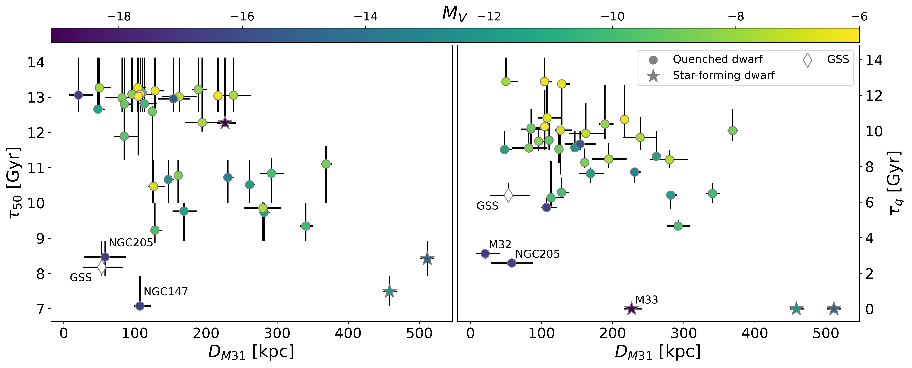
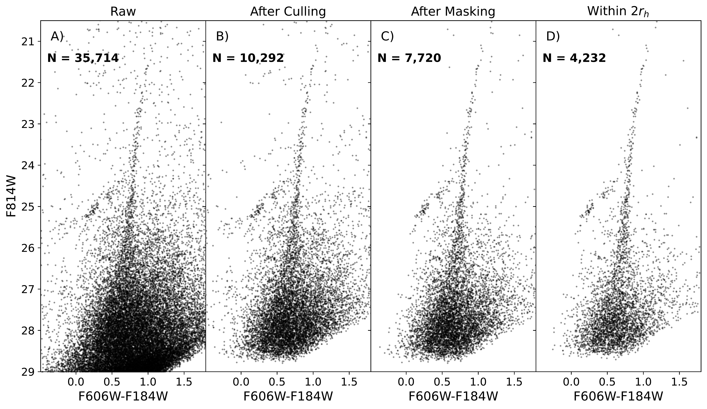

$\newcommand{\ensuremath}{}$
$\newcommand{\xspace}{}$
$\newcommand{\object}[1]{\texttt{#1}}$
$\newcommand{\farcs}{{.}''}$
$\newcommand{\farcm}{{.}'}$
$\newcommand{\arcsec}{''}$
$\newcommand{\arcmin}{'}$
$\newcommand{\ion}[2]{#1#2}$
$\newcommand{\textsc}[1]{\textrm{#1}}$
$\newcommand{\hl}[1]{\textrm{#1}}$
$\newcommand{\footnote}[1]{}$
$\newcommand{\vdag}{(v)^\dagger}$
$\newcommand$
$\newcommand$
$\newcommand$
$\newcommand$
$\newcommand$
$\newcommand{\A}[1]{And~{\sc #1}}$
$\newcommand{\refs}{\textbf{REFS}}$

# The Hubble Space Telescope Survey of M31 Satellite Galaxies IV. \ Survey Overview and Lifetime Star Formation Histories

<mark>Appeared on: 2025-01-24</mark> -  _Accepted for publication on ApJ. 47 pages, 24 figures, 12 tables. Corresponding HLSP data can be retrieved at: this https URL_

A. Savino, et al. -- incl., <mark>N. Martin</mark>

**Abstract:** From $>1000$ orbits of HST imaging, we present deep homogeneous resolved star color-magnitude diagrams that reach the oldest main sequence turnoff and uniformly measured star formation histories (SFHs) of 36 dwarf galaxies ( $-6 \ge M_V \ge -17$ ) associated with the M31 halo, and for 10 additional fields in M31, M33, and the Giant Stellar Stream.From our SFHs we find: i) the median stellar age and quenching epoch of M31 satellites correlate with galaxy luminosity and galactocentric distance. Satellite luminosity and present-day distance from M31 predict the satellite quenching epoch to  within $1.8$ Gyr at all epochs. This tight relationship highlights the fundamental connection between satellite halo mass, environmental history, and star formation duration. ii) There is no difference between the median SFH of galaxies on and off the great plane of Andromeda satellites. iii) $\sim50$ \% of our M31 satellites show prominent ancient star formation ( $>12$ Gyr ago) followed by delayed quenching ( $8-10$ Gyr ago), which is not commonly observed among the MW satellites. iv) A comparison withTNG50 and FIRE-2 simulated satellite dwarfs around M31-like hosts show that some of these trends (dependence of SFH on satellite luminosity) are reproduced in the simulations while others (dependence of SFH on galactocentric distance, presence of the delayed-quenching population) are weaker or absent. We provide all photometric catalogs and SFHs as High-Level Science Products on MAST.

**Figure 14. -** Median star formation epoch ($\tau_{50}$, left), and quenching epoch ($\tau_{q}$, right) as function of distance from M31 (taken from \citealt{Savino22}). The symbols are color-coded by the value of absolute luminosity. Star forming galaxies are shown as star symbols. Notable outliers from the general trend are highlighted by their name. (*Fig:Tq_DM31*)

**Figure 8. -** The ACS CMD of $\A${XI}($M_V = -6.4$), at different steps of our contaminant cleaning procedure. A) Raw photometric catalog, as output from DOLPHOT. B) Photometric catalog, after the quality cuts of \S \ref{Sec:Culling} have been applied. C) Photometric catalog, after the bright-star mask (\S \ref{Sec:Masks}) has been applied. D) Final photometric catalog, after the spatial cut of \S \ref{Sec:SpatialCut} has been applied.  (*Fig:Culling*)

**Figure 12. -** Cumulative SFHs for the 36 dwarf galaxies in our sample, measured from the ACS fields. The black line shows the best-fit SFH, the yellow region show the statistical uncertainties and the grey region show the systematic uncertainties. The epoch of reionization is highlighted by the red shaded region \citep[$6 < z < 10$, corresponding to $13.33 Gyr < t < 12.87 Gyr$ with Planck cosmological parameters,][]{Planck20,Robertson22}. The galaxies are ordered by absolute luminosity. (*Fig:SFHs*)

