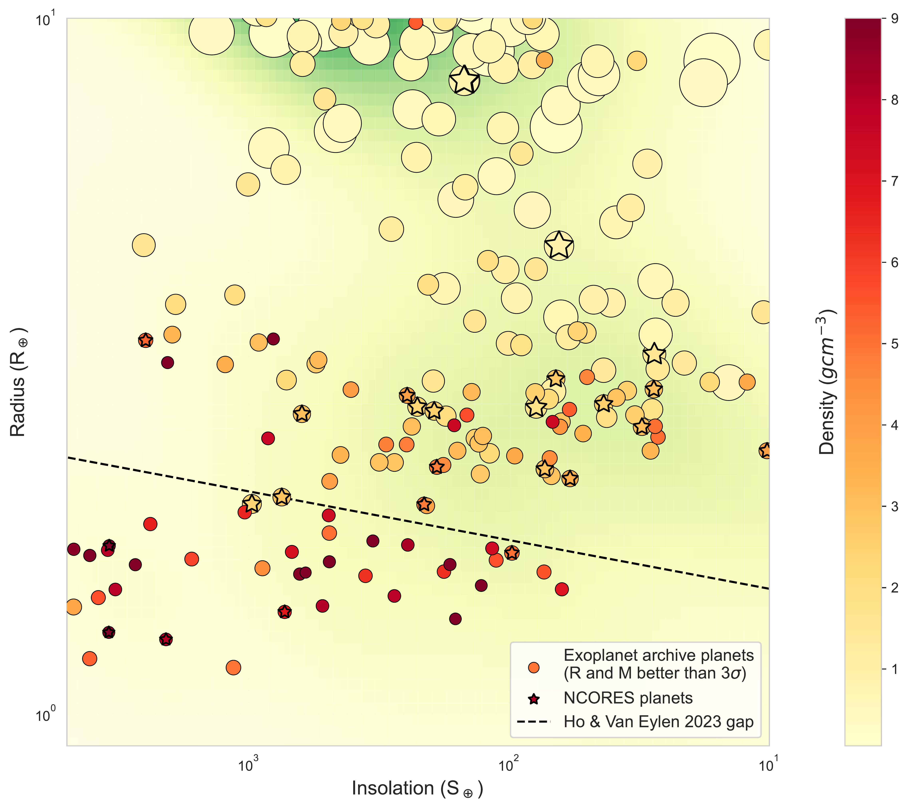

$\newcommand{\ensuremath}{}$
$\newcommand{\xspace}{}$
$\newcommand{\object}[1]{\texttt{#1}}$
$\newcommand{\farcs}{{.}''}$
$\newcommand{\farcm}{{.}'}$
$\newcommand{\arcsec}{''}$
$\newcommand{\arcmin}{'}$
$\newcommand{\ion}[2]{#1#2}$
$\newcommand{\textsc}[1]{\textrm{#1}}$
$\newcommand{\hl}[1]{\textrm{#1}}$
$\newcommand{\footnote}[1]{}$
$\newcommand{\kms}{km s^{-1}}$
$\newcommand{\ms}{m s^{-1}}$
$\newcommand{\mss}{\mbox{m s^{-2}}}$
$\newcommand{\masy}{mas yr^{-1}}$
$\newcommand{\mpl}{\mbox{M_{p}}}$
$\newcommand{\rpl}{\mbox{R_{p}}}$
$\newcommand{\mstar}{\mbox{M_{\star}}}$
$\newcommand{\rstar}{\mbox{R_{\star}}}$
$\newcommand{\mjup}{\mbox{M_{\rm Jup}}}$
$\newcommand{\rjup}{\mbox{R_{\rm Jup}}}$
$\newcommand{\msun}{\mbox{M_{\odot}}}$
$\newcommand{\rsun}{\mbox{R_{\odot}}}$
$\newcommand{\rearth}{R_{\oplus}}$
$\newcommand{\mearth}{M_{\oplus}}$
$\newcommand{\gccc}{g cm^{-3}}$
$\newcommand{\ergscm}{erg s^{-1}cm^{-2}}$
$\newcommand{\vsini}{v\sin{i}}$
$\newcommand{\teff}{T_{\rm eff}}$
$\newcommand{\feh}{\mbox{\rm[Fe/H]}}$
$\newcommand{\ymg}{\mbox{\rm[Y/Mg]}}$
$\newcommand{\logg}{\log g}$
$\newcommand{\rprs}{\mbox{R_{p}/R_{s}}}$
$\newcommand{\vdag}{(v)^\dagger}$
$\newcommand{\jv}{\textcolor[RGB]{200,20,50}}$
$\newcommand{\arraystretch}{1.3}$
$\newcommand{\thebibliography}{\DeclareRobustCommand{\VAN}[3]{##3}\VANthebibliography}$

# The NCORES Program: Precise planetary masses, null results, and insight into the planet mass distribution near the radius gap$\thanks{Based on observations collected at the European Southern Observatory under ESO programme 1102.C-0249 (PI: Armstrong). This paper includes data gathered with the 6.5 meter Magellan Telescopes located at Las Campanas Observatory, Chile.}$

<mark>Appeared on: 2025-01-27</mark> -  _Accepted to MNRAS_

D. J. Armstrong, et al. -- incl., <mark>R. Burn</mark>

**Abstract:** NCORES was a large observing program on the ESO HARPS spectrograph, dedicated to measuring the masses of Neptune-like and smaller transiting planets discovered by the _TESS_ satellite using the radial velocity technique. This paper presents an overview of the programme, its scientific goals and published results, covering 35 planets in 18 planetary systems. We present spectrally derived stellar characterisation and mass constraints for five additional TOIs where radial velocity observations found only marginally significant signals (TOI-510.01, $M_p = 1.08^{+0.58}_{-0.55}M_\oplus$ ), or found no signal (TOIs 271.01, 641.01, 697.01 and 745.01). A newly detected non-transiting radial velocity candidate is presented orbiting TOI-510 on a 10.0d orbit, with a minimum mass of $4.82^{+1.29}_{-1.26}M_\oplus$ , although uncertainties on the system architecture and true orbital period remain. Combining the NCORES sample with archival known planets we investigate the distribution of planet masses and compositions around and below the radius gap, finding that the population of planets below the gap is consistent with a rocky composition and ranges up to a sharp cut-off at $10M_\oplus$ . We compare the observed distribution to models of pebble- and planetesimal-driven formation and evolution, finding good broad agreement with both models while highlighting interesting areas of potential discrepancy. Increased numbers of precisely measured planet masses in this parameter space are required to distinguish between pebble and planetesimal accretion.

**Figure 1. -** _TESS_ field of view around TOI-510 in Sector 6, generated with \texttt{tpfplotter}. Known stars from Gaia are shown as red circles. TOI-510 is marked by a white cross. The _TESS_ photometric aperture is highlighted in red. (*fig:tpf510*)

**Figure 20. -** Radial velocity data for TOI-271, TOI-641, TOI-697 and TOI-745, phase folded on the period from the joint model. Random models from the MCMC trace are shown in orange. The model best matching the 95\% confidence limit on semi-amplitude is shown in red to highlight the limit we place on candidate planet mass. (*fig:rvnulls*)

**Figure 11. -** Planets with known mass and radius determined to better than $3\sigma$ plotted in Insolation-Radius space, coloured and inversely scaled in size by their density. Only planets with host star mass $M_*>0.7M_\odot$ are shown. The radius gap location determined in \citet{Ho:2023ab} is shown as a black dashed line. The background is coloured by a kernel density estimate of the planets shown. The diversity of sub-Neptune composition above the gap can be seen in the range of densities observed in this region. (*fig:SRplot*)

