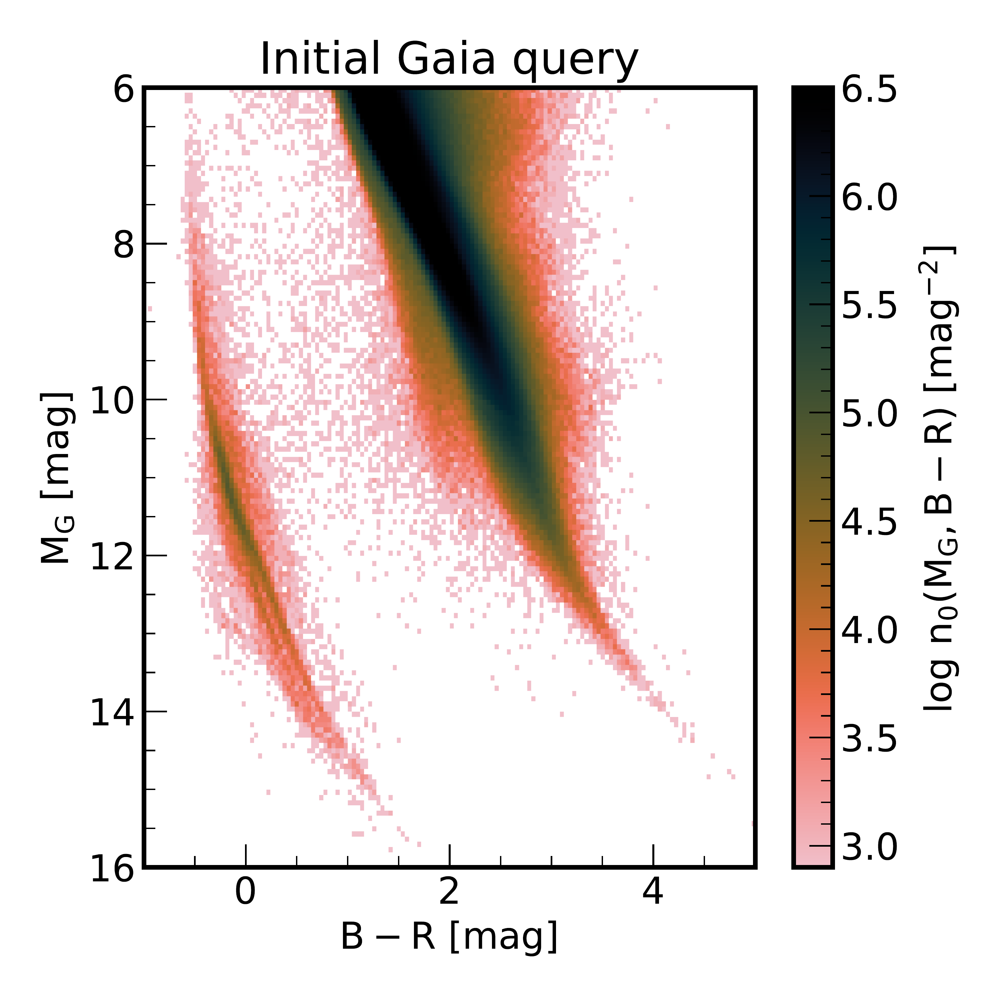
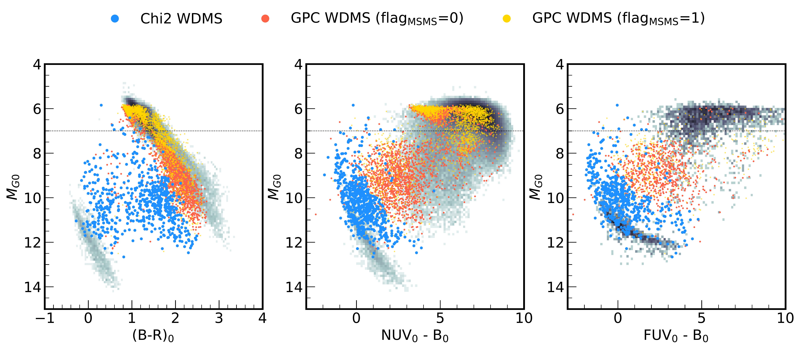

$\newcommand{\ensuremath}{}$
$\newcommand{\xspace}{}$
$\newcommand{\object}[1]{\texttt{#1}}$
$\newcommand{\farcs}{{.}''}$
$\newcommand{\farcm}{{.}'}$
$\newcommand{\arcsec}{''}$
$\newcommand{\arcmin}{'}$
$\newcommand{\ion}[2]{#1#2}$
$\newcommand{\textsc}[1]{\textrm{#1}}$
$\newcommand{\hl}[1]{\textrm{#1}}$
$\newcommand{\footnote}[1]{}$
$\newcommand{\vdag}{(v)^\dagger}$
$\newcommand$
$\newcommand$
$\newcommand{\photmoh}{[M/H]_{\rm phot}}$
$\newcommand{\teff}{T_{\mathrm{eff}}}$
$\newcommand{\logg}{\log g}$
$\newcommand{\moh}{[M/H]}$
$\newcommand{\msun}{M_{\odot}}$
$\newcommand{\singlechi}{\chi^2_{\mathrm{single}}}$
$\newcommand{\binarychi}{\chi^2_{\mathrm{WDMS}}}$
$\newcommand{\jd}[1]{\textcolor{blue}{JD:~#1}}$
$\newcommand{\hw}[1]{\textcolor{purple}{HW:~#1}}$
$\newcommand{\gaia}{\textsl{Gaia}}$

# Identification of 30,000 White Dwarf-Main Sequence binaries candidates from Gaia DR3 BP/RP(XP) low-resolution spectra

<mark>Appeared on: 2025-01-27</mark> -  _30 pages, 12 figures, Submitted to ApJS_

<mark>J. Li</mark>, et al. -- incl., <mark>H.-W. Rix</mark>, <mark>J. Müller-Horn</mark>, <mark>R. Seeburger</mark>

**Abstract:** White dwarf-main sequence (WDMS) binary systems are essential probes for understanding binary stellar evolution and play a pivotal role in constraining theoretical models of various transient phenomena.In this study, we construct a catalog of WDMS binaries using Gaia DR3's low-resolution BP/RP (XP) spectra.Our approach integrates a model-independent neural network for spectral modelling with Gaussian Process Classification to accurately identify WDMS binaries among over 10 million stars within 1 kpc.This study identify approximately 30,000 WDMS binary candidates, including 1,700 high-confidence systems confirmed through spectral fitting.Our technique is shown to be effective at detecting systems where the main-sequence star dominates the spectrum - cases that have historically challenged conventional methods.Validation using GALEX photometry reinforces the reliability of our classifications: 70 \% of candidates with an absolute magnitude $M_{G} > 7$ exhibit UV excess, a characteristic signature of white dwarf companions.Our all-sky catalog of WDMS binaries expands the available dataset for studying binary evolution and white dwarf physics and sheds light on the formation of WDMS.

**Figure 6. -** CMD showing the distribution of WDMS binary candidates identified through $\chi^2$ fitting of XP spectra (red dots).
    The background grayscale shows the density distribution of all stars, with the scale bar indicating the logarithmic number of stars per bin.
    The x-axis shows the de-reddened $\gaia$ color (B-R)$_0$, while the y-axis shows the absolute G magnitude ($M_{G0}$) after extinction correction.
    The 10 cyan stars are examples of the $\chi^2$ selected WDMS binaries, the yellow lines show the best fit spectral decomposition of a WD and an MS by XP spectra.
    The binary candidates primarily occupy the region between the main sequence (right) and white dwarf sequence (left), as expected for composite systems.
    The blue dotted line denotes the requirements of the WD component of a binary model fit, which should lie to the left of this line as in the WD regime. (*fig:hrd_wdmsfit*)

**Figure 3. -** 
    Left: Color-magnitude diagram (CMD) showing the density distribution of stars of selected $\gaia$  data, with absolute G-band magnitude ($M_G$) plotted against $B_p$-$R_p$ color (B-R).
    Middle: Extinction-corrected CMD for the stars displayed in the left panel, accounting for interstellar reddening.
    Right: The CMD showing the distribution of stars in our sample within $\sim$300 pc that passed our initial cleaning for training the spectral emulator.
    The blue dotted line represents a PARSEC isochrone for [M/H]$= 0.5$,  which serves as an upper boundary for selecting single main sequence stars.
    The blue dashed line is a hard cut to select white dwarf stars.  (*fig:initial query*)

**Figure 11. -** 
   Comparison of WDMS binary candidates selected by different methods in various CMDs.
   Left panel: $\gaia$ CMD showing absolute G magnitude versus de-reddened B-R color.
   Middle and right panels: GALEX-Gaia CMD using NUV and FUV bands, respectively.
   In all panels, blue dots represent WDMS binaries identified through $\chi^2$-fitting of their XP spectra (\texttt{Chi2} sample in Table \ref{tab:sample_stats}), while red dots show WDMS candidates identified by our Gaussian Process Classifier (GPC) (\texttt{QC} sample) but missed by the \texttt{Chi2} sample.
   Yellow dots mark possible MSMS binaries (\texttt{flag$_{\rm MSMS}$}=1), mostly brighter than the dotted line at $M_{G0} = 7$.
   The underlying grey points show the single stars, as defined by the GPC with $P_{\rm WDMS}<0.2$.
    (*fig:galex*)

