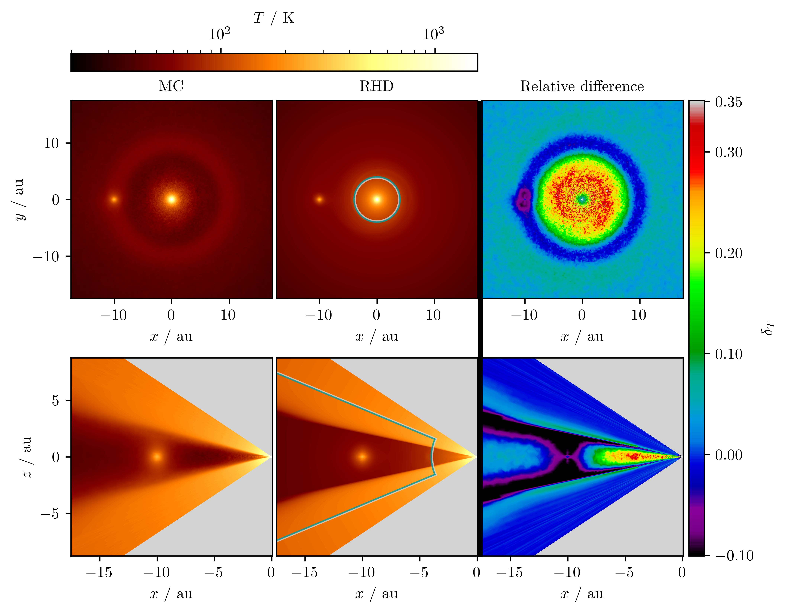

$\newcommand{\ensuremath}{}$
$\newcommand{\xspace}{}$
$\newcommand{\object}[1]{\texttt{#1}}$
$\newcommand{\farcs}{{.}''}$
$\newcommand{\farcm}{{.}'}$
$\newcommand{\arcsec}{''}$
$\newcommand{\arcmin}{'}$
$\newcommand{\ion}[2]{#1#2}$
$\newcommand{\textsc}[1]{\textrm{#1}}$
$\newcommand{\hl}[1]{\textrm{#1}}$
$\newcommand{\footnote}[1]{}$
$\newcommand{\mdIV}{\texttt{D+IV}}$
$\newcommand{\mdI}{\texttt{D+I}}$
$\newcommand{\mdInu}{\texttt{D+I\nu}}$
$\newcommand{\mdIkappa}{\texttt{D+I\kappa}}$
$\newcommand{\mdV}{\texttt{D+V}}$
$\newcommand{\temprt}{T_{\rm MC}}$
$\newcommand{\temphd}{T_{\rm RHD}}$
$\newcommand{\quotes}[1]{"#1"}$
$\newcommand{\hubert}[1]{\blue{[HK:{\it #1}]}}$
$\newcommand{\david}[1]{\blue{[David:{#1}]}}$
$\newcommand{\anton}[1]{\purple{[Anton:{#1}]}}$
$\newcommand\blue{#1}$
$\newcommand\purple{#1}$

# Monte Carlo post-processing for radiation hydro simulations of accreting planets in protoplanetary disks

<mark>Appeared on: 2025-01-28</mark> -  _Accepted for publication in A&A, 31 pages, 28 figures, 2 tables_

A. Krieger, <mark>H. Klahr</mark>, J. D. M. Fuksman, S. Wolf

**Abstract:** This paper is part of a series investigating the observational appearance of planets accreting from their nascent protoplanetary disk (PPD). We evaluate the differences between gas temperature distributions determined in our radiation hydrodynamical (RHD) simulations and those recalculated via post-processing with a Monte Carlo (MC) radiative transport (RT) scheme. Our MCRT simulations were performed for global PPD models, each composed of a local 3D high-resolution RHD model embedded in an axisymmetric global disk simulation.    We report the level of agreement between the two approaches and point out several caveats that prevent a perfect match between the temperature distributions with our respective methods of choice.    Overall, the level of agreement is high, with a typical discrepancy between the RHD and MCRT temperatures of the high-resolution region of only about 10 percent. The largest differences were found close to the disk photosphere, at the transition layer between optically dense and thin regions, as well as in the far-out regions of the PPD, occasionally exceeding values of 40 percent.    We identify several reasons for these discrepancies, which are mostly related to general features of typical radiative transfer solvers used in hydrodynamical simulations (angle- and frequency-averaging and ignored scattering) and MCRT methods (ignored internal energy advection and compression and expansion work). This provides a clear pathway to reduce systematic temperature inaccuracies in future works.    Based on MCRT simulations, we finally determined the expected error in flux estimates, both for the entire PPD and for planets accreting gas from their ambient disk, independently of the amount of gas piling up in the Hill sphere and the used model resolution.

**Figure 13. -** Cuts through the temperature distributions derived by the MCRT (left column) and RHD simulations (central column) and their relative differences $\delta_T$(right column). The upper and lower rows show results for the midplane and a vertical cut through it at the azimuthal position of the planet, respectively. The color bar for the temperature distributions (relative differences) is displayed above (to the right). Additionally, the high-resolution and the low-resolution regions are divided by a green-gray line that is shown in the plots of the RHD simulations (i.e., in the central column). Here, the high-resolution (low-resolution) region is located on the green (gray) side of the line.  (*fig:temp*)

**Figure 19. -** Relative flux difference maps for models based on the resolution \texttt{N1} that simulate a $300 {\rm M}_\oplus$(upper row) or $10 {\rm M}_\oplus$(lower row) planet when assuming observing wavelengths in the VIS (left column), NIR (central column), or submm (right column) range. For the purpose of better comparability, the color bar has been clipped. (*fig:flux_reldiff_N1*)

**Figure 3. -** Relative temperature differences between RHD and MCRT simulations of the reference model. Top: Normalized histogram. Center: Scatter plot for derived RHD temperatures and corresponding relative temperature differences. Bottom: Scatter plot for derived RHD gas densities and corresponding relative temperature differences. Data for the high-resolution (Hill) region is color coded in blue (red). The mean and std of the displayed distributions are indicated in the top-right corner. Labels in the scatter plots mark areas that roughly correspond to the following regions: the midplane (indicated by the letter $\quotes${M}), the gap ($\quotes${G}), and the photosphere and higher layers ($\quotes${P}). (*fig:histogram*)

