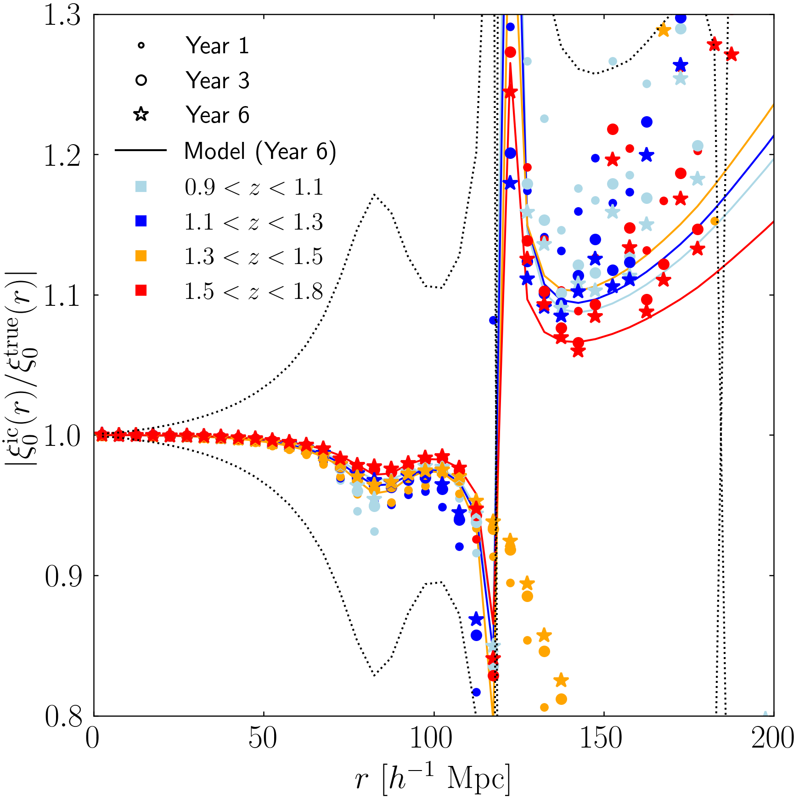

$\newcommand{\ensuremath}{}$
$\newcommand{\xspace}{}$
$\newcommand{\object}[1]{\texttt{#1}}$
$\newcommand{\farcs}{{.}''}$
$\newcommand{\farcm}{{.}'}$
$\newcommand{\arcsec}{''}$
$\newcommand{\arcmin}{'}$
$\newcommand{\ion}[2]{#1#2}$
$\newcommand{\textsc}[1]{\textrm{#1}}$
$\newcommand{\hl}[1]{\textrm{#1}}$
$\newcommand{\footnote}[1]{}$
$\newcommand{\nc}{\newcommand}$
$\newcommand{\orcid}[1]$
$\newcommand$

# $\Euclid$ preparation. 3-dimensional galaxy clustering in configuration space Part \textrm{I}: 2-point correlation function estimation

<mark>Appeared on: 2025-01-29</mark> -  _17 pages, 13 figures, submitted to A&A_

E. Collaboration, et al. -- incl., <mark>K. Jahnke</mark>

**Abstract:** The 2-point correlation function of the galaxy spatial distribution is a major cosmological observable that enables constraints on the dynamics and geometry of the Universe. The $\Euclid$ mission aims at performing an extensive spectroscopic survey of approximately 20--30 million H $\alpha$ -emitting galaxies up to about redshift two. This ambitious project seeks to elucidate the nature of dark energy by mapping the 3-dimensional clustering of galaxies over a significant portion of the sky. This paper presents the methodology and software developed for estimating the 3-dimensional 2-point correlation function within the Euclid Science Ground Segment. The software is designed to overcome the significant challenges posed by the large and complex $\Euclid$ data set, which involves millions of galaxies. Key challenges include efficient pair counting, managing computational resources, and ensuring the accuracy of the correlation function estimation. The software leverages advanced algorithms, including kd-tree, octree, and linked-list data partitioning strategies, to optimise the pair-counting process. These methods are crucial for handling the massive volume of data efficiently. The implementation also includes parallel processing capabilities using shared-memory open multi-processing to further enhance performance and reduce computation times. Extensive validation and performance testing of the software are presented. Those have been performed by using various mock galaxy catalogues to ensure that it meets the stringent accuracy requirement of the $\Euclid$ mission. The results indicate that the software is robust and can reliably estimate the 2-point correlation function, which is essential for deriving cosmological parameters with high precision. Furthermore, the paper discusses the expected performance of the software during different stages of the Euclid Wide Survey observations and forecasts how the precision of the correlation function measurements will improve over the mission's timeline, highlighting the software's capability to handle large data sets efficiently.

**Figure 2. -** Runtimes for the calculation of the multipole correlation of galaxies obtained from the ELM mock. The times are expressed in CPU-hour and as a function of the data or random catalogue size. The various symbols represent the time spent on the data structure construction, DD calculation, DR calculation, RR calculation, and the overall 2PCF runtime with and without random split option. The DR calculation times are provided as a function of the number of objects in the data catalogue and assuming a fifty times larger random catalogue. The different curves represent the runtimes obtained with the linked-list (solid), kd-tree (dashed), and octree (dotted) algorithms. The blue vertical band shows the range of expected number densities in the spectroscopic sample at redshifts within $0.9<z<1.8$. The abscissa refers to the number of object in the data catalogue except for RR calculation where it refers to the that in the random catalogue. (*fig:runtimes*)

**Figure 8. -** Monopole correlation function estimated from the FGM mock for galaxies with $\mathrm{H}\alpha$ flux above $2\times10^{-16} \mathrm{erg}  \mathrm{s}^{-1} \mathrm{cm}^{-2}$ at different epochs of observations. The different colours show the monopole in the redshift intervals: $0.9<z<1.1$, $1.1<z<1.3$, $1.3<z<1.5$,$1.5<z<1.8$. (*fig:xi0*)

**Figure 12. -** Impact of the integral constraint on the monopole correlation function in the Euclid Wide Survey. The curves with the different different symbols show the absolute value of the ratio between the monopole correlation functions affected by integral constraint and true underlying one, after 1, 3, and 6 years of observation respectively. The solid curves show the same quantity for year 6 observations, but when the integral constraint effect is derived from a model correlation function. The different colours show this quantity for the redshift intervals: $0.9<z<1.1$, $1.1<z<1.3$,$1.3<z<1.5$,$1.5<z<1.8$. The dotted curves delineate the expected $1\sigma$ statistical uncertainty on the monopole correlation function in the completed Euclid Wide Survey. (*fig:ic*)

