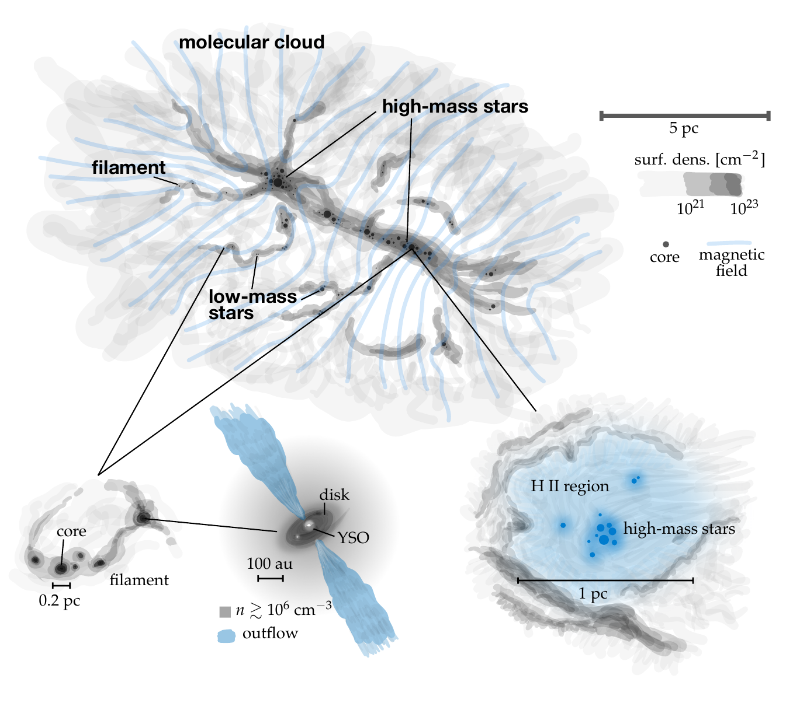
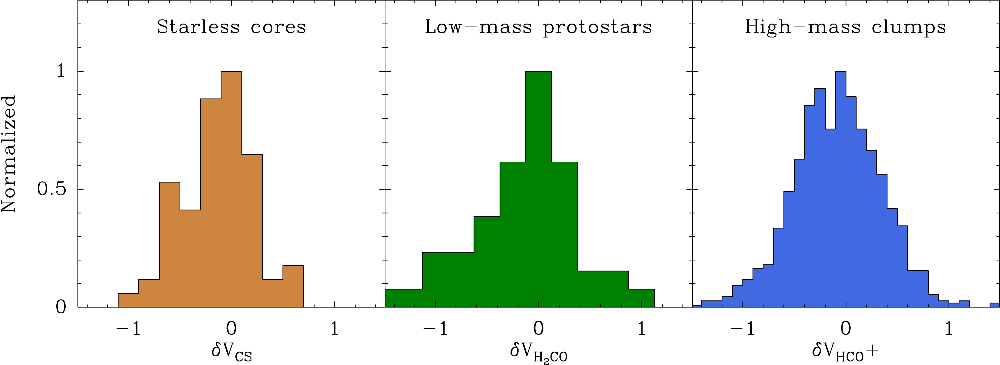

$\newcommand{\ensuremath}{}$
$\newcommand{\xspace}{}$
$\newcommand{\object}[1]{\texttt{#1}}$
$\newcommand{\farcs}{{.}''}$
$\newcommand{\farcm}{{.}'}$
$\newcommand{\arcsec}{''}$
$\newcommand{\arcmin}{'}$
$\newcommand{\ion}[2]{#1#2}$
$\newcommand{\textsc}[1]{\textrm{#1}}$
$\newcommand{\hl}[1]{\textrm{#1}}$
$\newcommand{\footnote}[1]{}$
$\newcommand{\MTnote}[1]{ {\color{red} [MT: ~#1]}}$
$\newcommand{\aj}{AJ}$
$\newcommand{\araa}{ARA\&A}$
$\newcommand{\apj}{ApJ}$
$\newcommand{\apjl}{ApJ}$
$\newcommand{\apjs}{ApJS}$
$\newcommand{\ao}{Appl.~Opt.}$
$\newcommand{\apss}{Ap\&SS}$
$\newcommand{\aap}{A\&A}$
$\newcommand{\aapr}{A\&A~Rev.}$
$\newcommand{\aaps}{A\&AS}$
$\newcommand{\azh}{AZh}$
$\newcommand{\baas}{BAAS}$
$\newcommand{\jrasc}{JRASC}$
$\newcommand{\memras}{MmRAS}$
$\newcommand{\mnras}{MNRAS}$
$\newcommand{\pra}{Phys.~Rev.~A}$
$\newcommand{\prb}{Phys.~Rev.~B}$
$\newcommand{\prc}{Phys.~Rev.~C}$
$\newcommand{\prd}{Phys.~Rev.~D}$
$\newcommand{\pre}{Phys.~Rev.~E}$
$\newcommand{\prl}{Phys.~Rev.~Lett.}$
$\newcommand{\pasp}{PASP}$
$\newcommand{\pasj}{PASJ}$
$\newcommand{\qjras}{QJRAS}$
$\newcommand{\skytel}{S\&T}$
$\newcommand{\solphys}{Sol.~Phys.}$
$\newcommand{\sovast}{Soviet~Ast.}$
$\newcommand{\ssr}{Space~Sci.~Rev.}$
$\newcommand{\zap}{ZAp}$
$\newcommand{\nat}{Nature}$
$\newcommand{\iaucirc}{IAU~Circ.}$
$\newcommand{\aplett}{Astrophys.~Lett.}$
$\newcommand{\apspr}{Astrophys.~Space~Phys.~Res.}$
$\newcommand{\bain}{Bull.~Astron.~Inst.~Netherlands}$
$\newcommand{\fcp}{Fund.~Cosmic~Phys.}$
$\newcommand{\gca}{Geochim.~Cosmochim.~Acta}$
$\newcommand{\grl}{Geophys.~Res.~Lett.}$
$\newcommand{\jcp}{J.~Chem.~Phys.}$
$\newcommand{\jgr}{J.~Geophys.~Res.}$
$\newcommand{\jqsrt}{J.~Quant.~Spec.~Radiat.~Transf.}$
$\newcommand{\memsai}{Mem.~Soc.~Astron.~Italiana}$
$\newcommand{\nphysa}{Nucl.~Phys.~A}$
$\newcommand{\physrep}{Phys.~Rep.}$
$\newcommand{\physscr}{Phys.~Scr}$
$\newcommand{\planss}{Planet.~Space~Sci.}$
$\newcommand{\procspie}{Proc.~SPIE}$

# Star formation from low to high mass:\ A comparative view

<mark>Appeared on: 2025-01-29</mark> -  _45 pages, 6 figures, accepted for Annual Reviews of Astronomy and Astrophysics_

<mark>H. Beuther</mark>, R. Kuiper, M. Tafalla

**Abstract:** * Qualitative differences between low- and high-mass star formation relate mainly to the radiative and ionizing feedback that occurs almost exclusively in regions forming high-mass stars. Nevertheless, accretion apparently can continue via disk structures in ionized accretion flows.\end{itemize}Finally, we discuss to what extent a unified picture of star formation over all masses is possible and which issues need to be addressed in the future.\end{minipage}$

**Figure 3. -** Comparison of core separations and average densities for example low-, intermediate and high-mass star-forming regions on the same physical scales. The left, middle and right panels show data in color and contours for B213 ($N_2$H$^+$(1--0), \citealt{tafalla2015}), IRDC 19175 ($N_2$H$^+$(1--0), \citealt{beuther2009}) and IRDC 18310-4 (1.1 mm continuum, \citealt{beuther2015}). Linear scale-bars and spatial resolution elements are shown to the left and top-right in each panel, respectively. (*jeans-length*)

**Figure 4. -** Sketch of a star formation complex encompassing low- and high-mass star formation. While the top-part presents a large, magnetized filamentary cloud with low- and high-mass star formation occurring in different density regimes, the insets in the bottom part outline sub-aspects. While cores, disks and jets can be found in low- and high-mass regions, the feedback processes exclusively stem from high-mass stars. The figure is inspired by observational and numerical data from \citet{grudic2022,soler2019,traficante2023,oliva2023b}, and a Hubble image of Orion (credit: NASA, C.R. O'Dell and S.K. Wong). The entire figure is created by André Oliva. (*sketch_summary*)

**Figure 2. -** Normalized histograms of the $\delta V$ parameter derived from
infall searches towards low-mass
starless cores (left panel, \citealt{lee2001}), low-mass
protostars (middle panel, \citealt{mardones1997}), and high-mass clumps
(right panel, \citealt{jackson2019}). All $\delta V$ estimates use
$N_2$H$^+$ as the thin tracer and the thick tracer indicated in the
abscissa label. Despite the large differences between their targets, the three
histograms present similar $\delta V$ distributions in terms of shape, width,
and slight excess of negative values (indicative of contraction motions). (*fig_deltav*)

