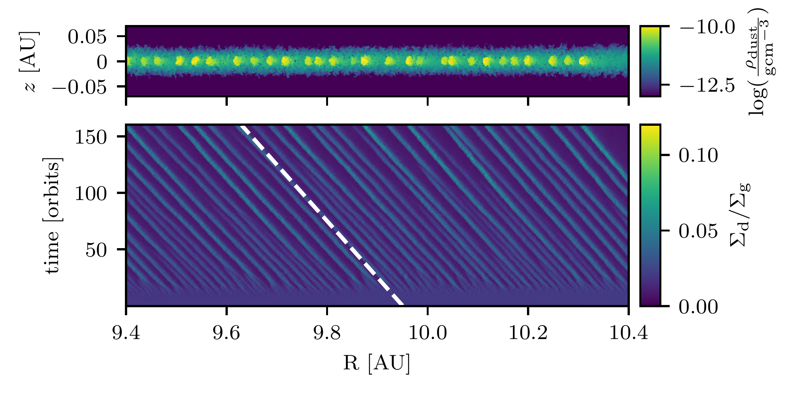
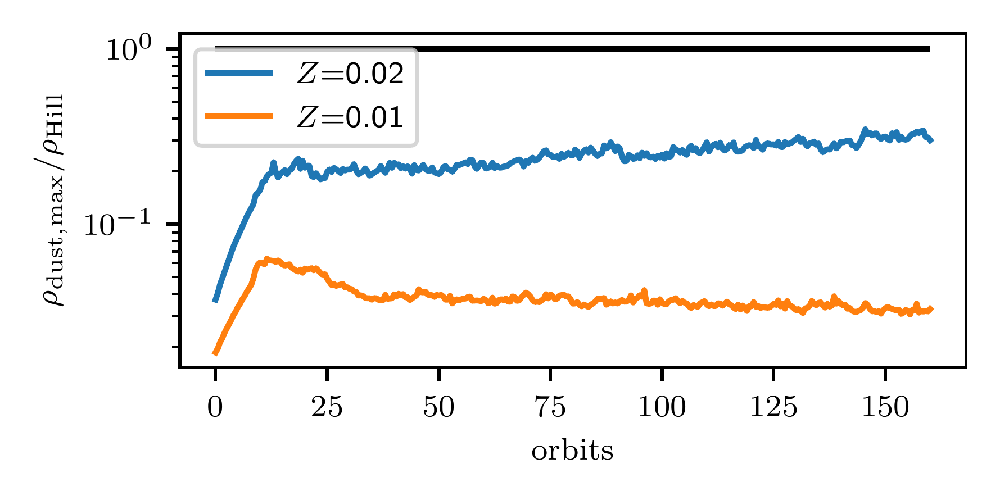

$\newcommand{\ensuremath}{}$
$\newcommand{\xspace}{}$
$\newcommand{\object}[1]{\texttt{#1}}$
$\newcommand{\farcs}{{.}''}$
$\newcommand{\farcm}{{.}'}$
$\newcommand{\arcsec}{''}$
$\newcommand{\arcmin}{'}$
$\newcommand{\ion}[2]{#1#2}$
$\newcommand{\textsc}[1]{\textrm{#1}}$
$\newcommand{\hl}[1]{\textrm{#1}}$
$\newcommand{\footnote}[1]{}$

# Strong clumping in global streaming instability simulations with a dusty fluid

<mark>Appeared on: 2025-01-31</mark> -  _7 pages, 6 figures_

<mark>D. Ostertag</mark>, <mark>M. Flock</mark>

**Abstract:** How planets form in protoplanetary disks and what drives the formation of their seeds is still a major unknown. It is an accepted theory that multiple processes can trap dusty material in radially narrow rings or vortex-like structures, preventing the dust from drifting inwards. However, the relevant process for clumping this dusty material until it collapses under gravity still needs to be identified. One promising candidate is the streaming instability arising from the aerodynamic interaction between dust and gas once they reach similar densities. We investigate with a global disk model based on recent observational constraints if streaming instability can form dust clumps, which might gravitationally collapse. Further, our goal is to verify the observability of the produced structures using ALMA or ngVLA. For the first time, we present global 2D ( $R,z$ ) hydrodynamic simulations using FARGO3D in which the dust is treated as a pressureless fluid. The disk model assumes stratification, realistic boundary conditions, and meaningful resolution to resolve the fast-growing modes. We choose two values for the total dust-to-gas mass ratio $Z=0.01$ and $Z=0.02$ , compare the maximum clump density to the local Hill density, and compute the optical depth of the dust disk. With a dust-to-gas mass ratio of $Z=0.01$ , we confirm previous streaming instability simulations, not showing the ability to form strong concentrations of dust clumps.With $Z=0.02$ , dense clumps form within 20 orbits, however reaching only 30 $\%$ of the Hill density even following disk parameters from the massive protoplanetary disks GM Aur, HD163296, IM Lup, MWC 480, and TW Hya, which all share an astonishing similar surface density profiles. Our results show that clumping by the streaming instability to trigger self-gravity is less efficient than previously thought, especially when applying more realistic density profiles. By extrapolating our results, we estimate the gravitational collapse of concentrated pebbles earliest at 480 orbits, while for more frequent, less massive, or more compact disks, this time can reach 1000 orbits.Our results predict that substructures caused by streaming instability can vary between optical thin and optical thick at ALMA Band 1 wavelength for less massive disks.However, the average clump separation is 0.03 au at 10 au distance to the star, far too small to be observable with ALMA and even ngVLA.For the currently observed disks and best-fit surface density profiles, we predict efficient planetesimal formation outside 10 au, where the ratio of Hill- and gas midplane density is sufficiently small. Our results suggest that even for massive Class II disks, the critical Hill density can be reached in dust concentrations during 480 - 1000 orbits, corresponding to tens or hundreds of thousands of years, depending on the radial position.

**Figure 3. -** Comparison between five midplane gas density profiles (grey) and their critical Hill densities (blue). For reference, the red dot indicates our work's central location and gas density. A similar plot, though with only one gas density profile, was already shown in [ and Klahr (2020)](). (*fig:densityProfileComparison*)

**Figure 1. -** Evolution of the disk with $\Sigma_{\mathrm{d}}/\Sigma_{\mathrm{g}}=0.02$. Top: 2D dust density after 160 orbits, bottom: Evolution of the surface density ratio over 160 orbits. The white dashed line shows the theoretical radial drift with a constant drift velocity of $v_{\mathrm{r, clump}}$ = \qty{30}{cm.s^{-1}}. (*fig:EvolutionDTGRatio_Z002*)

**Figure 2. -** Evolution of the maximum dust density between 9.4 and 10.4 au over 160 orbits for the considered simulations. The black line indicates the density ratio that clumps need to reach to collapse under their own gravity. The domain is chosen not to consider clumps that are an artifact from the outer boundary. (*fig:evolutionMaxDustDensity*)

