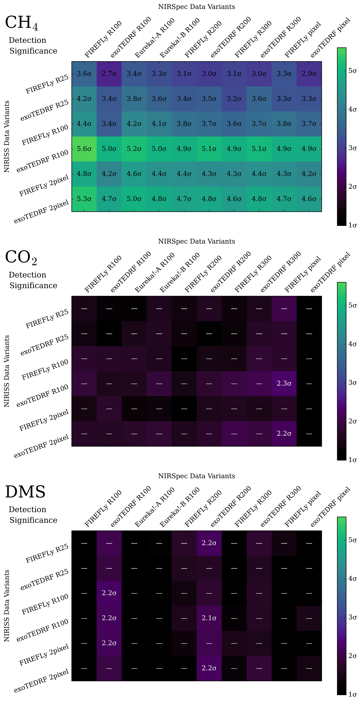
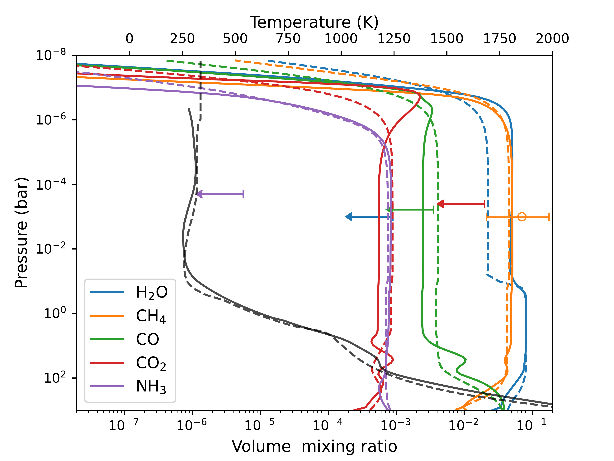
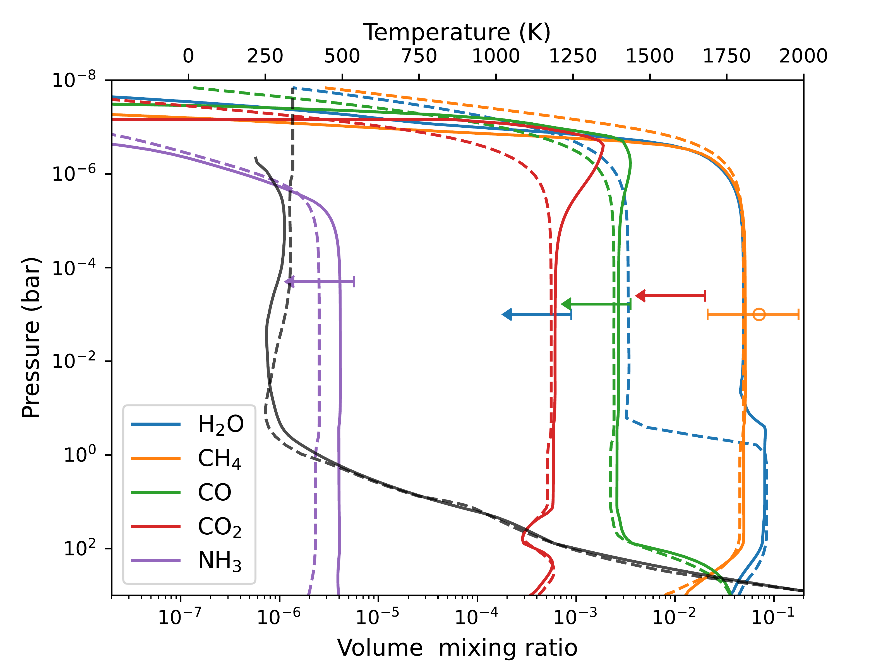

$\newcommand{\ensuremath}{}$
$\newcommand{\xspace}{}$
$\newcommand{\object}[1]{\texttt{#1}}$
$\newcommand{\farcs}{{.}''}$
$\newcommand{\farcm}{{.}'}$
$\newcommand{\arcsec}{''}$
$\newcommand{\arcmin}{'}$
$\newcommand{\ion}[2]{#1#2}$
$\newcommand{\textsc}[1]{\textrm{#1}}$
$\newcommand{\hl}[1]{\textrm{#1}}$
$\newcommand{\footnote}[1]{}$
$\newcommand{\vdag}{(v)^\dagger}$
$\newcommand$
$\newcommand$
$\newcommand{\eureka}{\texttt{Eureka!}\xspace}$

# A Comprehensive Reanalysis of K2-18 b's JWST NIRISS+NIRSpec Transmission Spectrum

<mark>Appeared on: 2025-01-31</mark> -  _42 pages, 20 figures. Submitted to AAS Journals_

S. P. Schmidt, et al. -- incl., <mark>E.-M. Ahrer</mark>

**Abstract:** $\noindent$ Sub-Neptunes are the most common type of planet in our galaxy. Interior structure models suggest that the coldest sub-Neptunes could host liquid water oceans underneath their hydrogen envelopes---sometimes called "hycean" planets. JWST transmission spectra of the $\sim$ 250 K sub-Neptune K2-18 b were recently used to report detections of $CH_4$ and $CO_2$ , alongside weaker evidence of ($CH_3$ ) $_2$ S (dimethyl sulfide, or DMS). Atmospheric $CO_2$ was interpreted as evidence for a liquid water ocean, while DMS was highlighted as a potential biomarker. However, these notable claims were derived using a single data reduction and retrieval modeling framework, which did not allow for standard robustness tests. Here we present a comprehensive reanalysis of K2-18 b's JWST NIRISS SOSS and NIRSpec G395H transmission spectra, including the first analysis of the second-order NIRISS SOSS data. We incorporate multiple well-tested data reduction pipelines and retrieval codes, spanning 60 different data treatments and over 250 atmospheric retrievals. We confirm the detection of $CH_4$ ( $\approx 4\sigma$ ), with a volume mixing ratio of $\log \mathrm{CH_4} = -1.15^{+0.40}_{-0.52}$ , but we find no statistically significant or reliable evidence for $CO_2$ or DMS. Finally, we quantify the observed atmospheric composition using photochemical-climate and interior models, demonstrating that our revised composition of K2-18 b can be explained by an oxygen-poor mini-Neptune without requiring a liquid water surface or life.

**Figure 1. -** Detection significances of $CH_4$, $CO_2$, and DMS from \texttt{POSEIDON} retrievals of K2-18 b's JWST NIRISS SOSS + NIRSpec G395H transmission spectrum. Each grid cell represents a Bayesian model comparison between two retrievals, one with and one without a molecule, for a specific NIRISS SOSS and NIRSpec G395H data variant pair. The data variants are ordered with increasing spectral resolution to the right (for NIRSpec) and down (for NIRISS). The cells are colored and annotated according to the detection significance equivalent to the calculated Bayes factor \citep[e.g.,][]{Trotta2008,Benneke2013}. Bayes factors $<3$(equivalent to $< 2.1\sigma$), corresponding to no evidence on the Jeffreys' scale, are donated by `---'. Our retrievals demonstrate strong evidence for $CH_4$, but find no reliable statistical evidence for $CO_2$ or DMS in K2-18 b's atmosphere.
     (*fig:retrieval_detection_significances*)

**Figure 13. -** Atmospheric, planetary, and stellar properties retrieved from K2-18 b's JWST NIRISS SOSS + NIRSpec G395H transmission spectrum by \texttt{POSEIDON}. Top block: retrieved atmospheric $\log_{\rm{10}}$ volume mixing ratios. Middle row: retrieved 10 mbar temperature, planetary mass, and cloud-top pressure. Bottom row: retrieved starspot (stellar heterogeneity) coverage fraction, starspot temperature, and stellar photosphere temperature. Parameters with clear upper and lower limits are annotated with the median and $\pm 1\sigma$ credible interval (vertical and dashed lines). Non-detected molecules are annotated with upper limits representing the 95\% credible interval (solid lines and left-pointing arrows). The non-detected cloud pressure is annotated with the lower limit representing the 5\% credible interval (solid line with right-pointing arrow). The \texttt{POSEIDON} posteriors shown here are the combined retrieval results from 60 NIRISS SOSS and NIRSpec G395H data variants (spanning different reduction codes and final spectral resolution); thus, they represent the marginalized posterior over all data-level analysis choices considered in this study. (*fig:retrieval_average_posterior*)

**Figure 3. -** Self-consistent mini-Neptune models of K2-18 b's atmosphere. Upper panel: 100$\times$ solar metallicity case. Lower panel: the same metallicity, but with 5000 $\times$ nitrogen depletion. The temperature (black lines) and composition profiles (colored lines) from \texttt{VULCAN}-\texttt{HELIOS}(solid lines) and \texttt{Photochem}-\texttt{PICASO}(dashed lines) with the 1 $\sigma$ $CH_4$ constraint (orange error bar) and 95\% upper limits for other molecules (arrows) from the ensemble  retrieval posterior (Figure \ref{fig:retrieval_average_posterior}). (*fig:Nep_clouds*)

