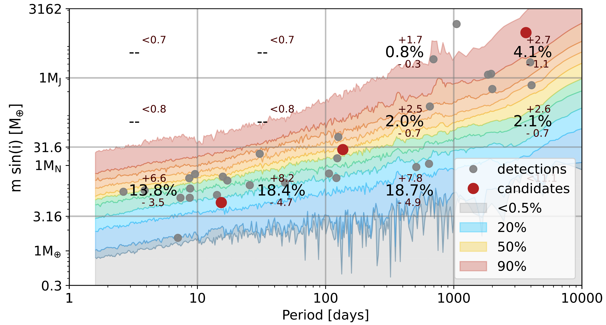
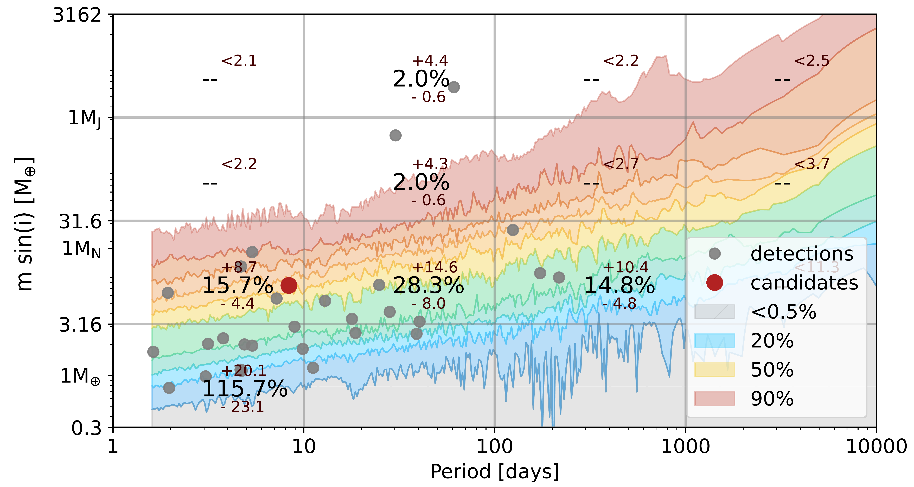
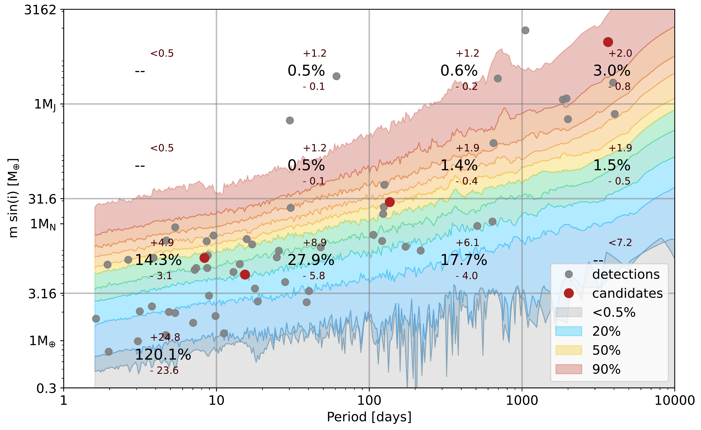

$\newcommand{\ensuremath}{}$
$\newcommand{\xspace}{}$
$\newcommand{\object}[1]{\texttt{#1}}$
$\newcommand{\farcs}{{.}''}$
$\newcommand{\farcm}{{.}'}$
$\newcommand{\arcsec}{''}$
$\newcommand{\arcmin}{'}$
$\newcommand{\ion}[2]{#1#2}$
$\newcommand{\textsc}[1]{\textrm{#1}}$
$\newcommand{\hl}[1]{\textrm{#1}}$
$\newcommand{\footnote}[1]{}$
$\newcommand{\gcnote}[1]{\textcolor{orange}{\textbf{[GC: #1]}}}$
$\newcommand{\thefootnote}{\arabic{footnote}}$
$\newcommand{\footnoterule}$
$\newcommand{\footnoterule}$
$\newcommand{\footnoterule}$
$\newcommand\cl{#1}$
$\newcommand\cf{#1}$
$\newcommand\cn{#1}$
$\newcommand\cx{#1}$
$\newcommand\rb{#1}$

# Radial velocity homogeneous analysis of M dwarfs observed with HARPS. II. Detection limits and planetary occurrence statistics

<mark>Appeared on: 2025-02-11</mark> - 

L. Mignon, et al. -- incl., <mark>R. Burn</mark>

**Abstract:**            We re-determine planetary occurrences around M dwarfs using 20 years of observations from HARPS on 197 targets. The first aim of this study is to propose more precise occurrence rates using the large volume of the sample but also variations to previous calculations, particularly by considering multiplicity, which is now an integral part of planetary occurrence calculations. The second aim is to exploit the extreme longevity of HARPS to determine occurrence rates in the unexplored domain of very long periods. This work relies entirely on the 197 radial velocity time series obtained and analysed in our previous study. By considering they are cleaned of any detectable signal, we convert them into detection limits. We use these 197 limits to produce a detectability map and combine it with confirmed planet detections to establish our occurrence rates. Finally, we also convert the detection limits from orbital period to insolation in order to construct an occurrence statistics for the temperate zone. We find a strong prevalence of low-mass planets around M dwarfs, with an occurrence rate of 120% for planets with a mass between 0.75 and 3 Me. In addition, we compute an occurrence rate of 45.3% +20-16% for temperate zone planets around M dwarfs. We obtain an occurrence rate of a few percent for giant planets with wide separations. In our sample these giant planets with wide separations are only detected around the most massive M dwarfs.         

**Figure 3. -** Planetary occurrence statistics obtained on the sub-sample of M-dwarfs with $\rm M_* > 0.35 M_{\odot}$ (*statocc_sup35*)

**Figure 4. -** Planetary occurrence statistics obtained on the sub-sample of M-dwarfs with $\rm M_* < 0.35 M_{\odot}$ (*statocc_inf35*)

**Figure 11. -** Planetary occurrence statistic. Colours in the background refer to the detection limit map, from the non-reachable region (grey) to the unmissable one (white). The grey points represent the considered detections while the red points represent the candidates. The grey horizontal and vertical lines delineate the probed domains. The computed occurrence rates (along with their corresponding statistical bounds) are indicated at the center of each domain. (*statocc*)

