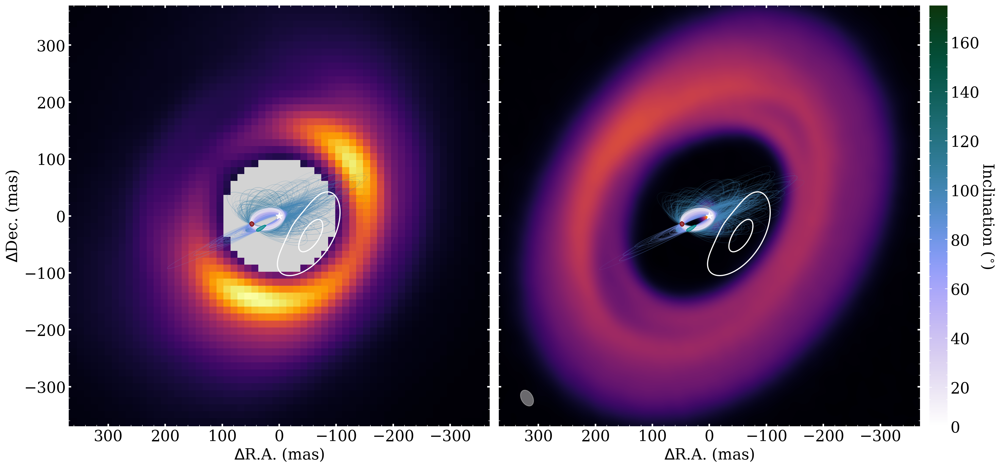

$\newcommand{\ensuremath}{}$
$\newcommand{\xspace}{}$
$\newcommand{\object}[1]{\texttt{#1}}$
$\newcommand{\farcs}{{.}''}$
$\newcommand{\farcm}{{.}'}$
$\newcommand{\arcsec}{''}$
$\newcommand{\arcmin}{'}$
$\newcommand{\ion}[2]{#1#2}$
$\newcommand{\textsc}[1]{\textrm{#1}}$
$\newcommand{\hl}[1]{\textrm{#1}}$
$\newcommand{\footnote}[1]{}$
$\newcommand{\vdag}{(v)^\dagger}$
$\newcommand$
$\newcommand$
$\newcommand{\dij}[1]{\textcolor{brown}{#1}}$
$\newcommand{\db}[1]{\textcolor{red}{#1}}$
$\newcommand{\bn}[1]{\textcolor{magenta}{#1}}$

# A Tentative Detection of a Point Source in the Disk Gap of HD 100546 with VLT/SPHERE-IRDIS Sparse Aperture Masking Interferometry $\footnote{ Based on observations collected at the European Southern Observatory under ESO programmes 2100.C-5052(B), 105.2067.001}$

<mark>Appeared on: 2025-02-12</mark> -  _Accepted for publication in AJ_

D. Blakely, et al. -- incl., <mark>M. Benisty</mark>

**Abstract:** We re-analyze VLT/SPHERE-IRDIS _K_ and _H_ -band sparse aperture masking interferometry data of the transition disk HD 100546 observed in 2018 and 2021, respectively. We fit geometrical models to the closure phases extracted from both datasets. We compare three model classes: a forward scattering disk, a forward scattering disk plus an arbitrary asymmetric disk feature and a forward scattering disk plus an unresolved point source in the disk-gap. ${We find that the forward scattering disk plus point source model is the best representation of the data.}$ We find that this point source candidate moved from a position of ${sep. = $39.9^{+2.8}_{-3.3}$ mas, P.A. = $124.1^{+1.0}_{-1.0}$ degrees to a sep. = $50.0^{+1.0}_{-1.0}$ mas, P.A. = $106.4^{+1.4}_{-1.4}$}$ degrees between 2018 and 2021. ${Both of these positions are well within the $\sim$13 au ($\sim$120 mas) disk-gap, favouring the point source interpretation}$ . We explore the orbital parameter space that is consistent with the measured relative astrometry. We find orbits either with a similar orientation to the outer disk, with a high eccentricity $e \gtrapprox 0.65$ , or orbits with a large relative inclination ( $\sim$ 60 degrees) to the outer disk, and any eccentricity.Despite the significance of the observed ${point-source}$ signal, follow-up observations will be necessary to conclusively determine its nature.

**Figure 7. -** Corner plot from the joint fit of the PG+PS model, with the disk geometry fixed between epochs, and the companion location allowed to vary. (*fig:corner_plot*)

**Figure 4. -** {Reduced chi-squared ($\chi^2_{r}$) maps, calculated by fitting a point source (binary) model to the residuals of the PG model fit, at each location (with a step size of 1 mas) within a radius of 125 mas. The significance of the 2018 detection is a $>$8$\sigma$ result and the 2021 detection is a 5$\sigma$ result, using the method by [Gallenne, Mérand and Kervella (2015)](). The 3$\sigma$ credible interval contours on the location of the point source at each epoch are denoted by the teal (2018, left) and maroon (2021, right) contours.} The 90\% and 50\% contours of the disk from the single polar Gaussian (PG) fit are denoted by the black lines. (*fig:chi2_plot*)

**Figure 6. -** The white contours show the {median model} disk component of the PG+PS model plotted on top of a $_K_s$_-band total intensity image of HD 100546 from [Ren, Benisty and Ginski (2023)]()(left) and ALMA band 6 data of HD 100546 from [Norfolk, Pinte and Calcino (2022)]()(right). The images are shown on a linear scale. In both panels, the location of the central star is denoted by the white star and the 3 $\sigma$ credible interval on the point source positions from the joint fit to all datasets with the PG+PS model are shown by the teal (2018) and maroon (2021) contours. The beamsize of the ALMA image is shown in the bottom left corner of the right panel. 1000 randomly drawn orbits from the orbital fit posteriors are plotted on top of both images. Note that in the right panel the inner disk in the ALMA image is almost entirely occulted by the plotted orbits. (*fig:joint_fit*)

