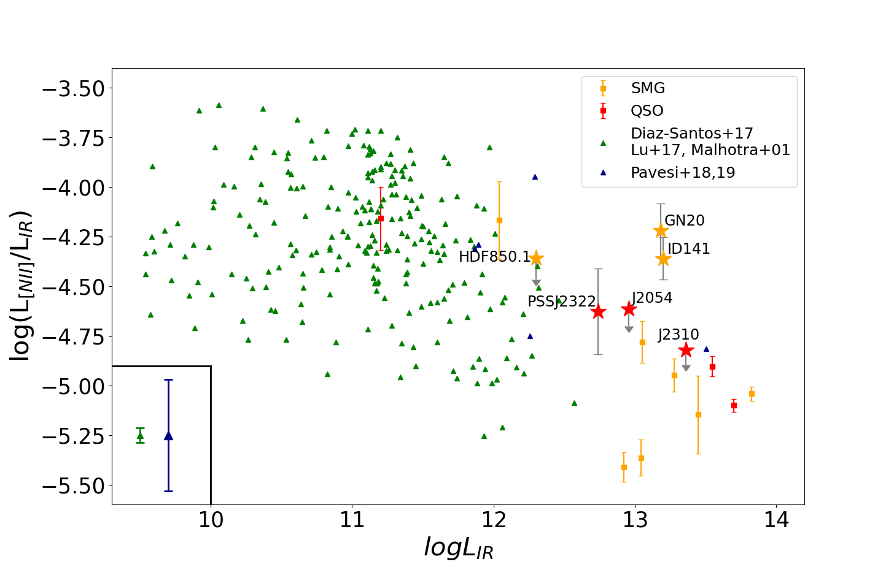

$\newcommand{\ensuremath}{}$
$\newcommand{\xspace}{}$
$\newcommand{\object}[1]{\texttt{#1}}$
$\newcommand{\farcs}{{.}''}$
$\newcommand{\farcm}{{.}'}$
$\newcommand{\arcsec}{''}$
$\newcommand{\arcmin}{'}$
$\newcommand{\ion}[2]{#1#2}$
$\newcommand{\textsc}[1]{\textrm{#1}}$
$\newcommand{\hl}[1]{\textrm{#1}}$
$\newcommand{\footnote}[1]{}$

# The [NII] $205  \mu m$ line emission from high-z SMGs and QSOs

<mark>Appeared on: 2025-02-14</mark> -  _14 pages, 11 figures, accepted for publication in A&A_

S. Kolupuri, et al. -- incl., <mark>F. Walter</mark>

**Abstract:** We present [ NII ] 205 $\mu$ m fine structure line observations of three submillimeter galaxies (SMGs) and three quasar host galaxies at 4 $\lesssim$ z $\lesssim$ 6 using the Institut de radioastronomie millimétrique (IRAM) interferometer. The [ NII ] emission is detected in three sources, and we report detections of the underlying dust continuum emission in all sources. The observed [ NII ] -to-infrared luminosity ratio spans at least 0.5 dex for our sources. Comparing our estimates with sources detected in the [ NII ] 205 $\mu$ m at similar redshifts shows that the overall [ NII ] -to-IR luminosity ratio spans over a dex in magnitude from L $_{[NII]}$ /L $_{IR}$ $\sim$ 10 $^{-4}$ -- 10 $^{-5}$ and follows the trend of the so-called [ NII ] fine structure line deficit observed in (ultra)-luminous infrared galaxies in the local Universe. The [ CII ] -to- [ NII ] luminosity ratio is >10 for most of our sources, indicating that the bulk of the [ CII ] 158 $\mu$ m line emission ( $*f*$ ( [ CII ] $^{PDR}$ ) >75 \% ) arises from the neutral medium. From our analysis, we do not find significant differences in the [ NII ] 205 $\mu$ m emission and the respective ratios between SMGs and QSOs, suggesting a negligible contribution to the boosting of [ NII ] 205 $\mu$ m emission due to the active galactic nucleus (AGN) photoionization. Future investigations involving other fine structure lines and optical diagnostics will provide further insight into a suite of ionized medium properties and reveal the diversity between AGN and non-AGN environments.

**Figure 5. -** Vibrational stability equation of state
               $S_{\mathrm{vib}}(\lg e, \lg \rho)$.
               $>0$ means vibrational stability.
              Vibrational stability equation of state
               $S_{\mathrm{vib}}(\lg e, \lg \rho)$.
               $>0$ means vibrational stability.
              Nonlinear Model ResultsNonlinear Model ResultsSpectral types and photometry for stars in the
  region.Spectral types and photometry for stars in the
  region.List of nearby SNe used in this work.Summary for ISOCAM sources with mid-IR excess
(YSO candidates).Summary for ISOCAM sources with mid-IR excess
(YSO candidates). Sample stars with absolute magnitudecontinued. Sample stars with absolute magnitudecontinued.Shown in greyscale is a...Plotted above...Complexes characterisation.Line data and abundances ...Continued. (*FigVibStab*)

**Figure 12. -** Vibrational stability equation of state
               $S_{\mathrm{vib}}(\lg e, \lg \rho)$.
               $>0$ means vibrational stability.
              Nonlinear Model ResultsNonlinear Model ResultsSpectral types and photometry for stars in the
  region.Spectral types and photometry for stars in the
  region.List of nearby SNe used in this work.Summary for ISOCAM sources with mid-IR excess
(YSO candidates).Summary for ISOCAM sources with mid-IR excess
(YSO candidates). Sample stars with absolute magnitudecontinued. Sample stars with absolute magnitudecontinued.Shown in greyscale is a...Plotted above...Complexes characterisation.Line data and abundances ...Continued. (*FigVibStab*)

**Figure 6. -** The [NII]-to-IR ratio as a function of IR luminosity for the sources in our sample. Our sample is illustrated as stars, following the same color scheme in Fig. 1. We also compile sources from the local Universe (green triangles) as well as at high redshifts (orange/red squares \& blue triangles) that have been detected in [NII] 205 $\mu$m emission. The green and blue bars represent the mean error bars for their respective data points. All luminosities are corrected for gravitational magnification. Our new measurements further populate the sparser high-end of the infrared luminosity regime of such sources.  (*fig:2*)

