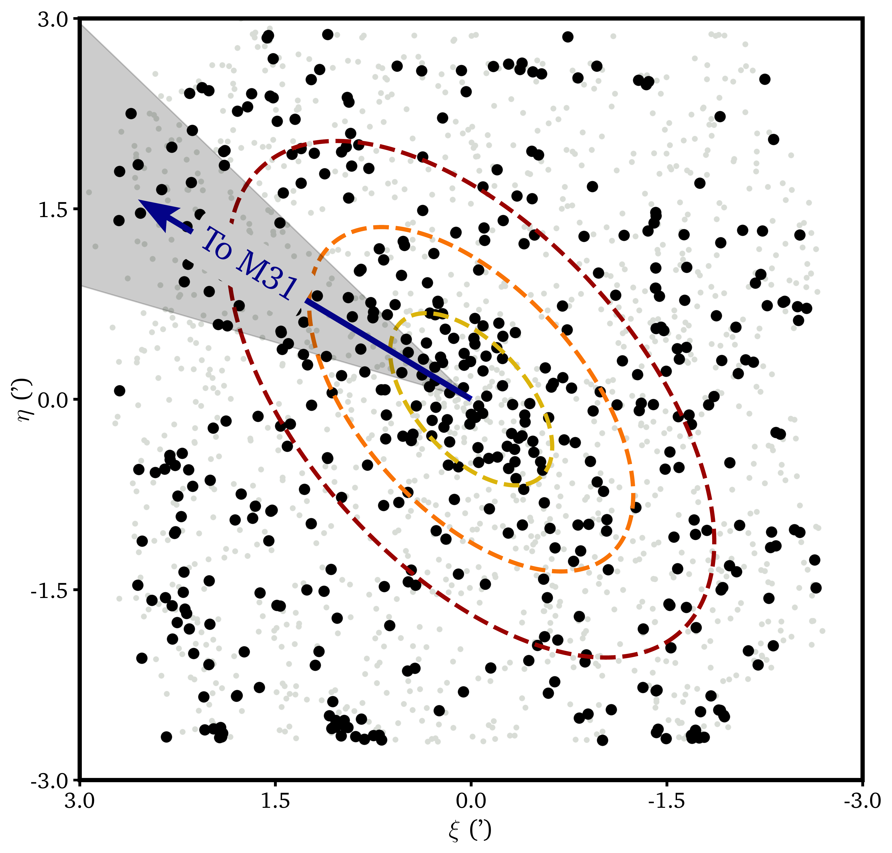
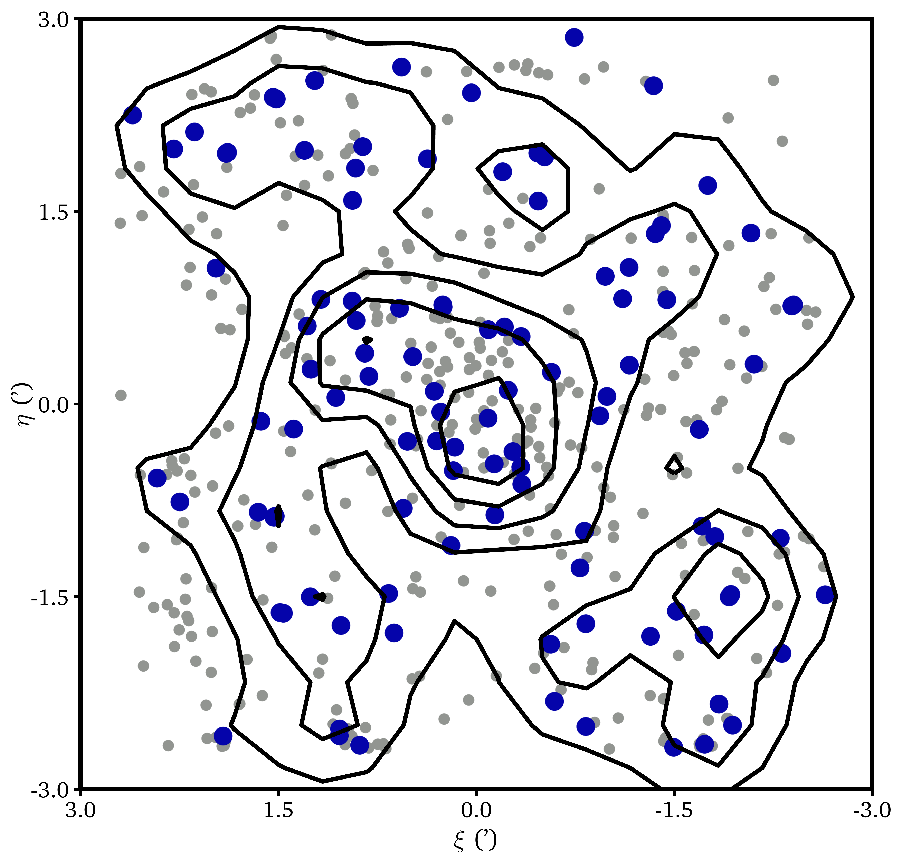

$\newcommand{\ensuremath}{}$
$\newcommand{\xspace}{}$
$\newcommand{\object}[1]{\texttt{#1}}$
$\newcommand{\farcs}{{.}''}$
$\newcommand{\farcm}{{.}'}$
$\newcommand{\arcsec}{''}$
$\newcommand{\arcmin}{'}$
$\newcommand{\ion}[2]{#1#2}$
$\newcommand{\textsc}[1]{\textrm{#1}}$
$\newcommand{\hl}[1]{\textrm{#1}}$
$\newcommand{\footnote}[1]{}$
$\newcommand{\vdag}{(v)^\dagger}$
$\newcommand$
$\newcommand$
$\newcommand{\chg}[1]{\textbf{#1}}$
$\newcommand{\warn}[1]{\textcolor{red}{\textbf{#1}}}$
$\newcommand{\plot}[1]{\textit{#1}:}$
$\newcommand{\code}[1]{\texttt{#1}}$
$\newcommand{\rh}{r_{\text{h}}}$
$\newcommand{\rhm}{r_{\text{h}}}$
$\newcommand{\ebv}{E(B-V)}$
$\newcommand{\Rv}{R_{V}}$
$\newcommand{\vh}{v_{\odot}}$
$\newcommand{\Msun}{\textup{M}_\odot}$
$\newcommand{\Lsun}{\textup{L}_\odot}$
$\newcommand{\sqdeg}{deg^2}$
$\newcommand{\kms}{km s^{-1}}$
$\newcommand{\met}{[Fe/H]}$
$\newcommand{\peg}{Peg VII}$

# Deep in the Fields of the Andromeda Halo: \\Discovery of the Pegasus VII dwarf galaxy in UNIONS

<mark>Appeared on: 2025-02-18</mark> -  _13 pages, 5 figures, accepted for publication in ApJ_

S. E. T. Smith, et al. -- incl., <mark>N. Martin</mark>

**Abstract:** We present the newly discovered dwarf galaxy Pegasus VII ( $\peg$ ), a member of the M31 sub-group which has been uncovered in the $ri$ photometric catalogs from the Ultraviolet Near-Infrared Optical Northern Survey and confirmed with follow-up imaging from both the Canada-France-Hawaii Telescope and the Gemini-North Telescope. This system has an absolute $V$ -band magnitude of $-5.7$ $\pm$ 0.2 mag and a physical half-light radius of 177 $^{+36}_{-34}$ pc, which is characteristic of dynamically-confirmed Milky Way satellite dwarf galaxies and about 5 times more extended than the most extended M31 globular clusters. $\peg$ lies at a three-dimensional separation from M31 of 331 $^{+15}_{-4}$ kpc and    a significant elongation ( $\epsilon \sim 0.5$ ) towards the projected direction of M31 could be indicative of a past tidal interaction, but additional investigation into the orbit, star formation history, and whether any gas remains in the galaxy is needed to better understand the evolution of $\peg$ .

**Figure 3. -** _ Left_: CMD of stellar sources (black markers) within 2 half-light radii of the $\peg$ centroid. An old (10 Gyr), metal-poor ([Fe/H] = $-2$) PARSEC isochrone is overlaid in red, shifted to a distance of 750 kpc. The 5$\sigma$ point source depths ($g \sim 26.1$ and $r \sim 25.7$ mag) are indicated with a dashed black line. Black crosses show the median color and magnitude errors as a function of magnitude. Dashed orange outlines have been drawn to delineate where putative member stars of $\peg$ fall on the CMD, as described in Section \ref{subsec:stardist}.
    _ Centre_: This CMD shows sources which fall in an elliptical annulus whose inner radius is 3 half-light radii and has an area equal to the inner 2 half-light radius region, demonstrating the non-member source contamination present in the left panel.
    _ Right_: Smoothed Hess difference plot between on-target and field CMDs. Light regions indicate a high density of $\peg$ stars compared to field stars, while dark regions show deficits. The adopted isochrone is shown in red and we also shift the distance of the HB by 60 kpc (orange dashed lines) to indicate how the distance uncertainty is inferred from the difference CMD.
     (*fig:peg7-cmd*)

**Figure 4. -** _ Left_: Tangent plane-projected spatial distribution of cleaned stellar sources detected in Gemini-N/GMOS imaging about $\peg$. Black stars fall within the isochrone membership selection box defined in the left panel of Figure \ref{fig:peg7-cmd} while grey stars fall outside of this selection box. Concentric ellipses in yellow, orange, and red show the 1, 2, \& 3 $\times$\rh iso-density contours, respectively, of the best-fit stellar distribution model. The blue arrow indicates the tangent plane-projected direction towards M31 and the grey wedge shows the 1$\sigma$ uncertainties on the projected direction towards M31 stemming from the position angle of the major axis of $\peg$. The direction towards M31 is 18$^{+12}_{-9}$$\deg$ from the position angle of the major axis.
    _ Right_: Here we plot in large blue markers the tangent plane-projected spatial distribution of all suspected horizontal branch stars (defined by the HB selection box in the left panel of Figure \ref{fig:peg7-cmd}). We overlay black contours showing the smoothed density distribution of these same HB stars. We also plot small grey markers for all candidate member stars (same as black point in left panel of this figure), demonstrating how the HB distribution traces the same overdensity as the rest of the member stars.
     (*fig:peg7-spatial*)

**Figure 5. -** Tangent plane projection centered on M31, which is shown as the central black ellipse.
    Known galaxies in the vicinity of M31 are shown as black circles where their filled shade of blue indicates total absolute $V$-band magnitude in the range indicated in the color bar. The position of M33 (Triangulum) is marked with a white triangle. The three concentric, dashed black circles indicate projected radii of 100, 200, \& 300 kpc at the distance of M31. The dashed grey outline demarcates the PAndAS footprint while the UNIONS footprint in the south galactic cap is shown with a thick dashed green line, as noted in the legend.
    $\peg$ is indicated with a label as well as a large black circle and lies in front of the tangent plane, at a total three-dimensional distance of $\sim$330 kpc from M31.
    All known galaxies in this field of view with projected M31 separations greater than 200 kpc are labelled.
    The greyscale background shows the dust maps from \citet{Schlegel98} where the color bar has a maximum of $E(B-V) = 1$ to show the features around the M31 satellites, though the top band reaches much greater extinctions towards the galactic midplane (indicated by the dashed white line). Triangulum II and Segue 2 are Milky Way satellites in the foreground of this field of view. (*fig:m31-field*)

