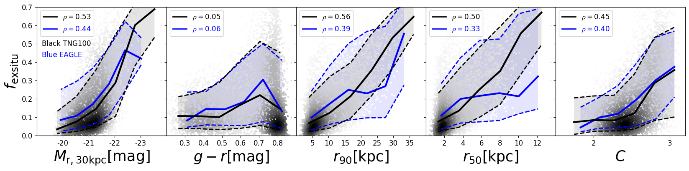
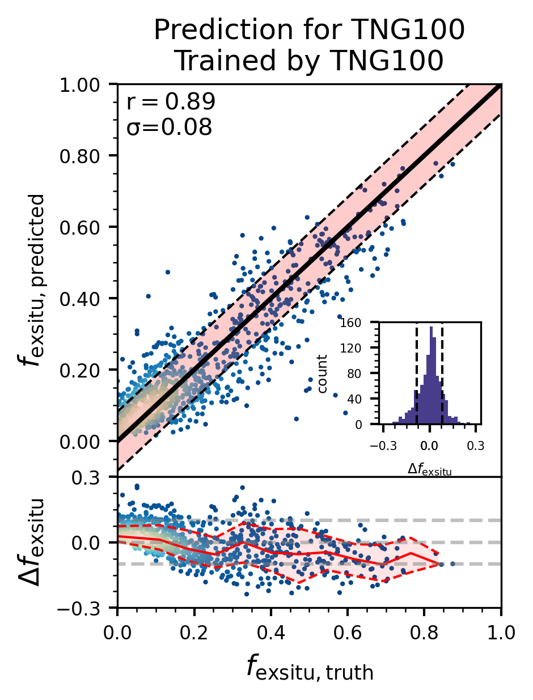
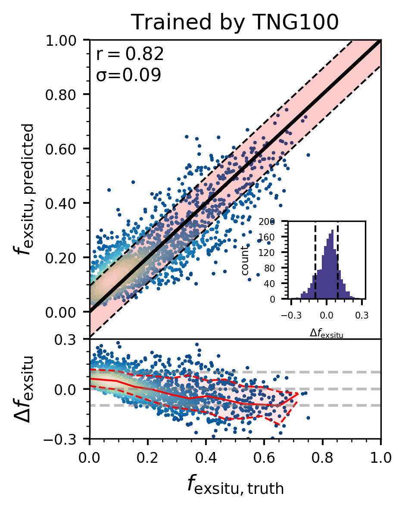
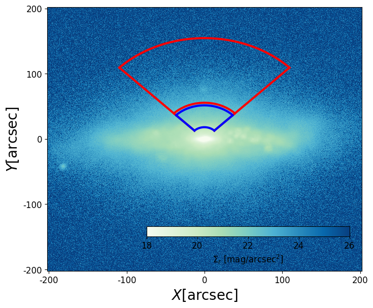
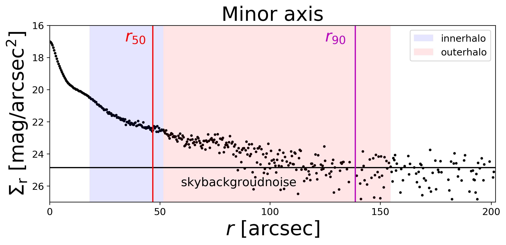

$\newcommand{\ensuremath}{}$
$\newcommand{\xspace}{}$
$\newcommand{\object}[1]{\texttt{#1}}$
$\newcommand{\farcs}{{.}''}$
$\newcommand{\farcm}{{.}'}$
$\newcommand{\arcsec}{''}$
$\newcommand{\arcmin}{'}$
$\newcommand{\ion}[2]{#1#2}$
$\newcommand{\textsc}[1]{\textrm{#1}}$
$\newcommand{\hl}[1]{\textrm{#1}}$
$\newcommand{\footnote}[1]{}$
$\newcommand{\dlens}{D_{\rm L}}$
$\newcommand{\dsource}{D_{\rm S}}$
$\newcommand{\dls}{D_{\rm S}-D_{\rm L}}$
$\newcommand{\vdag}{(v)^\dagger}$
$\newcommand{\vt}{{\rm v}_t}$
$\newcommand{\swd}{Schwarzschild }$
$\newcommand{\atlas}{ATLAS^{\rm{3D}}}$
$\newcommand{\sfg}{S^4G }$
$\newcommand{\kms}{km s^{-1}}$
$\newcommand{\dgr}{^\circ}$
$\newcommand{\kmsM}{km s^{-1} Mpc^{-1}}$
$\newcommand{\Msun}{M_\odot}$
$\newcommand{\Msunpcsq}{M_\odot pc^{-2}}$
$\newcommand{\Msunpccube}{M_\odot pc^{-3}}$
$\newcommand{\Lsun}{L_\odot}$
$\newcommand{\Lsunpcsq}{L_\odot pc^{-2}}$
$\newcommand{\Lsunpccube}{L_\odot pc^{-3}}$
$\newcommand{\MLsun}{M_\odot/L_\odot}$
$\newcommand{\magarcsq}{\mathrm{mag arcsec^{-2}}}$
$\newcommand{\Mstar}{\ensuremath{M_*}}$
$\newcommand{\rmaxhot}{\ensuremath{r|_{{\rm max}(p_{\rm hot})}}}$
$\newcommand{\rcut}{\ensuremath{r_\mathrm{cut}}}$
$\newcommand{\rmax}{\ensuremath{r_\mathrm{max}}}$
$\newcommand{\Mshalo}{\ensuremath{M_{*,\mathrm{halo(r< 2R_e)}}}}$
$\newcommand{\Mswarm}{\ensuremath{M_{*,\mathrm{warm(r< 2R_e)}}}}$
$\newcommand{\LZ}[1]{{\color{magenta} #1}}$
$\newcommand{\arraystretch}{1.5}$
$\newcommand{\arraystretch}{1.5}$
$\newcommand{\arraystretch}{1.5}$
$\newcommand{\arraystretch}{1.5}$

# Robust machine learning model of inferring the ex situ stellar fraction of galaxies from photometric data

<mark>Appeared on: 2025-02-20</mark> -  _Accepted in A&A_

R. Cai, et al. -- incl., <mark>A. Pillepich</mark>

**Abstract:** We search for parameters defined from photometric images to quantify the ex situ stellar mass fraction of galaxies.   We created mock images using galaxies in the cosmological hydrodynamical simulations TNG100, EAGLE, and TNG50 at redshift $z=0$ . We define a series of parameters describing their structures, including: the absolute magnitude in $r$ and $g$ bands ( $M_r$ , $M_g$ ), the half-light and 90 \% -light radius ( $r_{50}$ , $r_{90}$ ), the concentration ( $C$ ), the luminosity fractions of inner and outer halos ( $f_{\rm innerhalo}$ , $f_{\rm outerhalo}$ ), the inner and outer surface brightness gradients ( $\nabla \rho_{\rm inner}$ , $\nabla \rho_{\rm outer}$ ), and $*g-r*$ colour gradients ( $\nabla \rm (*g-r*)_{inner}$ , $\nabla \rm (*g-r*)_{outer}$ ). In particular, the inner and outer halo of a galaxy are defined by sectors ranging from $45-135$ degrees from the disk major axis, and with radii ranging from $3.5-10$ kpc and $10-30$ kpc, respectively, to avoid the contamination of disk and bulge. The surface brightness and colour gradients are defined by the same sectors along the minor axis and with similar radii ranges. We used the Random Forest method to create a model that predicts $f_{\rm exsitu}$ from morphological parameters. The model predicts $f_{\rm exsitu}$ well with a scatter smaller than 0.1 compared to the ground truth in all mass ranges. The models trained from TNG100 and EAGLE work similarly well and are cross-validated; they alsowork well in making predictions for TNG50 galaxies. The analysis using Random Forest reveals that $\nabla \rho_{\rm outer}$ , $\nabla \rm (*g-r*)_{outer}$ , $f_{\rm outerhalo}$ and $f_{\rm innerhalo}$ are the   most influential parameters in predicting $f_{\rm exsitu}$ , underscoring their significance in uncovering the merging history of galaxies. We further analyse how the quality of images will affect the results by using SDSS-like and HSC-like mock images for galaxies at different distances. Our results can be used to infer the ex situ stellar mass fractions for a large sample of galaxies from photometric surveys.

**Figure 4. -** The correlations between the parameters extracted from mock SDSS photometric observations for galaxies at 40 Mpc and the ex situ stellar mass fraction of galaxies. The grey dots are TNG100 galaxies, the black solid and dashed curves are the running median and the $\pm 1 \sigma$ scatter of the TNG100 galaxies. The blue symbols for EAGLE galaxies. {The Spearman’s rank coefficient($\rho$)} of each correlation is labelled in the figure.
 (*fig3:fexsitufeature*)

**Figure 6. -** The model predicted $f_{\rm exsitu}$ vs. the ground truth. The different panels are models trained and validated by TNG100 and EAGLE in the top, and cross-validated with each other in the bottom, all with the combined parameters Sub0. For each column, we show the one-to-one comparison in the top panel: $r$ is $\sqrt{r^2}$, and $\sigma(\Delta f_{\rm exsitu})$ is the scatter of residual $\Delta f_{\rm exsitu}=f_{\rm exsitu,predicted}-f_{\rm exsitu,truth}$, the solid black line marks $y=x$, and the dashed black line represents ±1$\sigma(\Delta f_{\rm exsitu})$ scatter. The inset panel is the histogram of $\Delta f_{\rm exsitu}$. In the bottom panel, we show the residual $\Delta f_{\rm exsitu}$ as a function of galaxy $f_{\rm exsitu,truth}$: the red solid and dashed curves show the running median and ±1$\sigma(\Delta f_{\rm exsitu})$ scatter.  (*fig:fex_fextrue*)

**Figure 1. -** A SDSS-like $r$-band image created from a TNG100 galaxy subhalo 6 at z=0 projected near edge-on, and placing it at the distance of 40 Mpc. ** Top:** 2D image. The sector enclosed by blue is defined as the inner halo (3.5 kpc-10 kpc) and that in red is the outer halo (10 kpc-30 kpc). ** Bottom:** surface brightness profile along the minor axis. The black horizontal line indicates the background noise of the sky $\Sigma_{r,0}$, the red and magenta vertical lines mark $r_{\rm 50}$ and $r_{\rm 90}$ obtained from the petrosian radius.
 (*TNG100SDSSlikeID6*)

