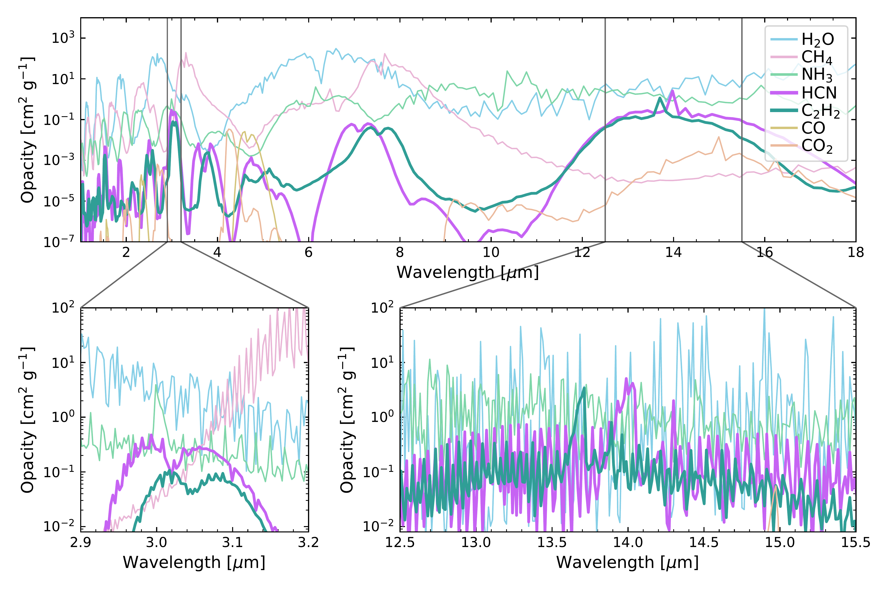

$\newcommand{\ensuremath}{}$
$\newcommand{\xspace}{}$
$\newcommand{\object}[1]{\texttt{#1}}$
$\newcommand{\farcs}{{.}''}$
$\newcommand{\farcm}{{.}'}$
$\newcommand{\arcsec}{''}$
$\newcommand{\arcmin}{'}$
$\newcommand{\ion}[2]{#1#2}$
$\newcommand{\textsc}[1]{\textrm{#1}}$
$\newcommand{\hl}[1]{\textrm{#1}}$
$\newcommand{\footnote}[1]{}$
$\newcommand{\vdag}{(v)^\dagger}$
$\newcommand$
$\newcommand$
$\newcommand{\topfraction}{.99}$
$\newcommand{\floatpagefraction}{0.99}$
$\newcommand{\arraystretch}{1.3}$
$\newcommand{\w0458}{WISE-0458}$
$\newcommand{\Mjup}{\ensuremath{M_\textrm{Jup}}}$
$\newcommand{\Rjup}{\ensuremath{R_\textrm{Jup}}}$

# $\ce{HCN}$ and $\ce{C2H2}$ in the atmosphere of a T8.5+T9 brown dwarf binary

<mark>Appeared on: 2025-02-20</mark> -  _Accepted for publication in The Astrophysical Journal Letters. 13 pages (5 figures) + appendices_

E. C. Matthews, et al. -- incl., <mark>P. Mollière</mark>, <mark>M. Samland</mark>, <mark>T. Henning</mark>

**Abstract:** T-type brown dwarfs present an opportunity to explore  atmospheres teeming with molecules such as $\ce{H2O}$ , $\ce{CH4}$ and $\ce{NH3}$ , which exhibit a wealth of absorption features in the mid-infrared. With JWST, we can finally explore this chemistry in detail, including for the coldest brown dwarfs that were not yet discovered in the Spitzer era. This allows precise derivations of the molecular abundances, which in turn informs our understanding of vertical transport in these atmospheres and can provide clues about the formation of cold brown dwarfs and exoplanets. This study presents the first JWST/MRS mid-IR spectrum (R $\sim$ 1500-3000) of a T-dwarf: the T8.5+T9 brown dwarf binary WISE J045853.90+643451.9. We fit the spectrum using a parameterized $P$ - $T$ profile and free molecular abundances (i.e., a retrieval analysis), treating the binary as unresolved. We find a good fit with a cloud-free atmosphere and identify $\ce{H2O}$ , $\ce{CH4}$ and $\ce{NH3}$ features. Moreover, we make the first detections of $\ce{HCN}$ and $\ce{C2H2}$ (at 13.4 $\sigma$ and 9.5 $\sigma$ respectively) in any brown dwarf atmosphere. The detection of $\ce{HCN}$ suggests intense vertical mixing ( $K_{zz}\sim10^{11}$ cm $^2$ s $^{-1}$ ), challenging previous literature derivations of $K_{zz}$ values for T-type brown dwarfs. Even more surprising is the $\ce{C2H2}$ detection, which cannot be explained with existing atmospheric models for isolated objects. This result challenges model assumptions about vertical mixing, and/or our understanding of the $\ce{C2H2}$ chemical network, or might hint towards a more complex atmospheric processes such as magnetic fields driving aurorae, or lightning driving ionization. These findings open a new frontier in studying carbon chemistry within brown dwarf atmospheres.

**Figure 3. -** The MIRI/MRS spectrum of $\w$0458, and our best-fit model. Panel (a) shows the full spectrum, binned to 1/10th the original spectral resolution for visual clarity. Colors represent each individual subchannel of the MRS detector (labelled 1A-3C), and we also label the locations of prominent molecular absorption features in this brown dwarf atmosphere. Panels (b), (d), (f) show the best-fit model (black) compared to the data for each channel (at R=1,000). Our model is a free retrieval using \texttt{pRT}(see Section \ref{sec:retrievals}), including a parameterized pressure-temperature profile and 7 molecular species; 5 molecules are confidently detected (\ce{H2O}, \ce{CH4}, \ce{NH3}, \ce{HCN} and \ce{C2H2}). Panels (c), (e) and (g) show the residuals, taking the 10$^b$ factor into account. (*fig:mainspectrum_and_model*)

**Figure 5. -** Opacities of molecules in our best-fit model, with abundances matching the best-fit value (for \ce{H2O}, \ce{CH4}, \ce{NH3}, \ce{HCN} and \ce{C2H2}) and 2$\sigma$ upper limits (for CO and $CO_2$) from our best-fit model. Opacities in the upper panel are at R=100 and in the lower panel are at R=1000 (matching the resolution used in our \texttt{pRT} retrievals). In the lower panel we highlight the regions where \ce{HCN} and \ce{C2H2} absorb most strongly in the near- and mid-IR. For the $\w$0458 abundances, both species are only detectable in the mid-IR around 14 \micron in the $\w$0458 atmosphere. With sufficiently high abundances (higher than those observed here), both species might become detectable in the near-IR, at 3 \micron and 1.5 \micron. (*fig:hcnopacity*)

**Figure 4. -** Comparison of the data and best-fit models with and without including the molecules \ce{HCN} and \ce{C2H2}. Here we show our retrieved spectra for a "basic" model with only \ce{H2O}, \ce{CH4}, \ce{NH3}, CO and $CO_2$(brown), and a model that also includes \ce{HCN} and \ce{C2H2}(green), alongside the data (black, including our retrieved uncertainty inflation). The lower panel shows the residuals (data - model) for the both models, and shading in the background of both panels indicates regions of high opacity for \ce{HCN}(pink) and \ce{C2H2}(blue). The plot shows only the 13.4-14.6 \micron region of the spectrum where \ce{HCN} and \ce{C2H2} absorption features are significant (see also Fig. \ref{fig:hcnopacity}), but these species have a small continuum effect across more of the mid-IR. (*fig:hcn_c2h2*)

