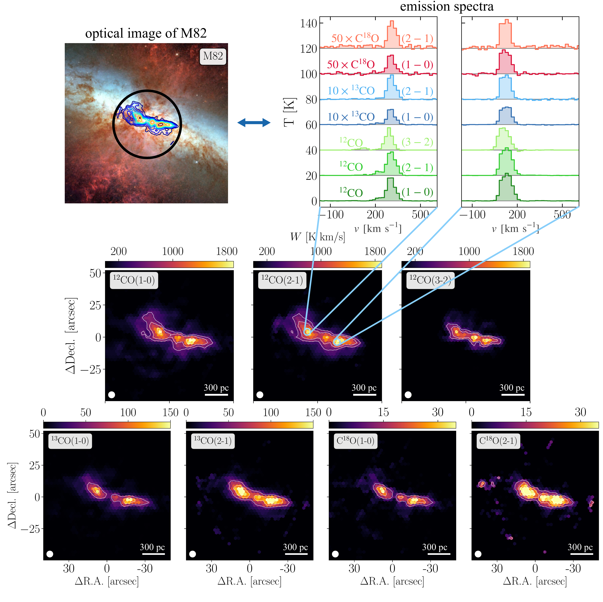
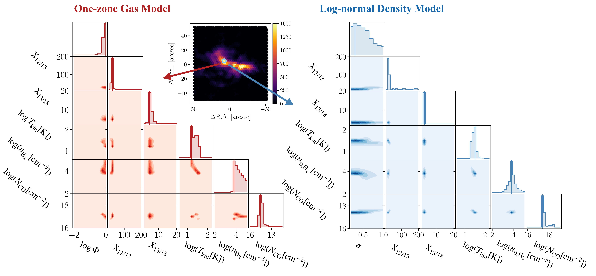

$\newcommand{\ensuremath}{}$
$\newcommand{\xspace}{}$
$\newcommand{\object}[1]{\texttt{#1}}$
$\newcommand{\farcs}{{.}''}$
$\newcommand{\farcm}{{.}'}$
$\newcommand{\arcsec}{''}$
$\newcommand{\arcmin}{'}$
$\newcommand{\ion}[2]{#1#2}$
$\newcommand{\textsc}[1]{\textrm{#1}}$
$\newcommand{\hl}[1]{\textrm{#1}}$
$\newcommand{\footnote}[1]{}$
$\newcommand{\vdag}{(v)^\dagger}$
$\newcommand$
$\newcommand$
$\newcommand{\co}{\ifmmode{\mathrm{CO}} \else CO\fi}$
$\newcommand{\coeighteen}{\ifmmode{\mathrm{C}^{18}\mathrm{O}} \else C^{18}O\fi}$
$\newcommand{\thirteenco}{\ifmmode{^{13}\mathrm{CO}} \else ^{13}CO\fi}$
$\newcommand{\hdens}{\ifmmode{n_{\mathrm{H}_{2}}} \else n_{\mathrm{H}_{2}}\fi}$
$\newcommand{\hdensLog}{\ifmmode{n_{0,\mathrm{H}_{2}}} \else n_{0,\mathrm{H}_{2}}\fi}$
$\newcommand{\tkin}{\ifmmode{\mathrm{T}_{\mathrm{kin}}} \else \mathrm{T}_{\mathrm{kin}}\fi}$
$\newcommand{\coldens}{\ifmmode{N_{\mathrm{CO}}} \else N_{\mathrm{CO}}\fi}$
$\newcommand{\width}{\ifmmode{\sigma} \else \sigma \fi}$
$\newcommand{\xthirteen}{\ifmmode{{X}_{12/13}} \else {X}_{12/13}\fi}$
$\newcommand{\xeighteen}{\ifmmode{{X}_{13/18}} \else {X}_{13/18}\fi}$
$\newcommand{\hydrogen}{\ifmmode{\mathrm{H}_{2}} \else H_{2}\fi}$
$\newcommand{\bff}{\ifmmode{\Phi} \else \Phi\fi}$
$\newcommand{\conv}{\ifmmode{\textrm{CO-to-H}_{2}}   \else CO-to-H_2 \fi}$
$\newcommand{\alphaco}{\ifmmode{\alpha_{\mathrm{CO}}}   \else \alpha_{\mathrm{CO}} \fi}$
$\newcommand{\Princeton}{\affiliation{Department of Astrophysical Sciences, Princeton University, 4 Ivy Lane, Princeton, NJ 08544, USA}}$
$\newcommand{\McMaster}{\affiliation{Department of Physics and Astronomy, McMaster University, 1280 Main Street West, Hamilton, ON L8S 4M1, Canada}}$
$\newcommand{\CITA}{\affiliation{Canadian Institute for Theoretical Astrophysics (CITA), University of Toronto, 60 St George Street, Toronto, ON M5S 3H8, Canada}}$
$\newcommand{\OSU}{\affiliation{Department of Astronomy, The Ohio State University, 140 West 18th Avenue, Columbus, OH 43210, USA}}$
$\newcommand{ÇAPP}{\affiliation{Center for Cosmology and Astroparticle Physics (CCAPP), 191 West Woodruff Avenue, Columbus, OH 43210, USA}}$
$\newcommand{\Alberta}{\affiliation{Department of Physics, University of Alberta, Edmonton, AB T6G 2E1, Canada}}$
$\newcommand{\Cologne}{\affiliation{I. Physikalisches Institut der Universität zu Köln, Zülpicher Straße 77, 50937, Köln, Germany}}$
$\newcommand{\ANU}{\affiliation{Research School of Astronomy and Astrophysics, Australian National University, Canberra, ACT 2611, Australia}}$
$\newcommand{\Arizona}{\affiliation{Steward Observatory, University of Arizona, 933 North Cherry Avenue, Tucson, AZ 85721, USA}}$
$\newcommand{\ASIAA}{\affiliation{Institute of Astronomy and Astrophysics, Academia Sinica, No. 1, Sec. 4, Roosevelt Road, Taipei 106216, Taiwan}}$
$\newcommand{\ASTROThreeD}{\affiliation{ARC Centre of Excellence for All Sky Astrophysics in 3 Dimensions (ASTRO 3D), Australia}}$
$\newcommand{\Bonn}{\affiliation{Argelander-Institut für Astronomie, Universität Bonn, Auf dem Hügel 71, 53121 Bonn, Germany}}$
$\newcommand{\Carnegie}{\affiliation{Observatories of the Carnegie Institution for Science, 813 Santa Barbara Street, Pasadena, CA 91101, USA}}$
$\newcommand{ÇA}{\affiliation{Center for Computational Astrophysics, Flatiron Institute, 162 Fifth Avenue, New York, NY 10010, USA}}$
$\newcommand{\CfA}{\affiliation{Center for Astrophysics \mid Harvard \& Smithsonian, 60 Garden Street, Cambridge, MA 02138, USA}}$
$\newcommand{\CITEVA}{\affiliation{Centro de Astronomía (CITEVA), Universidad de Antofagasta, Avenida Angamos 601, Antofagasta, Chile}}$
$\newcommand{\CNRS}{\affiliation{CNRS, IRAP, 9 Av. du Colonel Roche, BP 44346, F-31028 Toulouse cedex 4, France}}$
$\newcommand{\Connecticut}{\affiliation{Department of Physics, University of Connecticut, 196A Auditorium Road, Storrs, CT 06269, USA}}$
$\newcommand{\COOL}{\affiliation{Cosmic Origins Of Life (COOL) Research DAO, coolresearch.io}}$
$\newcommand{\EPFL}{\affiliation{Institute of Physics, Laboratory for galaxy evolution and spectral modelling, EPFL, Observatoire de Sauverny, Chemin Pegais 51, 1290 Versoix, Switzerland}}$
$\newcommand{\ESO}{\affiliation{European Southern Observatory, Karl-Schwarzschild Stra{\ss}e 2, D-85748 Garching bei München, Germany}}$
$\newcommand{\Gent}{\affiliation{Sterrenkundig Observatorium, Universiteit Gent, Krijgslaan 281 S9, B-9000 Gent, Belgium}}$
$\newcommand{\Hawaii}{\affiliation{Institute for Astronomy, University of Hawaii, 2680 Woodlawn Drive, Honolulu, HI 96822, USA}}$
$\newcommand{\Heidelberg}{\affiliation{Astronomisches Rechen-Institut, Zentrum für Astronomie der Universität Heidelberg, Mönchhofstra\ss e 12-14, D-69120 Heidelberg, Germany}}$
$\newcommand{\IAC}{\affiliation{Instituto de Astrofísica de Canarias, C/ Vía Láctea s/n, E-38205, La Laguna, Spain}}$
$\newcommand{\ICRAR}{\affiliation{International Centre for Radio Astronomy Research, University of Western Australia, 35 Stirling Highway, Crawley, WA 6009, Australia}}$
$\newcommand{\INAF}{\affiliation{INAF -- Osservatorio Astrofisico di Arcetri, Largo E. Fermi 5, I-50157, Firenze, Italy}}$
$\newcommand{\IPAC}{\affiliation{Caltech-IPAC, 1200 E. California Blvd. Pasadena, CA 91125, USA}}$
$\newcommand{\IPARC}{\affiliation{Instituto de Física de Partículas y del Cosmos IPARCOS, Facultad de Ciencias Físicas, Universidad Complutense de Madrid, E-28040, Spain}}$
$\newcommand{\IRAM}{\affiliation{Institut de Radioastronomie Millimétrique (IRAM), 300 Rue de la Piscine, F-38406 Saint Martin d'Hères, France}}$
$\newcommand{\ITA}{\affiliation{Universität Heidelberg, Zentrum für Astronomie, Institut für Theoretische Astrophysik, Albert-Ueberle-Str 2, D-69120 Heidelberg, Germany}}$
$\newcommand{\IWR}{\affiliation{Universität Heidelberg, Interdisziplinäres Zentrum für Wissenschaftliches Rechnen, Im Neuenheimer Feld 205, D-69120 Heidelberg, Germany}}$
$\newcommand{\JHU}{\affiliation{Department of Physics and Astronomy, The Johns Hopkins University, Baltimore, MD 21218, USA}}$
$\newcommand{\Kansas}{\affiliation{Department of Physics and Astronomy, University of Kansas, 1251 Wescoe Hall Drive, Lawrence, KS 66045, USA}}$
$\newcommand{\LAM}{\affiliation{Aix Marseille Univ, CNRS, CNES, LAM (Laboratoire d’Astrophysique de Marseille), Marseille, France}}$
$\newcommand{\Leiden}{\affiliation{Leiden Observatory, Leiden University, P.O. Box 9513, 2300 RA Leiden, The Netherlands}}$
$\newcommand{\Liverpool}{\affiliation{Astrophysics Research Institute, Liverpool John Moores University, IC2, Liverpool Science Park, 146 Brownlow Hill, Liverpool L3 5RF, UK}}$
$\newcommand{\Lyon}{\affiliation{Univ Lyon, Univ Lyon 1, ENS de Lyon, CNRS, Centre de Recherche Astrophysique de Lyon UMR5574, F-69230 Saint-Genis-Laval, France}}$
$\newcommand{\Maryland}{\affiliation{Department of Astronomy and Joint Space-Science Institute, University of Maryland, 4296 Stadium Drive, College Park, MD 20742, USA}}$
$\newcommand{\UMarry}{\affiliation{Department of Astronomy, University of Maryland, 4296 Stadium Drive, College Park, MD 20742, USA}}$
$\newcommand{\Yebes}{\affiliation{Centro de Desarrollos Tecnológicos, Observatorio de Yebes (IGN), 19141 Yebes, Guadalajara, Spain}}$
$\newcommand{\MPE}{\affiliation{Max-Planck-Institut für extraterrestrische Physik, Giessenbachstra{\ss}e 1, D-85748 Garching, Germany}}$
$\newcommand{\MPIA}{\affiliation{Max-Planck-Institut für Astronomie, Königstuhl 17, D-69117, Heidelberg, Germany}}$
$\newcommand{\Nagoya}{\affiliation{Department of Physics, Nagoya University, Furo-cho, Chikusa-ku, Nagoya, Aichi 464-8602, Japan}}$
$\newcommand{\NAOJ}{\affil{National Astronomical Observatory of Japan, 2-21-1 Osawa, Mitaka, Tokyo, 181-8588, Japan}}$
$\newcommand{\Nichidai}{\affil{Department of Physics, General Studies, College of Engineering, Nihon University, 1 Nakagawara, Tokusada, Tamuramachi, Koriyama, Fukushima, 963-8642, Japan}}$
$\newcommand{\NRAO}{\affiliation{National Radio Astronomy Observatory, 520 Edgemont Road, Charlottesville, VA 22903, USA}}$
$\newcommand{\OAN}{\affiliation{Observatorio Astronómico Nacional (IGN), C/Alfonso XII, 3, E-28014 Madrid, Spain}}$
$\newcommand{\ObsParis}{\affiliation{Sorbonne Université, Observatoire de Paris, Université PSL, CNRS, LERMA, F-75014, Paris, France}}$
$\newcommand{\Oxford}{\affiliation{Sub-department of Astrophysics, Department of Physics, University of Oxford, Keble Road, Oxford OX1 3RH, UK}}$
$\newcommand{\Rutgers}{\affiliation{Department of Physics and Astronomy, Rutgers, the State University of New Jersey, 136 Frelinghuysen Road, Piscataway, NJ 08854, USA}}$
$\newcommand{\STScI}{\affiliation{Space Telescope Science Institute, 3700 San Martin Drive, Baltimore, MD 21218, USA}}$
$\newcommand{\STScIESA}{\affiliation{AURA for the European Space Agency (ESA), Space Telescope Science Institute, 3700 San Martin Drive, Baltimore, MD 21218, USA}}$
$\newcommand{\Surrey}{\affiliation{Department of Physics, University of Surrey, Guildford GU2 7XH, UK}}$
$\newcommand{\Sydney}{\affiliation{Sydney Institute for Astronomy, School of Physics A28, The University of Sydney, NSW 2006, Australia}}$
$\newcommand{\TAPIR}{\affil{TAPIR, California Institute of Technology, Pasadena, CA 91125, USA}}$
$\newcommand{\Tamkang}{\affiliation{Department of Physics, Tamkang University, No.151, Yingzhuan Rd., Tamsui Dist., New Taipei City 251301, Taiwan}}$
$\newcommand{\Toulouse}{\affiliation{Université de Toulouse, UPS-OMP, IRAP, F-31028 Toulouse cedex 4, France}}$
$\newcommand{\Toledo}{\affiliation{University of Toledo, 2801 W. Bancroft St., Mail Stop 111, Toledo, OH 43606, USA}}$
$\newcommand{\UChile}{\affiliation{Departamento de Astronomía, Universidad de Chile, Camino del Observatorio 1515, Las Condes, Santiago, Chile}}$
$\newcommand{\UCM}{\affiliation{Departamento de Física de la Tierra y Astrofísica, Universidad Complutense de Madrid, E-28040, Spain}}$
$\newcommand{\UCSD}{\affiliation{Center for Astrophysics and Space Sciences, Department of Physics,  University of California, San Diego, 9500 Gilman Drive, La Jolla, CA 92093, USA}}$
$\newcommand{\ULL}{\affiliation{Departamento de Astrofísica, Universidad de La Laguna, Av. del Astrofísico Francisco Sánchez s/n, E-38206, La Laguna, Spain}}$
$\newcommand{\UMass}{\affiliation{University of Massachusetts—Amherst, 710 North Pleasant Street, Amherst, MA 01003, USA}}$
$\newcommand{\UVa}{\affiliation{University of Virginia, 530 McCormick Road, Charlottesville, VA 22904, USA}}$
$\newcommand{\Wyoming}{\affiliation{Department of Physics and Astronomy, University of Wyoming, Laramie, WY 82071, USA}}$
$\newcommand{\Zurich}{\affiliation{Institute for Computational Science, University of Zürich, Winterthurerstrasse 190, 8057 Zürich, Switzerland}}$
$\newcommand{\Lund}{\affiliation{Lund Observatory, Division of Astrophysics, Department of Physics, Lund University, Box 43, SE-221 00 Lund, Sweden}}$
$\newcommand{\Rad}{\affiliation{Radcliffe Institute for Advanced Studies at Harvard University, 10 Garden Street, Cambridge, MA 02138, U.S.A.}}$
$\newcommand{\Phillips}{\affiliation{Phillips Academy, Andover, MA 01810, USA}}$

# Application of resolved low-$J$ multi-CO line modeling with \texttt{RADEX} to constrain the molecular gas properties in the starburst M82

<mark>Appeared on: 2025-02-25</mark> -  _14 pages, 6 figures, accepted for publication in ApJ_

V. Zhang, et al. -- incl., <mark>F. Walter</mark>

**Abstract:** The distribution and physical conditions of molecular gas are closely linked to star formation and the subsequent evolution of galaxies. Emission from carbon monoxide (CO) and its isotopologues traces the bulk of molecular gas and provides constraints on the physical conditions through their line ratios. However, comprehensive understanding on how the particular choice of line modeling approach impacts derived molecular properties remain incomplete. Here, we study the nearby starburst galaxy M82, known for its intense star formation and molecular emission, using the large set of available multi-CO line observations. We present high-resolution ( ${\sim}85$ pc) emission of seven CO isotopologue lines, including $^{12}$ CO, $^{13}$ CO, and C $^{18}$ O from the $J = 1-0$ , $2-1$ and $3-2$ transitions. Using \texttt{RADEX} for radiative transfer modeling, we analyze M82’s molecular properties with (i) a one-zone model and (ii) a variable density model, comparing observed and simulated emissions via a minimum $\chi^2$ analysis. We find that inferred gas conditions—kinetic temperature and density—are consistent across models, with minimal statistical differences. However, due to their low critical densities ( ${<}10^{4}$ cm $^{-3}$ ), low- $J$ CO isotopologue lines do not effectively probe higher density gas prevalent in starburst environments like that of M82. Our results further imply that this limitation extends to high-redshift ( $z{\gtrapprox}1$ ) galaxies with similar conditions, where low- $J$ CO lines are inadequate for density constraints. Future studies of extreme star-forming regions like M82 will require higher- $J$ CO lines or alternative molecular tracers with higher critical densities.

**Figure 3. -** ** Histogram of 1DMax fitted parameters for $\xthirteen$, $\xeighteen$, $\coldens$, and $\tkin$ from both models.** We plot histograms of 1DMax fitted parameters, with the one-zone model (red) and the log-normal density model  (blue). The vertical dotted line is the median of the 1DMax values. In the horizontal markers above, we plot the weighted 16$^{\rm th}$-to-84$^{\rm th}$ percentile range from our results, from results found in \cite{Teng2023} for nearby barred galaxies, and from \citet{denBrok2024_M51} for M51. (*fig:overlayhist*)

**Figure 1. -** ** Optical image, CO Isotopologue Emission and Moment 0 images of M82.** On the top left, we present an optical image of M82. On the top right, we plot emission spectra for two pixels in the center regions of the galaxy. Note that we scale emission from $\thirteenco$ and $\coeighteen$ for visibility purposes. On the lower panel, we present the (1--0) and (2--1) energy transitions from each of the isotopologues $\co$, $\thirteenco$, and $\co$eighteen. \ Credit for M82 optical Image: NASA, ESA and the Hubble Heritage Team (STScI/AURA). Acknowledgment: J. Gallagher (University of Wisconsin), M. Mountain (STScI) and P. Puxley (NSF). (*fig:spectramom0*)

**Figure 2. -** ** Marginalized 1D and 2D likelihood distributions from a bright central pixel.** The red (left) corner plot is derived from our one-zone model, and the blue (right) corner plot is derived from our log-normal model. The map in the middle depicts the integrated intensity with one sightline circled from which the two corner plots are generated. (*fig:bothcorner*)

