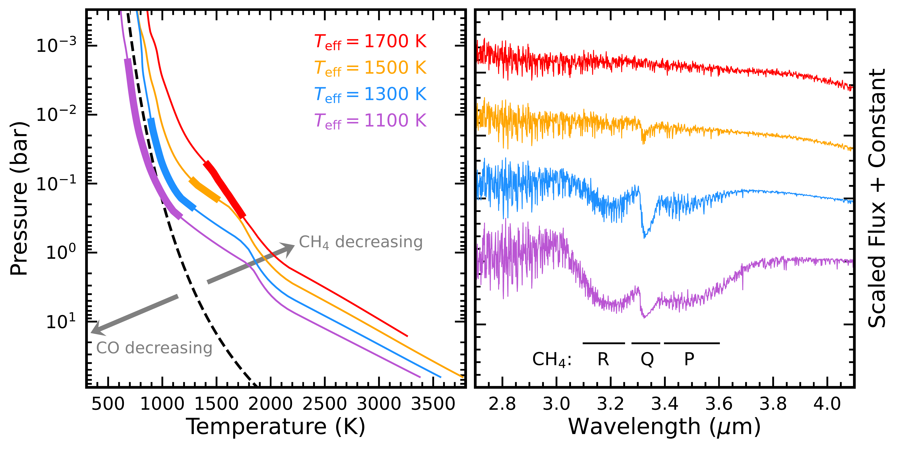

$\newcommand{\ensuremath}{}$
$\newcommand{\xspace}{}$
$\newcommand{\object}[1]{\texttt{#1}}$
$\newcommand{\farcs}{{.}''}$
$\newcommand{\farcm}{{.}'}$
$\newcommand{\arcsec}{''}$
$\newcommand{\arcmin}{'}$
$\newcommand{\ion}[2]{#1#2}$
$\newcommand{\textsc}[1]{\textrm{#1}}$
$\newcommand{\hl}[1]{\textrm{#1}}$
$\newcommand{\footnote}[1]{}$
$\newcommand$
$\newcommand{\vdag}{(v)^\dagger}$
$\newcommand$
$\newcommand$
$\newcommand$
$\newcommand$
$\newcommand$
$\newcommand{\dotdeg}{\rlap{.}^\circ}$
$\newcommand{\dotarcsec}{\rlap{.}"}$
$\newcommand{\arraystretch}{1.2}$
$\newcommand{\arraystretch}{1.1}$
$\newcommand{\arraystretch}{1.3}$
$\newcommand{\arraystretch}{1.3}$
$\newcommand{\arraystretch}{1.2}$

# ELemental abundances of Planets and brown dwarfs Imaged around Stars (ELPIS): \\II. The Jupiter-like Inhomogeneous Atmosphere of the First Directly Imaged Planetary-Mass Companion 2MASS 1207 b

<mark>Appeared on: 2025-02-27</mark> -  _51 pages, 22 figures, and 8 tables. Submitted to AJ and fully revised following the referee report. This work is dedicated to the 20th anniversary of the discovery of 2MASS 1207 b, the first directly imaged planetary-mass companion. A review of 20 years of literature on the 2MASS 1207 A+b system is presented in Section 2_

Z. Zhang (张周健), <mark>P. Mollière</mark>, J. J. Fortney, M. S. Marley

**Abstract:** 2MASS 1207 b, the first directly imaged planetary-mass companion, has been instrumental in advancing our understanding of exoplanets and brown dwarfs over the past 20 years. We have performed extensive atmospheric retrieval analyses of 2MASS 1207 b's JWST/NIRSpec spectrum using \texttt{petitRADTRANS} and a new atmospheric inhomogeneity framework, which characterizes homogeneous atmospheres, patchy clouds, cloud-free hot spots, or the combination of patchy clouds and spots. Among 24 retrieval runs with various assumptions, the most statistically preferred model corresponds to the patchy cloud scheme, with $T_{\rm eff}=1174^{+4}_{-3}$ K, $\log{(g)}=3.62^{+0.03}_{-0.02}$ dex, and $R=1.399^{+0.008}_{-0.010}$ R $_{\rm Jup}$ , along with near-solar atmospheric compositions of [ M/H ] $=-0.05\pm0.03$ dex and C/O $=0.440\pm0.012$ . This model suggests $\sim9\%$ of 2MASS 1207 b's atmosphere is covered by thin iron clouds, producing L-dwarf-like spectra, while the remaining $91\%$ consists of thick silicate and iron clouds, emitting blackbody-like spectra. These thin-cloud patches and thick-cloud regions resemble Jupiter's belts and zones, respectively, and this scenario is consistently supported by other retrieval runs incorporating inhomogeneous atmospheres. We demonstrate that the weak CO absorption of 2MASS 1207 b can be explained by the veiling effects of patchy thick clouds; the absence of 3.3 $\mu$ m CH $_{4}$ absorption is attributed to its hot thermal structure, which naturally leads to a CO-dominant, CH $_{4}$ -deficient atmosphere. The retrieved atmospheric models also match the observed variability amplitudes of 2MASS 1207 b. Our analysis reveals that the inferred atmospheric properties show significant scatter in less statistically preferred retrieval runs but converge to consistent values among the preferred ones. This underscores the importance of exploring diverse assumptions in retrievals to avoid biased interpretations of $\new{atmospheric properties}$ and formation $\new{pathways}$ .

**Figure 6. -** Results of our most preferred retrieval setup, \texttt{QEQ-1}(see Tables \ref{tab:retrieved_qeq_key}--\ref{tab:retrieved_qeq_cloud} and discussions in Section \ref{subsec:inhomo}), which has the lowest BIC value. The top panel compares the observed JWST/NIRSpec spectrum of 2MASS 1207 b (black circles) with the best-fit spectrum from \texttt{QEQ-1}(orange). The emergent spectra from each atmospheric column are plotted in purple and green, with fluxes scaled by their corresponding coverage fractions. The blue error bars ($\sigma$) represent the total error budget, where $\sigma = \sqrt{\sigma_{\rm obs}^{2} + b_{\rm chunk}^{2}}$, with $\sigma_{\rm obs}$ as the observed flux uncertainty and $b_{\rm chunk}$ as the fitted hyper-parameter (explained in Section \ref{subsec:params_priors}). The second panel from the top shows the residual spectrum between the observed and best-fit spectra, scaled by $\sigma$. The middle-left panel presents the confidence intervals for the retrieved T-P profiles. The remaining panels present the posteriors of key parameters, with median values and confidence intervals summarized in Table \ref{tab:retrieved_qeq_key}.  (*fig:patchy_fesifor_evo*)

**Figure 5. -** Four schemes in our atmospheric inhomogeneity framework (Section \ref{subsec:inhomo_framework}).  (*fig:inhomo*)

**Figure 11. -** _ Top_: The left panel shows T-P profiles from the \texttt{Sonroa Diamondback} models with varying effective temperatures: $T_{\rm eff} = 1700$ K (red), $1500$ K (orange), 1300 K (blue), and 1100 K (purple). All models have $\log{(g)} = 4.5$ dex, [M/H]$=0$ dex, and $f_{\rm sed} = 2$. The $3-4$ $\mu$m photosphere of each model is highlighted with a thick line. The CO$-$CH$_{4}$ transition curve (see Figure \ref{fig:tp_vs_f20}) is shown as a dashed line. The right panel presents the corresponding spectra, with CH$_{4}$ absorption features (R, Q, and P branches) labeled.  _ Bottom_: These two panels follow the same format as the top panels but present the T-P profiles and spectra for models with different [M/H] values: $+0.5$ dex (red), $0$ dex (orange), and $-0.5$ dex (blue). All models have $T_{\rm eff} = 1400$ K, $\log{(g)} = 4.5$ dex, and $f_{\rm sed} = 2$.  (*fig:onset_ch4_teffmh*)

