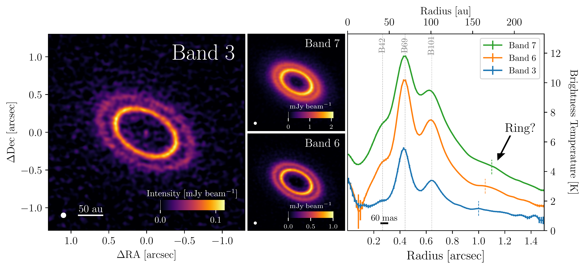
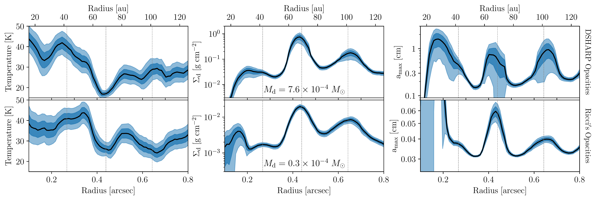

$\newcommand{\ensuremath}{}$
$\newcommand{\xspace}{}$
$\newcommand{\object}[1]{\texttt{#1}}$
$\newcommand{\farcs}{{.}''}$
$\newcommand{\farcm}{{.}'}$
$\newcommand{\arcsec}{''}$
$\newcommand{\arcmin}{'}$
$\newcommand{\ion}[2]{#1#2}$
$\newcommand{\textsc}[1]{\textrm{#1}}$
$\newcommand{\hl}[1]{\textrm{#1}}$
$\newcommand{\footnote}[1]{}$
$\newcommand{\paola}[1]{{\color{cyan} [PP: #1]}}$
$\newcommand{\paola}[1]{{\color{cyan} [PP: #1]}}$
$\newcommand{\thebibliography}{\DeclareRobustCommand{\VAN}[3]{##3}\VANthebibliography}$
$\newcommand{\thebibliography}{\DeclareRobustCommand{\VAN}[3]{##3}\VANthebibliography}$

# High angular resolution evidence of dust traps from deep ALMA Band 3 observations of LkCa15

<mark>Appeared on: 2025-03-06</mark> - 

A. Sierra, et al. -- incl., <mark>M. Benisty</mark>

**Abstract:** Dust traps are the most promising mechanisms to explain the observed substructures in protoplanetary discs. In this work, we present high-angular resolution ( $\sim$ 60 mas, 9.4 au) and high-sensitivity Atacama Large Millimetre/submillimetre Array (ALMA) observations at 3 mm of the transitional disc around LkCa15. The new data, combined with previous high-resolution observations at $\lambda=0.87,1.3$ mm, make LkCa15 an ideal laboratory for testing the dust trapping mechanism.We found that the width of the three rings decreases linearly with frequency, and the spectral indices show local minima at the locations of the rings, consistent with dust trap models. Multi-wavelength modelling confirms that the dust surface density and maximum grain size peak at 69 and 101 au, and suggestive peak at 42 au. The estimated total dust mass is between 13-250 M $_{\oplus}$ , depending on the chosen opacity.The inner disc shows bright and unresolved emission at 3 mm, exhibiting a spectral index of $\alpha_{1.3-3 \rm mm} = 0.3 \pm 0.37$ , and $\alpha_{\rm 3mm-3cm}$ ranging from $-0.1$ to $0.0$ . These properties are consistent with free-free emission from an ionised jet or disc wind.Dust evolution models and radiative transfer calculations suggest that a viscosity coefficient of $\alpha = 10^{-3}$ , a fragmentation velocity of 10 m s $^{-1}$ , and DSHARP opacities provide the best match to the observed properties.

**Figure 7. -** Left: CLEAN image of the dust continuum data at ALMA Band 3. Middle: CLEAN image of the dust continuum data at ALMA Band 7 (Top) and Band 6 (Bottom). Right: Brightness temperature radial profile of the dust continuum data. The circular beam of 60 mas for all maps is shown in the bottom left corner of each panel. The vertical grey dashed lines indicate the positions of the three bright rings (B). The vertical coloured dashed lines indicate the position of a tentative faint ring. (*fig:CleanData*)

**Figure 15. -** Left: CLEAN image of the dust continuum data at ALMA Band 3. Middle: CLEAN image of the dust continuum data at ALMA Band 7 (Top) and Band 6 (Bottom). Right: Brightness temperature radial profile of the dust continuum data. The circular beam of 60 mas for all maps is shown in the bottom left corner of each panel. The vertical grey dashed lines indicate the positions of the three bright rings (B). The vertical coloured dashed lines indicate the position of a tentative faint ring. (*fig:CleanData*)

**Figure 11. -** Dust properties constraints from the multi-wavelength dust continuum observations of LkCa15 using the DSHARP opacities (Top panels) and Ricci's opacities (Bottom panels). The shaded regions show 1$\sigma$ and 2$\sigma$ uncertainties. The vertical dashed lines show the position of the ring locations at 42, 69, and 101 au. (*fig:DustProp*)

