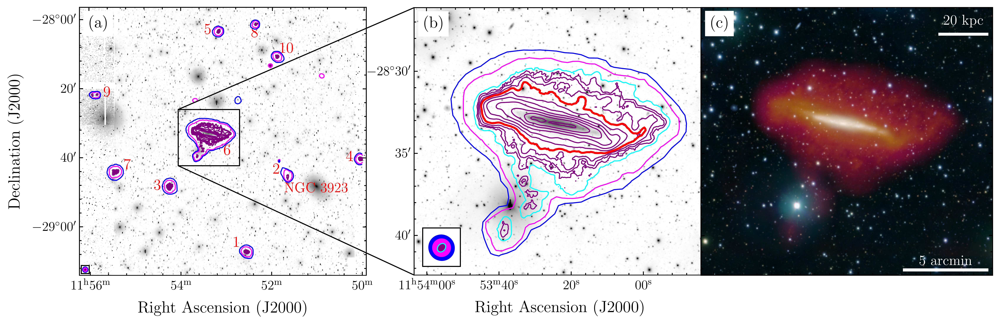
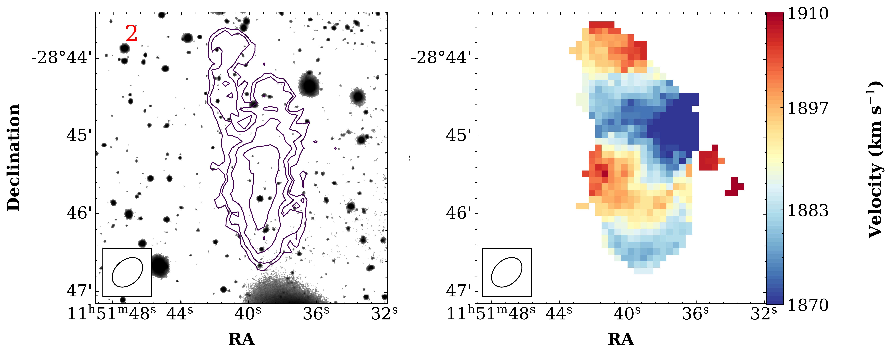
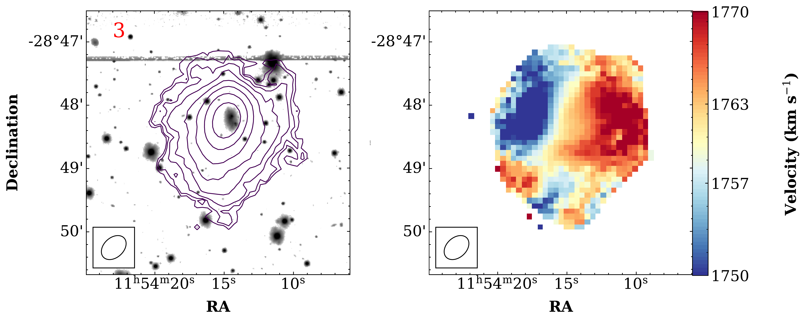

$\newcommand{\ensuremath}{}$
$\newcommand{\xspace}{}$
$\newcommand{\object}[1]{\texttt{#1}}$
$\newcommand{\farcs}{{.}''}$
$\newcommand{\farcm}{{.}'}$
$\newcommand{\arcsec}{''}$
$\newcommand{\arcmin}{'}$
$\newcommand{\ion}[2]{#1#2}$
$\newcommand{\textsc}[1]{\textrm{#1}}$
$\newcommand{\hl}[1]{\textrm{#1}}$
$\newcommand{\footnote}[1]{}$
$\newcommand{\HI}{\rm H{\sc i }}$
$\newcommand{\MB}{\ensuremath{\rm M_B}}$
$\newcommand{\mb}{\ensuremath{\rm M_{bar}}}$
$\newcommand{\mhi}{\ensuremath{\rm M_{HI}}}$
$\newcommand{\mg}{\ensuremath{\rm M_{g}}}$
$\newcommand{\ms}{\ensuremath{\rm M_{s}}}$
$\newcommand{\msun}{\ensuremath{\rm M_{\odot}}}$
$\newcommand{\fatm}{\ensuremath{\rm f_{atm}}}$
$\newcommand{\kms}{\ensuremath{\rm km   s^{-1}}}$
$\newcommand{\vhel}{\ensuremath{ V_{\rm hel}}}$
$\newcommand{\kpc}{\ensuremath{\rm kpc}}$
$\newcommand{\Jykms}{\ensuremath{ \rm Jy   km   s^{-1} }}$
$\newcommand{\mJybeam}{\ensuremath{ \rm mJy   beam^{-1} }}$
$\newcommand{\LCDM}{\ensuremath{\Lambda{\rm CDM}}}$
$\newcommand{\fat}{{\sc fat }}$
$\newcommand{\thebibliography}{\DeclareRobustCommand{\VAN}[3]{##3}\VANthebibliography}$

# Uncovering Extraplanar Gas in UGCA 250 with the Ultra-deep MHONGOOSE Survey

<mark>Appeared on: 2025-03-06</mark> -  _16 pages, 14 figures, Accepted for publication in MNRAS_

S. Kurapati, et al. -- incl., <mark>E. Schinnerer</mark>, <mark>F. Walter</mark>

**Abstract:** We use the neutral atomic hydrogen (H ${\sc i}$ ) observations of the edge-on galaxy UGCA 250, taken as part of the MeerKAT $\HI$ Observations of Nearby Galactic Objects - Observing Southern Emitters (MHONGOOSE) survey to investigate the amount, morphology, and kinematics of extraplanar gas. The combination of high column density sensitivity and high spatial resolution of the survey over a large field of view is ideal for studying the underlying physics governing the extraplanar gas. These data reveal 9 additional detections within the field of view along with UGCA 250, with 8 of them being within $\sim$ 200 km s $^{-1}$ of the galaxy’s systemic velocity. The galaxy seems to have a tail-like feature extending away from it in the southern direction  up to $\sim$ 41 kpc (in projection). We also detect a cloud at anomalous velocities, but we did not find any optical counterpart. We construct a detailed tilted ring model for this edge-on galaxy to gain a deeper understanding of the vertical structure of its neutral hydrogen. The model that best matches the data features a thick disc with a scale height of $\sim$ 3 $\pm$ 1 kpc and an $\HI$ mass of about 15 $\%$ of the total H ${\sc i}$ mass. This extraplanar gas is detected for the first time in UGCA 250. Our analysis favours a mixed origin for the extraplanar gas in UGCA 250, likely arising from a combination of internal stellar feedback and external tidal interactions.

**Figure 9. -** . The $\HI$ integrated intensity contours are overlaid on the VST optical $g$-band image. (a) Moment 0 map of UGCA 250 and its 9 satellite galaxies. The contours are shown from data at various resolutions: 26.7$\arcsec$$\times$ 18.8$\arcsec$({\tt r10t00}) in purple with levels of 1.2$\times$10$^{19}$ cm$^{-2} \times 2^{n}$, n = 0,1,2,3 ..; 34.3$\arcsec$$\times$ 25.6$\arcsec$({\tt r15t00}) in cyan at 3.0$\times$10$^{18}$ cm$^{-2}$; 65.3$\arcsec$$\times$ 63.8$\arcsec$({\tt r05t60}) in magenta at 1.0$\times$10$^{18}$ cm$^{-2}$; and 93.8$\arcsec$$\times$ 91.7$\arcsec$({\tt r10t90}) in blue at 6.2$\times$10$^{17}$ cm$^{-2}$. (b) Moment-0 map of the galaxy UGCA 250 with the same $\HI$ contours, where the thick red contour corresponds to 1.0 $\times$10$^{20}$ cm$^{-2}$. Note that the $\HI$ column density values have not been corrected for the primary beam attenuation.  The ellipses in the bottom left corner represent the beams at each resolution. The zoomed-in moment 0 and moment 1 maps of individual satellite galaxies are shown in Figs \ref{fig:sat1} and \ref{fig:sat2} in the appendix. (c) The red, orange, and yellow show the $\HI$ integrated intensity from three different resolution data cubes: 14.4$\arcsec$$\times$ 9.8$\arcsec$, 26.7$\arcsec$$\times$ 18.8$\arcsec$, and 65.3$\arcsec$$\times$ 63.8$\arcsec$. These H{\sc i} maps are overlaid on a composite optical RGB image of UGCA  250 in the background. The creation of this image followed the technique outlined in \citet{English2017}. (*fig:mom0_overlay*)

**Figure 2. -** Selected channel maps of UGCA 250 at the resolution of 34.3$\arcsec$$\times$ 25.6$\arcsec$({\tt r15t00}, $r =$ 1.5 and $t =$ 0). The heliocentric velocity in $\kms$ is indicated on top-left of each panel. Contours begin at 3$\sigma$ and increase by factors of 2. The presence of cloud and filament is evident in the channels at velocities ranging from 1587 to 1637 km s$^{-1}$ (*fig:channel_maps*)

**Figure 7. -** The $\HI$ intensity map (moment 0) and velocity field (moment 1) of satellite galaxies. The H{\sc i} contours are at levels of 1.2$\times$10$^{19}$ cm$^{-2} \times 2^{n}$, n = 0,1,2,3 .. (*fig:sat1*)

