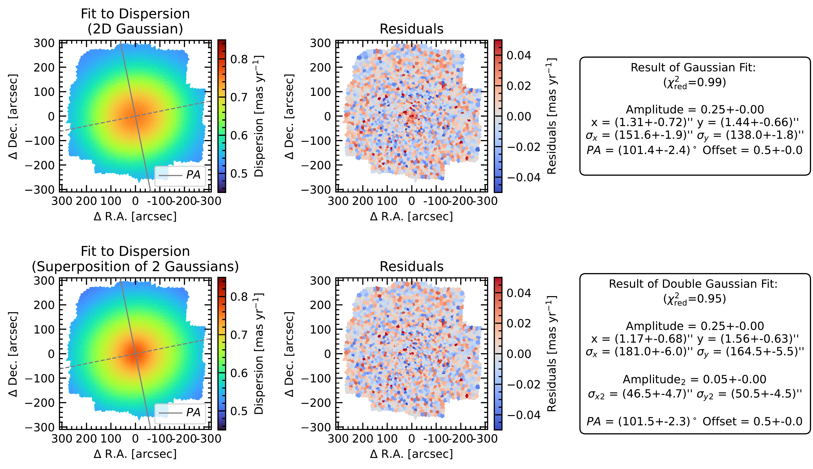
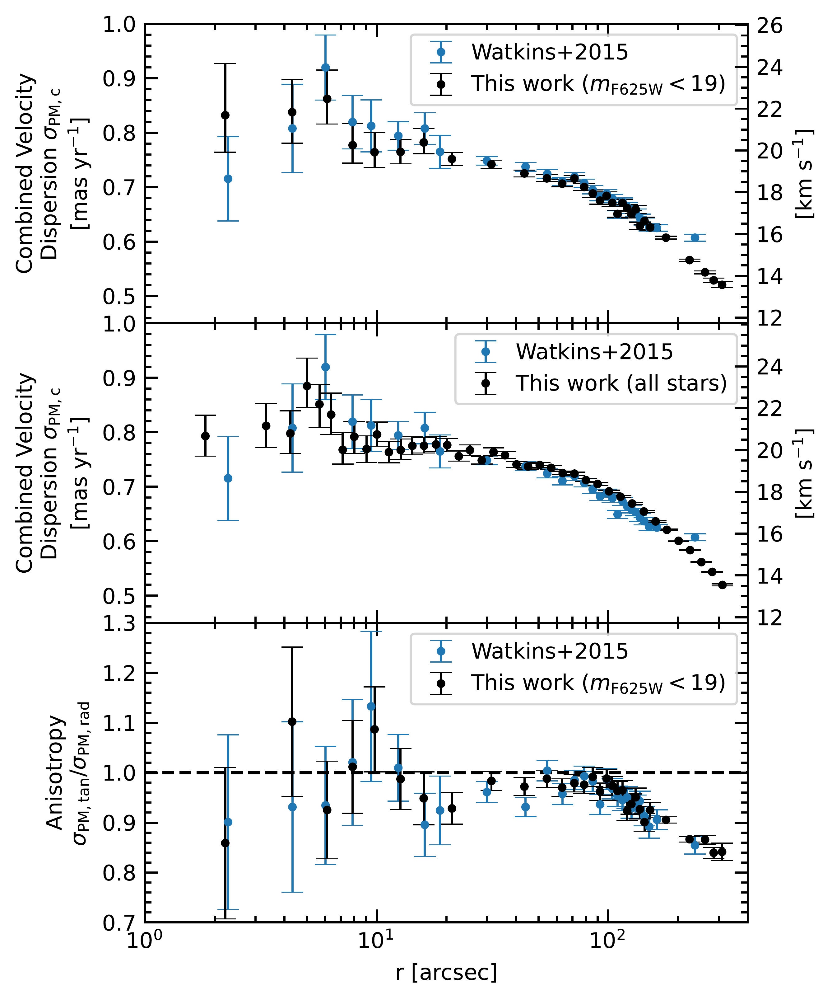

$\newcommand{\ensuremath}{}$
$\newcommand{\xspace}{}$
$\newcommand{\object}[1]{\texttt{#1}}$
$\newcommand{\farcs}{{.}''}$
$\newcommand{\farcm}{{.}'}$
$\newcommand{\arcsec}{''}$
$\newcommand{\arcmin}{'}$
$\newcommand{\ion}[2]{#1#2}$
$\newcommand{\textsc}[1]{\textrm{#1}}$
$\newcommand{\hl}[1]{\textrm{#1}}$
$\newcommand{\footnote}[1]{}$
$\newcommand{\vdag}{(v)^\dagger}$
$\newcommand$
$\newcommand$
$\newcommand{\todo}[1]{{\textcolor{red}{TODO: #1}}}$
$\newcommand$
$\newcommand{\revision}[1]{{\textcolor{blue}{\textbf{#1}}}}$
$\newcommand{\sectionautorefname}{Section}$
$\newcommand{\subsectionautorefname}{Section}$
$\newcommand{\subsubsectionautorefname}{Section}$
$\newcommand{\figureautorefname}{Fig.}$

# oMEGACat. VI. Analysis of the overall kinematics of Omega Centauri in 3D: velocity dispersion, kinematic distance, anisotropy, and energy equipartition

<mark>Appeared on: 2025-03-10</mark> -  _31 pages, 23 Figures, 4 Tables. Accepted for publication in ApJ. Data products available under: this https URL_

<mark>M. Häberle</mark>, et al. -- incl., <mark>N. Neumayer</mark>, <mark>C. Clontz</mark>

**Abstract:** Omega Centauri ( $\omc$ ) is the Milky Way's most massive globular cluster and is likely the stripped nucleus of an accreted dwarf galaxy. In this paper, we analyze $\omc$ 's kinematics using data from oMEGACat, a comprehensive catalog of $\omc$ 's central regions, including 1.4 million proper motion measurements and 300,000 spectroscopic radial velocities.  Our velocity dispersion profiles and kinematic maps are consistent with previous work but improve on their resolution, precision, and spatial coverage.  The cluster's 3D dispersion is isotropic in the core, with increasing radial anisotropy at larger radii. The 2D kinematic maps show an elongation of the velocity dispersion field comparable to the flattening observed photometrically.We find good agreement between proper motions and line-of-sight velocity dispersion and measure a kinematic distance of $5494\pm61$ pc, the most precise kinematic distance to $\omc$ available.The subset of data with precise metallicity measurements shows no correlation between metallicity and kinematics, supporting the picture of well-mixed stellar populations within the half-light radius of $\omc$ .Finally, we study the degree of energy equipartition using a large range of stellar masses. We find partial energy equipartition in the center that decreases towards large radii. The spatial dependence of the radial energy equipartition is stronger than the tangential energy equipartition.Our kinematic observations can serve as a new reference for future dynamical modeling efforts that will help to further disentangle the complex mass distribution within $\omc$ .

**Figure 9. -** Dispersion map combining both proper motion components and determined using $N=250$ Voronoi bins. The right panel shows a zoom into the centermost arcminute with the numerical values (in mas yr$^{-1}$) for the individual bins shown in black letters. (*fig:voronoi_map_proper_motion*)

**Figure 10. -** _Top:_ Result of a single component 2D Gaussian fit to the 2D proper motion dispersion field shown from \autoref{fig:voronoi_map_proper_motion}. The _left_ shows the result, the _center_ shows the residuals, which are in good agreement besides an underestimation of the cusp of the velocity dispersion in the centermost region, and the _right_ shows the parameters of the Gaussian fit. _Bottom:_ Results for a 2-component 2D Gaussian fit. This 2-component model is better able to describe the velocity dispersion in the innermost region, as can be seen from the residuals. Both models successfully recover the ellipticity and the position angle of the dispersion field. (*fig:voronoi_map_gaussian_fit*)

**Figure 2. -** Proper motion dispersion profiles determined using the new oMEGACat (black markers). We compare the new dispersion measurements with the literature profile by \citetalias{2015ApJ...803...29W}(blue markers). For better comparability, in the _top panel_ we restrict our data set to bright stars and use a binning scheme similar to the literature. In the _center panel_ we use logarithmic radial bins and the full high-quality subset. In the _bottom panel_ we compare the anisotropy, again using the bright sample only. (*fig:watkins_comparison*)

