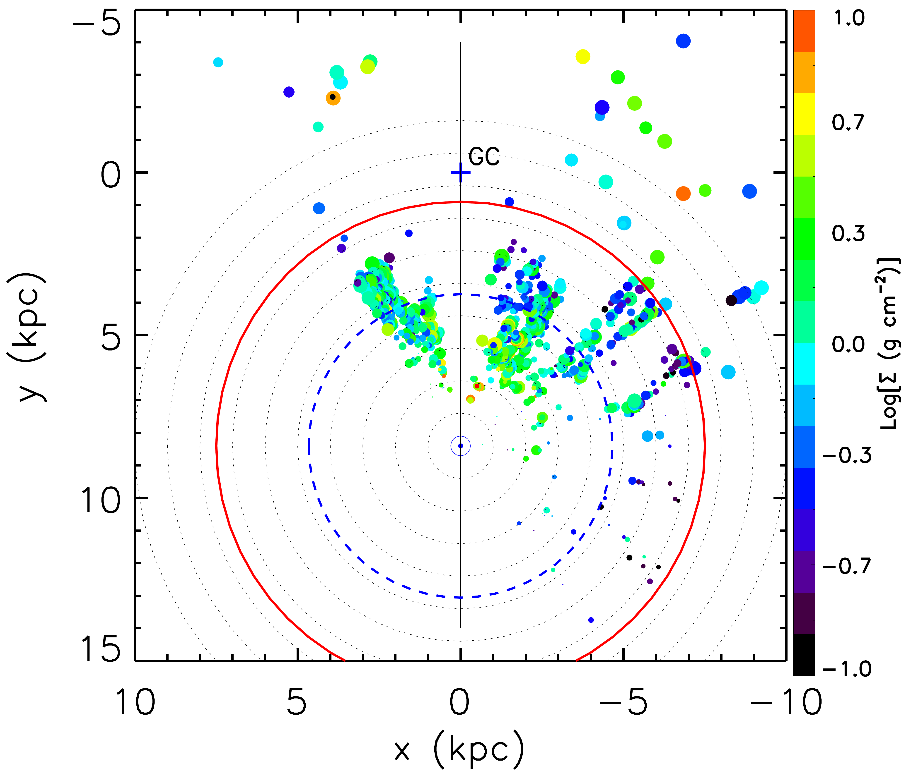
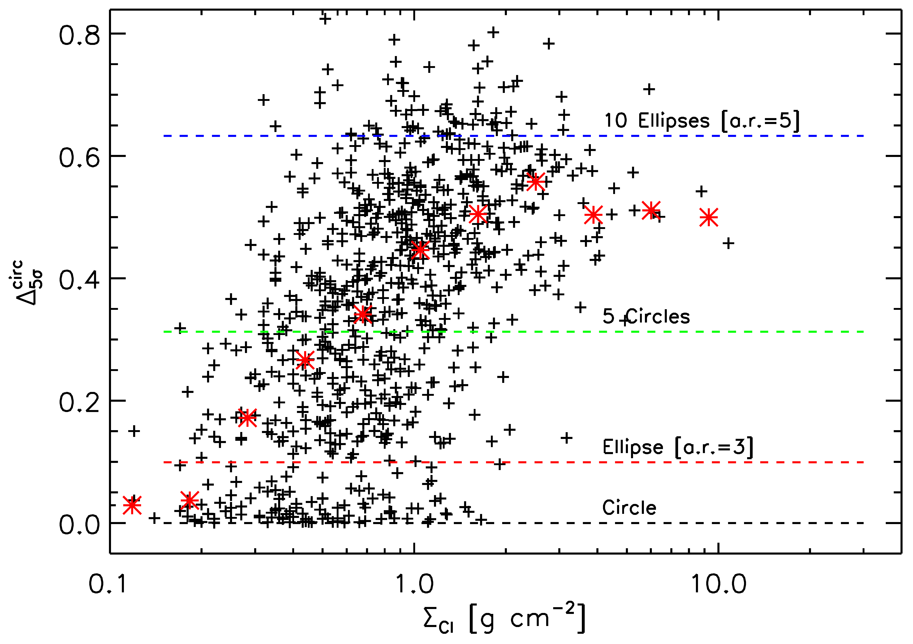

$\newcommand{\ensuremath}{}$
$\newcommand{\xspace}{}$
$\newcommand{\object}[1]{\texttt{#1}}$
$\newcommand{\farcs}{{.}''}$
$\newcommand{\farcm}{{.}'}$
$\newcommand{\arcsec}{''}$
$\newcommand{\arcmin}{'}$
$\newcommand{\ion}[2]{#1#2}$
$\newcommand{\textsc}[1]{\textrm{#1}}$
$\newcommand{\hl}[1]{\textrm{#1}}$
$\newcommand{\footnote}[1]{}$
$\newcommand{\kms}{km s^{-1}}$
$\newcommand{\msun}{M_{\odot}}$
$\newcommand{\lsun}{L_{\odot}}$
$\newcommand{\lbol}{L_{\mathrm{bol}}}$
$\newcommand{\um}{\mum}$
$\newcommand{\adeg}{^{\circ}}$
$\newcommand{\hi}{H{\sc i}}$
$\newcommand{\hii}{H{\sc ii}}$
$\newcommand{\chiiicn}{CH_3CN (12--11)}$
$\newcommand{\chiiitcn}{CH_3^{13}CN (12--11)}$
$\newcommand{\hiico}{H_2CO}$
$\newcommand{\chiiioh}{CH_3OH}$
$\newcommand{\dcn}{DCN (3 -- 2)}$
$\newcommand{\ocs}{OCS (19 -- 18)}$
$\newcommand{\hciiin}{HC_3N(24 -- 23)}$
$\newcommand{\so}{SO (6_5 -- 5_4)}$
$\newcommand{\sio}{SiO (5 -- 4)}$
$\newcommand{\tco}{^{13}CO (2--1)}$
$\newcommand{\ceo}{C^{18}O (2--1)}$
$\newcommand{\vlsr}{v_{\rm LSR}}$
$\newcommand{\gcmtwo}{g cm^{-2}}$
$\newcommand{\asec}{^{\prime \prime}}$
$\newcommand{\deltacirc}{\Delta^{\rm circ} _{5\sigma}}$
$\newcommand{\qhull}{Q^{\rm hull} _{5\sigma}}$
$\newcommand{\fres}{\textit{\sc 7m+tm2+tm1}}$
$\newcommand{\ires}{\textit{\sc 7m+tm2}}$
$\newcommand{\lres}{\textit{\sc 7m}}$
$\newcommand{\n}{"near"}$
$\newcommand{\f}{"far"}$
$\newcommand{\cpear}{r_P}$
$\newcommand{\revision}[1]{\textbf{\color{red} #1}}$
$\newcommand{\nhigal}{915}$
$\newcommand{\nrms}{98}$
$\newcommand{\nall}{1013}$
$\newcommand{\nvlim}{77}$
$\newcommand{\ndnf}{24}$
$\newcommand{\ndfn}{39}$
$\newcommand{\ndfiveh}{95}$
$\newcommand{\nkdanewcommandnear}{7}$
$\newcommand{\nnewcommandnear}{7}$
$\newcommand{\samplen}{538}$
$\newcommand{\samplef}{479}$

# ALMAGAL I. The ALMA evolutionary study of high-mass protocluster formation in the Galaxy: Presentation of the survey and early results

<mark>Appeared on: 2025-03-10</mark> -  _21 pages, 18 figures plus appendices. Astronomy & Astrophysics, accepted_

S. Molinari, et al. -- incl., <mark>H. Beuther</mark>, <mark>M. Wells</mark>, <mark>T. Henning</mark>

**Abstract:** A large fraction of stars form in clusters containing high-mass stars, which subsequently influences the local and galaxy-wide environment. Fundamental questions about the physics responsible for fragmenting molecular parsec-scale clumps into cores of a few thousand astronomical units (au)  are still open, that only a statistically significant investigation with ALMA is able to address; for instance: the identification of the dominant agents  that determine the core demographics, mass, and spatial distribution as a function of the physical properties of the hosting clumps, their evolutionary stage and the different Galactic environments in which they reside. The extent to which fragmentation is driven by clumps dynamics or mass transport in filaments also remains elusive. With the ALMAGAL project, we observed the 1.38 mm continuum and lines toward more than 1000 dense clumps in our Galaxy, with $M \geq$ 500 $\msun$ , $\Sigma\geq 0.1$ $\gcmtwo$ and $d$ $\leq$ 7.5 kiloparsec (kpc). Two different combinations of ALMA Compact Array (ACA) and 12-m array setups were used to deliver a minimum resolution of $\sim$ 1000 au over the entire sample distance range. The sample covers all evolutionary stages from infrared dark clouds (IRDCs) to $\hii$ regions from the tip of the Galactic bar  to the outskirts of the Galaxy. With a continuum sensitivity of 0.1 mJy, ALMAGAL enables a complete study of the clump-to-core fragmentation process down to $M\sim 0.3 $ ${\msun}$ across the Galaxy. The spectral setup includes several molecular lines to trace the multiscale physics and dynamics of gas, notably $CH_3$ CN, $H_2$ CO, SiO, $CH_3$ OH, DCN, $HC_3$ N, and SO, among others. We present an initial overview of the observations and the early science product and results produced in the ALMAGAL Consortium, with a first characterization of the morphological properties of the continuum emission detected above 5 $\sigma$ in our fields. We used "perimeter-versus-area" and convex hull-versus-area metrics to classify the different morphologies. We find that more extended and morphologically complex (significantly departing from circular or generally convex) shapes are found toward clumps that are relatively more evolved and have higher surface densities. ALMAGAL is poised to  serve as a game-changer for a number of specific issues in star formation: clump-to-core fragmentation processes, demographics of cores, core and clump gas chemistry and dynamics, infall and outflow dynamics, and disk detections. Many of these issues will  be covered in the first generation of papers that closely follow on the present publication.

**Figure 5. -** ALMA 1.38 mm total emission area above 5$\sigma$ in $\fres$ images as a function of the clump surface density from Table 1. The green symbols are for target clumps with $L/M\geq$5. The red histogram reports the fractional distribution of the surface density  for ALMAGAL sources with no 5$\sigma$ detection (to be read on the red right $y$-axis). (*roi-area_surf_d*)

**Figure 20. -** (a) Galactic distribution of ALMAGAL target clumps are shown on the left, with a symbol size of $\propto$Log($M_c$) (clump mass) and color coded by $\Sigma_c$(surface density), as determined from the Hi-GAL data (non-beam-deconvolved), reflecting the updated distances and physical parameters described in Sect. \ref{revision} and reported in Table 1, available at the CDS. Dotted circles represent 1 kpc distance interval centered on the Sun and the plus symbol marks the location of the Galactic Center. The blue dashed circle marks the distance threshold used to split the target sample among the two ALMA antenna configurations designed to provide a minimum 1000 au linear resolution. The red circle marks the 7.5 kpc distance originally used as an upper limit for source selection. b)  L$_{bol}$/M$_{clump}$ plot for the 1017 selected clumps (color-coded by T$_{dust}$) is shown on the right.
  Asterisks indicate Hi-GAL sample sources associated with $\hi$i regions from the surveys of CORNISH  ([Purcell, Hoare and Cotton 2013]()) , and CORNISH-S  ([Irabor, Hoare and Burton 2023]()) .
   (*sample_fig*)

**Figure 9. -** Departure from circularity, $\deltacirc$, of the total of the 5$\sigma$ ALMA emission RoIs in each field as a function of the clump surface density. The red asterisks are the medians of $\deltacirc$ in logarithmic bins of surface density. (*deltacirc_surfd_fig*)

