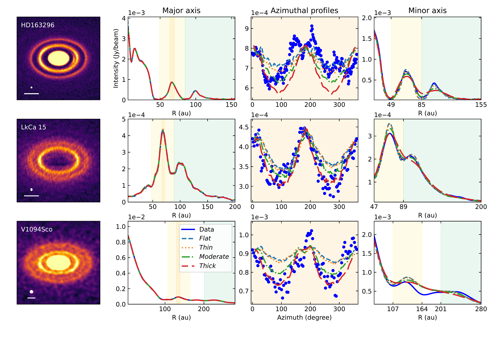
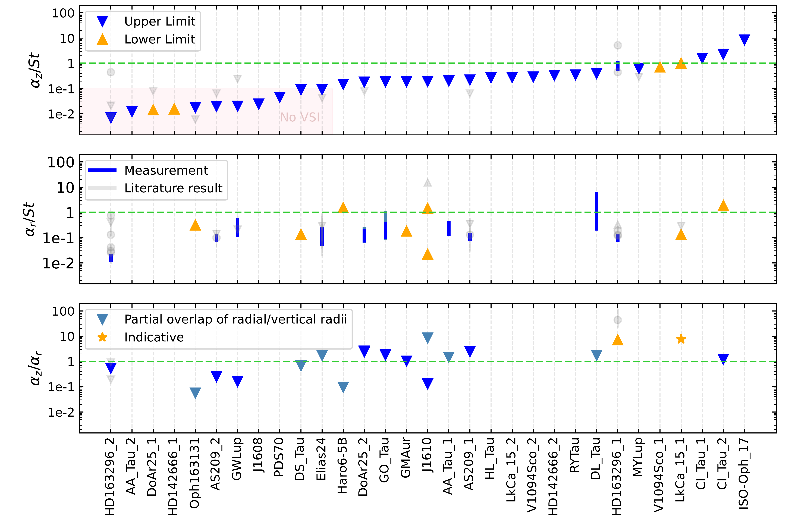

$\newcommand{\ensuremath}{}$
$\newcommand{\xspace}{}$
$\newcommand{\object}[1]{\texttt{#1}}$
$\newcommand{\farcs}{{.}''}$
$\newcommand{\farcm}{{.}'}$
$\newcommand{\arcsec}{''}$
$\newcommand{\arcmin}{'}$
$\newcommand{\ion}[2]{#1#2}$
$\newcommand{\textsc}[1]{\textrm{#1}}$
$\newcommand{\hl}[1]{\textrm{#1}}$
$\newcommand{\footnote}[1]{}$
$\newcommand{\vdag}{(v)^\dagger}$
$\newcommand$
$\newcommand$
$\newcommand{\St}{\text{St}}$
$\newcommand{\Sc}{\text{Sc}}$

# Turbulence in protoplanetary disks: A systematic analysis of dust settling in 33 disks

<mark>Appeared on: 2025-03-11</mark> -  _Accepted in A&A_

M. Villenave, et al. -- incl., <mark>K. Doi</mark>

**Abstract:** The level of dust vertical settling and radial dust concentration in protoplanetary disks is of critical importance for understanding the efficiency of planet formation. Here, we present the first uniform analysis of the vertical extent of millimeter dust for a representative sample of 33  protoplanetary disks, covering broad ranges of disk evolutionary stages and stellar masses.We used radiative transfer modeling of archival high-angular-resolution ( $\lesssim0.1\arcsec$ ) ALMA dust observations of inclined and ringed disks to estimate their vertical dust scale height, which was compared to estimated gas scale heights to characterize the level of vertical sedimentation.In all 23 systems for which constraints could be obtained, we find that the outer parts of the disks are vertically settled.Five disks allow for the characterization of the dust scale height both within and outside approximately half the dust disk radius, showing a lower limit on their dust heights at smaller radii. This implies that the ratio between vertical turbulence, $\alpha_z$ , and the Stokes number, $\alpha_z/\St$ , decreases radially in these sources. For 21 rings in 15 disks, we also constrained the level of radial concentration of the dust, finding that about half of the rings are compatible with strong radial trapping. In most of these rings, vertical turbulence is found to be comparable to or weaker than radial turbulence,which is incompatible with the turbulence generated by the vertical shear instability at these locations. We further used our dust settling constraints to estimate the turbulence level under the assumption that the dust size is limited by fragmentation, finding typical upper limits around $\alpha_\text{frag}\lesssim10^{-3}$ .  In a few sources, we find that turbulence cannot be the main source of accretion.Finally, in the context of pebble accretion, we identify several disk regions that have upper limits on their dust concentrationthat would allow core formation to proceed efficiently, even at wide orbital distances outside of 50 au.

**Figure 7. -** Vertically thick inner ring and thin outer disk in HD163296, LkCa 15, and V1094Sco. The shaded colors on the major axis cuts indicate the location of the azimuthal profiles (orange) and rings of interest (yellow and green).
    "Flat" models are too thin vertically to show sufficient azimuthal variation compared to the data (third panels), while "Thick" models  are too vertically extended to reproduce the outer disk/ring brightness in all three disks. The beam size and a 25 au scale are indicated in the bottom left corner of the first panels. (*fig:upperLower_LkCa15_V1094Sco*)

**Figure 8. -** Resolved thickness in the inner disk half and flat outer disk in DoAr 25 and HD 142666. For both disks, "Flat" models show too strong of a gap in the inner region (third panels), indicating that the disks must be thicker. On the other hand, "Moderate" and "Thick" models do not reproduce the gap and ring in DoAr 25, and the outer disk profile in both disks (last panels), highlighting the presence of a flat outer disk. The beam size and a 25 au scale are indicated in the bottom left corner of the first panels. (*fig:upperLower_DoAr25_HD142666*)

**Figure 9. -** Vertical $\alpha_z/$\St$$(top), radial $\alpha_r/$\St$$(middle), and their ratio $\alpha_z/\alpha_r$(bottom). In the bottom panel, we mark the rings without a full inclusion into the domain of the vertical constraints with a lighter blue. In all panels, constraints obtained by previous studies are shown in gray. The labels correspond to the constrained regions in \autoref{tab:verticalTrapping}. The underscore `\_1' corresponds to the only or first region with a constraint in a disk, while `\_2' displays the results for the second region. (*fig:radial_vertical_alpha*)

