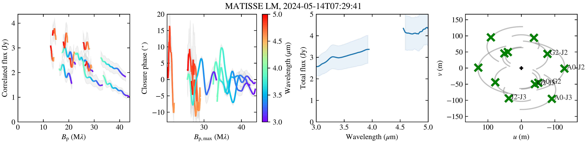
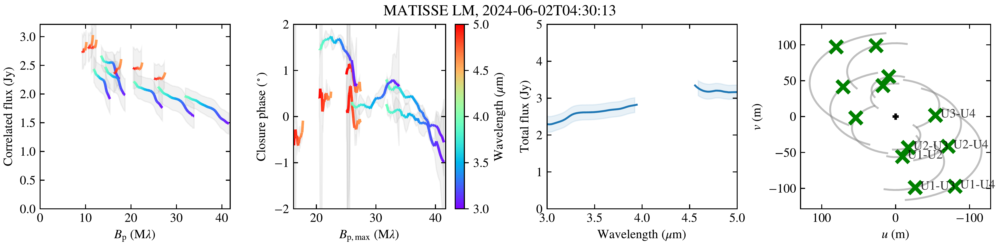
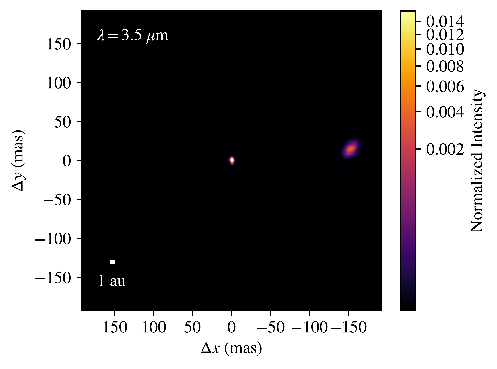
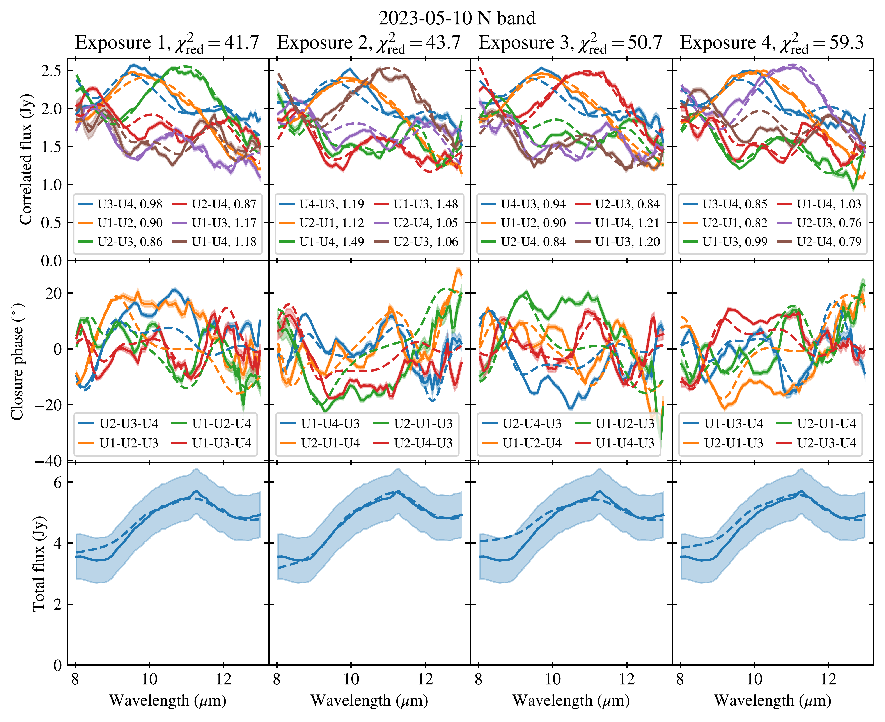
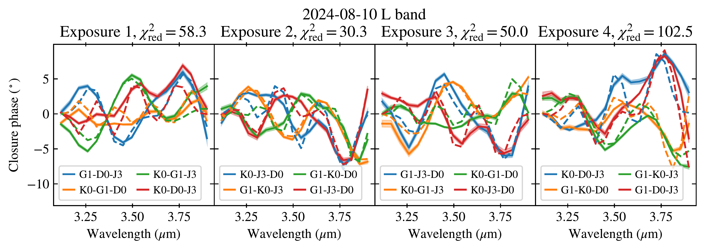
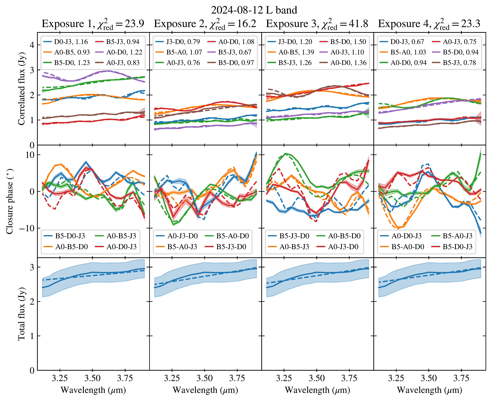

$\newcommand{\ensuremath}{}$
$\newcommand{\xspace}{}$
$\newcommand{\object}[1]{\texttt{#1}}$
$\newcommand{\farcs}{{.}''}$
$\newcommand{\farcm}{{.}'}$
$\newcommand{\arcsec}{''}$
$\newcommand{\arcmin}{'}$
$\newcommand{\ion}[2]{#1#2}$
$\newcommand{\textsc}[1]{\textrm{#1}}$
$\newcommand{\hl}[1]{\textrm{#1}}$
$\newcommand{\footnote}[1]{}$

# T CrA has a companion$\thanks{Based on observations collected at the European Southern Observatory under ESO programmes 111.253T.001, 113.26PG.001, 113.26PG.006, and 113.26PG.008.}$: First direct detection of T CrA B with VLTI/MATISSE

<mark>Appeared on: 2025-03-12</mark> -  _9 pages, 8 figures_

J. Varga, et al. -- incl., <mark>R. v. Boekel</mark>, <mark>T. Henning</mark>, <mark>M. Scheuck</mark>

**Abstract:** T CrA is a Herbig Ae-type young star in a complex circumstellar environment; it includes a circumstellar disk, accretion streamers, jets, and outflows. It has long been suspected to be a binary. However, until now, there has been no direct detection of a companion. Here we present new VLTI/MATISSE $L$ - and $N$ -band observations of T CrA taken between 2023 May and 2024 August with the aim of testing the binary nature of the system. We modeled the data with a geometric model using the Python tool \texttt{oimodeler} .We detected a companion (T CrA B) with a projected separation of $\Delta r = 153.2 \pm 1.2$ mas ( $\approx23$ au) toward the  west direction at a position angle of $275.4 \pm 0.1◦$ , in 2024 May--August.Our results support that the companion has a nearly edge-on orbit that is highly misaligned with respect to the circumprimary disk. Such a configuration could cause warping and tearing of the disk around the primary, which has been proposed by recent studies. In the $L$ band the companion is extended, with a full width at half maximum (FWHM) size of $\sim1$ au, suggesting that the emission comes from a disk around the secondary star. The companion flux is $0.2$ -- $0.3$ Jy in the $L$ band, and $0.2$ -- $0.7$ Jy in the $N$ band, accounting for $4$ -- $20\%$ of the total emission at those wavelengths. The SED of the companion is compatible with thermal radiation of warm dust ( $600$ -- $800$ K).

**Figure 4. -** Calibrated MATISSE $L$- and $LM$-band data sets with pipeline produced uncertainties. First column: Correlated flux as a function of the spatial frequency. Second column: Closure phase as a function of the spatial frequency corresponding to the longest baselines of the triangles. Third column: Single-dish flux as a function of the wavelength. Fourth column: $uv$ coverage of the observations. The correlated flux and the closure phase values are the average over the four non-chopped exposures of each observation, while the single-dish flux values are the average over the eight chopped exposures. The 2023 May 10 and 2024 June 2 data are UT observations, the rest are AT observations.  (*fig:data_L*)

**Figure 1. -** Best-fit model image corresponding to the fit to the three complete $L$-band data sets. The companion is clearly visible at $153$ mas separation toward the west direction. The J2000 coordinate of the central source is $\alpha = 19^\mathrm{h}01^\mathrm{m}58.79^\mathrm{s}$, $\delta = -36◦57$\arcmin$50.34$\arcsec$$. (*fig:model_img*)

**Figure 9. -** Fits to the individual exposures in the second stage of our modeling. Each large three by four panel corresponds to a single epoch observation. A column in a panel shows the fits to a particular exposure, with the correlated flux on the top, closure phase in the middle, and single-dish flux at the bottom. The data are shown as solid lines, and the model as dashed lines. Correction factors are indicated in the legend of the correlated flux plots, for each baseline. The 2024 Aug 10 data set is incomplete, and thus only the closure phases were fitted. (*fig:fit_CF_CP*)

