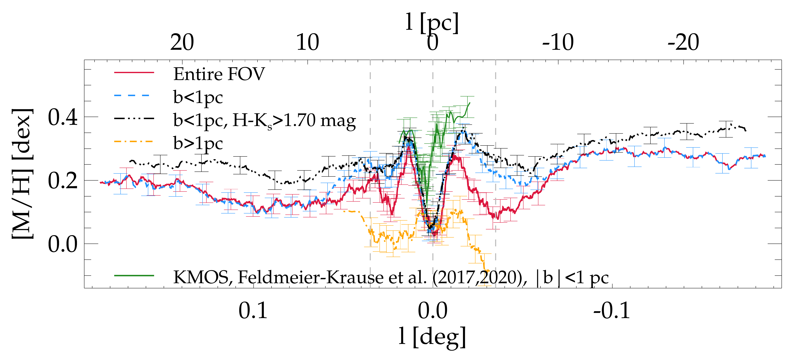
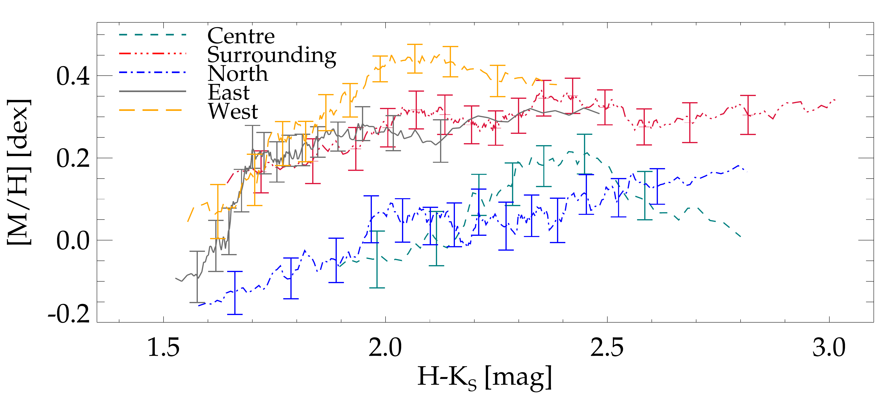
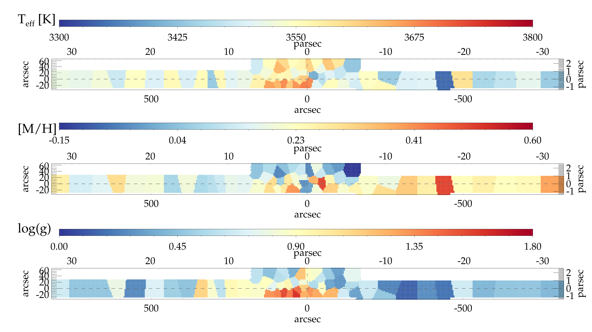
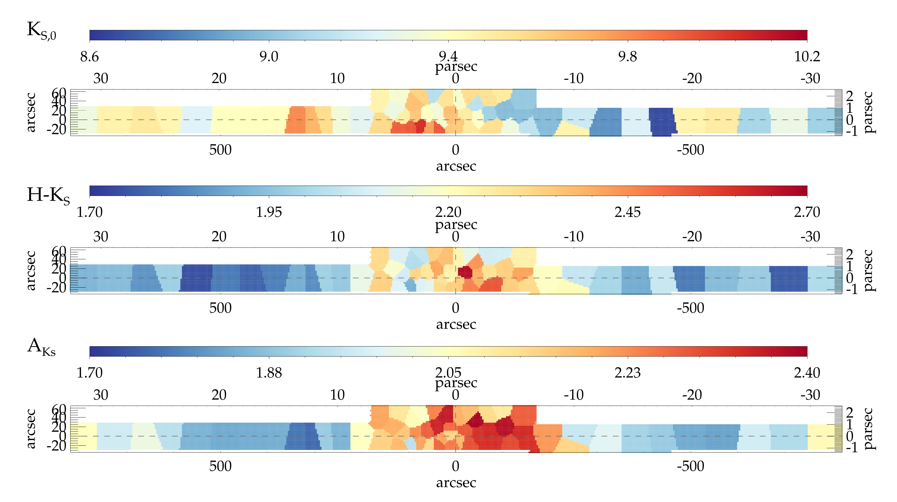

$\newcommand{\ensuremath}{}$
$\newcommand{\xspace}{}$
$\newcommand{\object}[1]{\texttt{#1}}$
$\newcommand{\farcs}{{.}''}$
$\newcommand{\farcm}{{.}'}$
$\newcommand{\arcsec}{''}$
$\newcommand{\arcmin}{'}$
$\newcommand{\ion}[2]{#1#2}$
$\newcommand{\textsc}[1]{\textrm{#1}}$
$\newcommand{\hl}[1]{\textrm{#1}}$
$\newcommand{\footnote}[1]{}$
$\newcommand{\micron}{\ensuremath{\mu}m}$
$\newcommand{\angstrom}{\mathring{A}}$
$\newcommand{\teff}{\ensuremath{T_\textrm{eff}}\xspace}$
$\newcommand{\re}{\ensuremath{R_\textrm{e}}\xspace}$
$\newcommand{\logg}{\ensuremath{\log(\rm g)}\xspace}$
$\newcommand{\mh}{[M/H]\xspace}$
$\newcommand{\kms}{km s\ensuremath{^{-1}}\xspace}$
$\newcommand{\msun}{\ensuremath{M_{\sun}}\xspace}$
$\newcommand{\vlos}{\ensuremath{V_\textrm{LOS}}\xspace}$
$\newcommand{\dlos}{\ensuremath{d_\textrm{LOS}}\xspace}$
$\newcommand{\slos}{\ensuremath{\sigma_{\textrm{LOS}}}\xspace}$
$\newcommand{\sgra}{Sgr~A^\star\xspace}$
$\newcommand{\sgr}{Sgr~A^\star\xspace}$
$\newcommand{\col}{\ensuremath{H-K_{S}}\xspace}$
$\newcommand{\ak}{\ensuremath{A_{K_S}}\xspace}$
$\newcommand{\thetable}{E.\arabic{table}}$

# A spectroscopic map of the Galactic centre: Observations and resolved stars 

<mark>Appeared on: 2025-03-18</mark> -  _20 pages (+ 7 pages Appendix), 17 (+ 4) figures, accepted A&A_

A. Feldmeier-Krause, et al. -- incl., <mark>N. Neumayer</mark>

**Abstract:** The Galactic Centre region contains a dense accumulation of stars, which can be separated into two components: A mildly flattened and extremely dense nuclear star cluster (NSC), and a surrounding, more extended and more flattened, nuclear stellar disc (NSD).  Previous studies have collected a few thousand spectra of the inner NSC, and also the outer NSD, and measured line-of-sight velocities and metallicities. Until now, such measurements exist only for a few 100 stars in the region where the stellar surface density transitions from being dominated by the NSC into being dominated by the NSD. We want to study the stellar population from the centre of the NSC out to well beyond its effective radius, where the NSD dominates. In this way, we can investigate whether and how the mean properties and kinematics of the stars change systematically. We conducted spectroscopic observations with Flamingos-2 in the $K$ -band via a continuous slit-scan. The data extend from the central NSC into the inner NSD, out to $\pm$ 32 pc from $\sgra$ along Galactic longitude $l$ .Based on their CO equivalent width we classify the stars as hot or cool stars. The former are massive, young stars, while almost all of the latter are older than one to a few gigayears. Applying full-spectral fitting, we measure the overall metallicity $\mh$ and line-of-sight velocity $\vlos$ for \textgreater 2 500 cool stars, increasingexisting samples outside of the very centre by a factor of 3 in terms of number of stars, and  by more than an order of magnitude in terms of covered area.We present the first continuous spatial maps and profiles of the mean value of various stellar and kinematic parameters. We identify hot, young stars across the field of view. Some stars appear to be isolated from other hot stars, while others accumulate within 2.7 pc of the Quintuplet cluster, or the central parsec cluster.The position-velocity curve of the cool stars shows no dependence on $\mh$ , but it depends on the colour of the stars. The colour may be a tracer of the line-of-sight distance, and thus distinguish stars located in the NSC from those in the NSD. A subset of the cool stars has high velocities \textgreater 150 $\kms$ , they may be associated with the bar or tidal tails of star clusters.

**Figure 7. -** Moving average $\mh$ profile of Galactic Centre late-type stars. Top panel: Profile along Galactic longitude, centred on $\sgra$. Red lines denote the average over the entire FOV,  blue dashed lines for stars at $b$\textless 1 pc, i.e. without stars located in the northern region of the FOV (shown as orange dot-dashed line), and black dot-dashed line excludes, in addition, stars with $\col$\textless1.7 mag. The average is computed on 200 stars, uncertainties are Poisson errors. The green line denotes the moving average of $\mh$ of 100 stars from \cite{2017MNRAS.464..194F,2020MNRAS.494..396F}.
 Vertical dashed lines denote the NSC $\re$=5 pc, and the centre at 0 pc. Middle panel: Same as top panel, but including NSD data from \cite{2021A&A...649A..83F}, shown as purple dashed and solid orange line with diamond symbols,  and \cite{2022MNRAS.513.5920F}, shown together with the \cite{2017MNRAS.464..194F,2020MNRAS.494..396F} data as green square symbols. To aid visibility, we plot error bars only every $\sim$20 pc. Bottom panel: Profile along observed $\col$, for different regions in our FOV, and averaged over 50--100 stars, to account for the lower and different number of stars per field.
 (*fig:lspav*)

**Figure 19. -** Mean effective temperature $\teff$, overall metallicity $\mh$, and surface gravity $\logg$. The regions with fainter stars in Fig. $\re$f{fig:vorK}(top panel) have higher $\teff$\space and $\logg$, as expected. High-velocity stars and foreground stars were excluded. Each bin contains $\sim$40 stars. (*fig:vorSP*)

**Figure 18. -** Mean photometric properties in different Voronoi bins, top: $K_{S,0}$, middle $\col$, bottom $A_{K_{S,0}}$. The mean $K_{S,0}$ indicates that the stars in the central region are slightly fainter than stars in the outer regions, especially in the west. The stars in the centre are slightly redder (higher mean $\col$), and in this region, the extinction $\ak$ is higher. High-velocity stars and foreground stars were excluded. Each bin contains $\sim$40 stars.  (*fig:vorK*)

