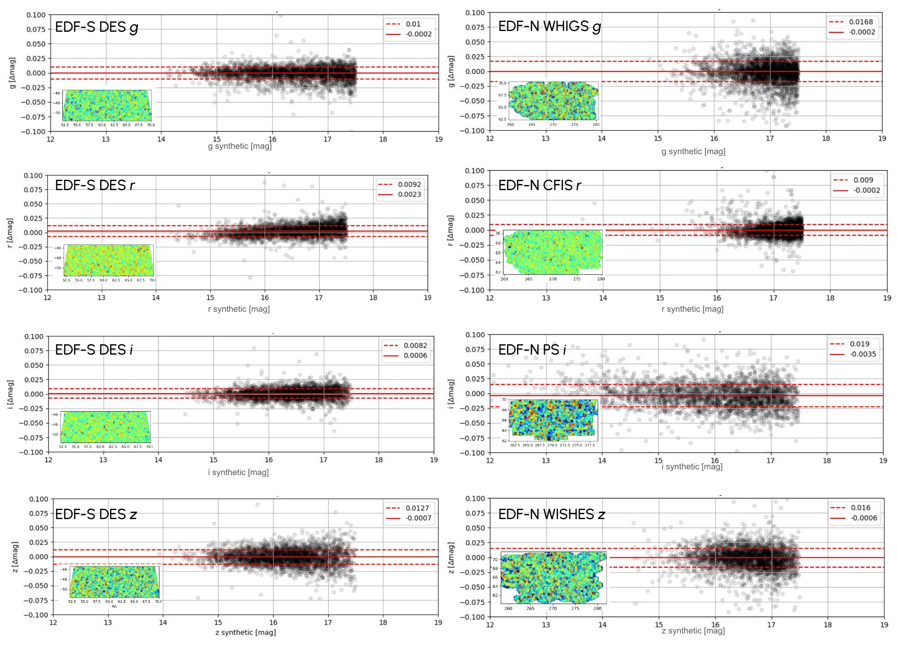
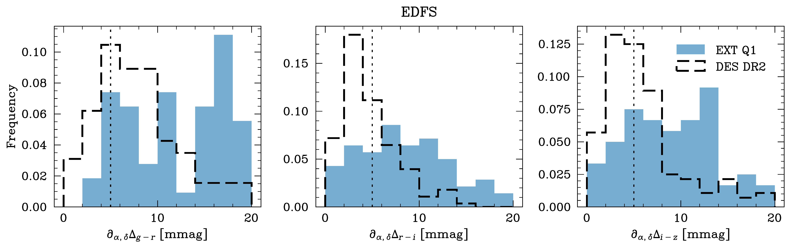

$\newcommand{\ensuremath}{}$
$\newcommand{\xspace}{}$
$\newcommand{\object}[1]{\texttt{#1}}$
$\newcommand{\farcs}{{.}''}$
$\newcommand{\farcm}{{.}'}$
$\newcommand{\arcsec}{''}$
$\newcommand{\arcmin}{'}$
$\newcommand{\ion}[2]{#1#2}$
$\newcommand{\textsc}[1]{\textrm{#1}}$
$\newcommand{\hl}[1]{\textrm{#1}}$
$\newcommand{\footnote}[1]{}$
$\newcommand{\DS}[1]{ {\color{violet}(Douglas: #1)}}$
$\newcommand{\pz}{\phantom{0}}$
$\newcommand{\ps}{\phantom{-}}$
$\newcommand{\orcid}[1]$

# $\Euclid$ Quick Data Release (Q1): Data release overview

<mark>Appeared on: 2025-03-20</mark> -  _27 pages, 12 figures, data release at this https URL paper submitted to the special A&A issue_

E. Collaboration, et al. -- incl., <mark>M. Schirmer</mark>, <mark>K. Jahnke</mark>

**Abstract:** The first Euclid Quick Data Release, Q1, comprises 63.1 deg $^2$ of the Euclid Deep Fields (EDFs) to nominal wide-survey depth. It encompasses visible and near-infrared space-based imaging and spectroscopic data, ground-based photometry in the $u$ , $g$ , $r$ , $i$ , and $z$ bands, as well as corresponding masks. Overall, Q1 contains about 30 million objects in three areas near the ecliptic poles around the EDF-North and EDF-South, as well as the EDF-Fornax field in the constellation of the same name. The purpose of this data release -- and its associated technical papers -- is twofold. First, it is meant to inform the community of the enormous potential of the $\Euclid$ survey data, to describe what is contained in these data, and to help prepare expectations for the forthcoming first major data release DR1. Second, itenables a wide range of initial scientific projects with wide-survey $\Euclid$ data, ranging from the early Universe to the Solar System. The Q1 data were processed with early versions of the processing pipelines, which already demonstrate good performance, with numerous improvements in implementation compared to pre-launch development. In this paper, we describe the sky areas released in Q1, the observations, a top-level view of the data processing of $\Euclid$ and associated external data, the Q1 photometric masks, and how to access the data. We also give an overview of initial scientific results obtained using the Q1 data set by Euclid Consortium scientists, and conclude with important caveats when using the data. As a complementary product, Q1 also contains observations of a star-forming area in Lynd's Dark Nebula 1641 in the Orion A Cloud, observed for technical purposes during $\Euclid$ 's performance-verification phase. This is a unique target, of a type not commonly found in $\Euclid$ 's nominal sky survey.

**Figure 6. -** Photometric quality of the DES (left) and UNIONS (right) \acp{SEF} after calibration using _Gaia_ spectrophotometry and the appropriate survey bandpass, assumed to be independent of focal plane location for Q1.  Shown in each panel is the median offset (solid line) with respect to the _Gaia_ calibrators, as well as the \ac{NMAD} scatter (dashed line).  (*fig:SEFphotometry*)

**Figure 10. -** Colour offsets.  Each panel here shows the spatial variation ($\partial_{\alpha,
    \delta}$) on scales of \ang{0.3;;} of the best-fit colour offset
    ($\Delta_{\rm color}$) for two of the \acp{EDF}. This
    statistic was determined for $g-r$(left), $r-i$(middle), and $i-z$(right),
    relative to the average stellar colour distribution in the \ac{EDF-S} area
    (top), and \ac{EDF-N}(bottom). In the case of \ac{EDF-S} we also show this
    result for DES DR2 data as the dashed dark histogram. The vertical black
    dotted line indicates the end-of-mission requirement. (*fig:Q1colorHomogeneityDECAMhistograms*)

**Figure 12. -** Footprints of the Q1 visits to the \acp{EDF} shown on the sky in ecliptic coordinates overlaid on two 25$^\circ$$\times$ 55$^\circ$ cut-outs of a full-sky Digitized Sky Survey 2 optical image generated by the \ac{CDSdata}.
    _Left_: A strip of the northern ecliptic hemisphere down to $+45^\circ$, showing \ac{EDF-N}(blue) at the ecliptic pole in the Draco constellation; one of its fields is noticeably out of the regular pattern in order to avoid the bright 42 Dra star. _Right_: A strip of the southern ecliptic hemisphere down to $-45^\circ$ showing \ac{EDF-F}(red) in the Fornax constellation and \ac{EDF-S}(orange) in the Dorado constellation.  The Large Magellanic Cloud is noticeable close to the ecliptic pole. (*fig:EDFs*)

