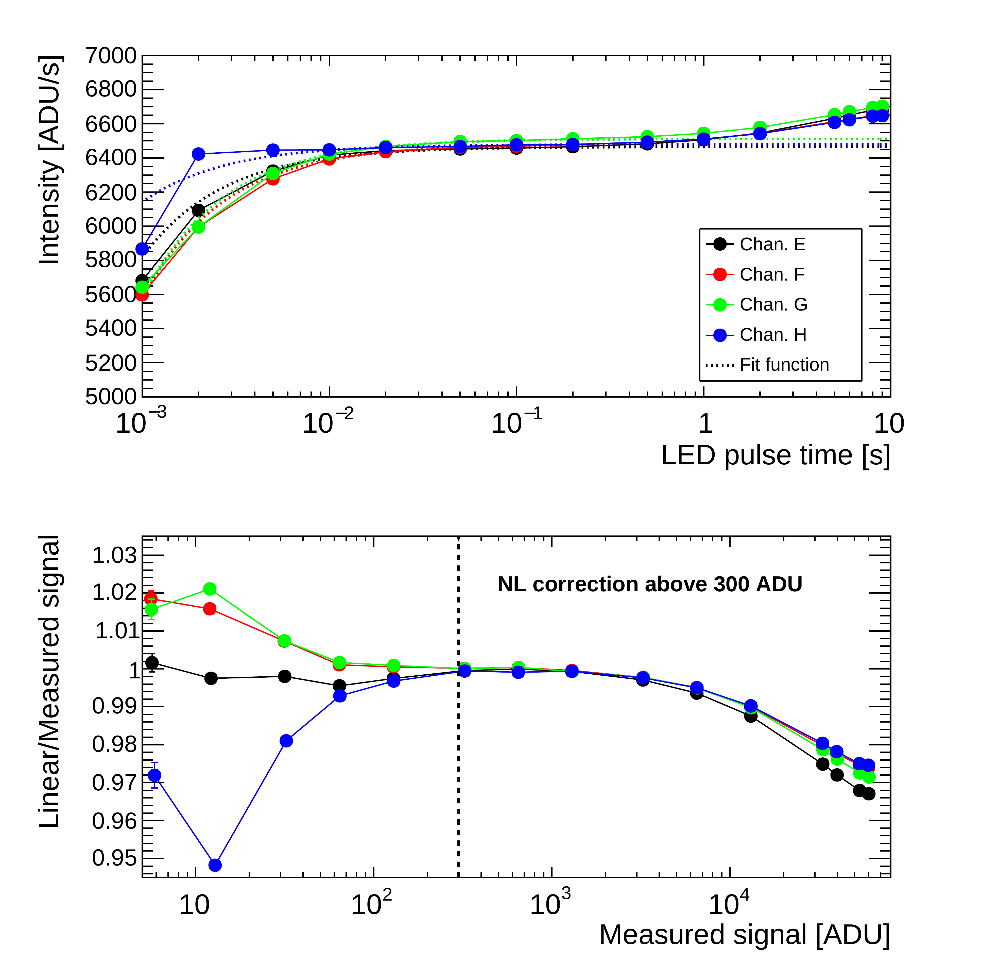

$\newcommand{\ensuremath}{}$
$\newcommand{\xspace}{}$
$\newcommand{\object}[1]{\texttt{#1}}$
$\newcommand{\farcs}{{.}''}$
$\newcommand{\farcm}{{.}'}$
$\newcommand{\arcsec}{''}$
$\newcommand{\arcmin}{'}$
$\newcommand{\ion}[2]{#1#2}$
$\newcommand{\textsc}[1]{\textrm{#1}}$
$\newcommand{\hl}[1]{\textrm{#1}}$
$\newcommand{\footnote}[1]{}$
$\newcommand{\fnurl}[2]{#1\footnote{\href{#2}{\url{#2}}}}$
$\newcommand{\orcid}[1]$
$\newcommand{\fnurl}[2]{#1\footnote{\href{#2}{\url{#2}}}}$

# $\Euclid$ Quick Data Release (Q1): VIS processing and data products

<mark>Appeared on: 2025-03-20</mark> -  _Paper submitted as part of the A&A Special Issue `Euclid Quick Data Release (Q1)', 21 pages, 21 figures_

E. Collaboration, et al. -- incl., <mark>K. Paterson</mark>, <mark>M. Schirmer</mark>

**Abstract:** This paper describes the $\ac{VIS PF}$ of the $\Euclid$ ground segment pipeline, which processes and calibrates raw data from the VIS camera. We present the algorithms used in each processing element, along with a description of the on-orbit performance of $\ac{VIS PF}$ , based on $\ac{PV}$ and Q1 data. We demonstrate that the principal performance metrics (image quality, astrometric accuracy, photometric calibration) are within pre-launch specifications. The image-to-image photometric scatter is less than $\SI{0.8}{\percent}$ and absolute astrometric accuracy compared to Gaia is 5 mas. Image quality is stable over all Q1 images with a $\ac{FWHM}$ of $\ang{;;0.16}$ . The stacked images (combining four nominal and two short exposures) reach $\IE=25.6$ ( $10 \sigma$ , measured as the variance of $\ang{;;1.3}$ diameter apertures). We also describe quality control metrics provided with each image and an appendix provides a detailed description of the provided data products. The excellent quality of these images demonstrates the immense potential of $\Euclid$ VIS data for weak lensing. VIS data, covering most of the extragalactic sky, will provide a lasting high-resolution atlas of the Universe.

**Figure 1. -** The layout of quadrants in the \ac{FPA}. The detectors, each containing four quadrants, are arranged in a \(6\times6\) array. The mean \ac{CCD} spacing is \SI{1.53 \pm 0.03}{\milli\meter} and \SI{7.74 \pm 0.06}{\milli\meter} in the \(x\)- and \(y\)-directions, respectively. (*fig:focal-plane-layout*)

**Figure 3. -** Pre-launch measurements of VIS nonlinearity based on ground testing for \ac{CCD} 6-2. Each of the four lines corresponds to a separate quadrant. _Top panel_: measured intensity as a function of pulse time width. _Bottom panel_: linear signal divided by measured signal. (*fig:nonlinearity*)

**Figure 5. -** Effect of \ac{BFE} correction on the difference of the surface brightness of the brightest pixel of stars in nominal versus short exposures as a function of VIS magnitude in an aperture of 13 pixels or \ang{;;1.3} diameter. (*fig:bfe-mumax*)

