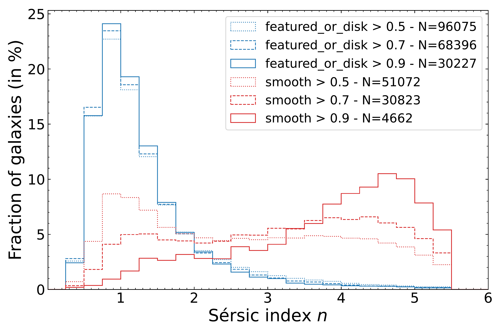

$\newcommand{\ensuremath}{}$
$\newcommand{\xspace}{}$
$\newcommand{\object}[1]{\texttt{#1}}$
$\newcommand{\farcs}{{.}''}$
$\newcommand{\farcm}{{.}'}$
$\newcommand{\arcsec}{''}$
$\newcommand{\arcmin}{'}$
$\newcommand{\ion}[2]{#1#2}$
$\newcommand{\textsc}[1]{\textrm{#1}}$
$\newcommand{\hl}[1]{\textrm{#1}}$
$\newcommand{\footnote}[1]{}$
$\newcommand{\eq}{Eq{.}~}$
$\newcommand{\eqs}{Eqs{.}~}$
$\newcommand{\tab}{Tab{.}~}$
$\newcommand{\fg}{Fig{.}~}$
$\newcommand{\fgs}{Figs{.}~}$
$\newcommand{\sct}{Sect{.}~}$
$\newcommand{\scts}{Sects{.}~}$
$\newcommand{\col}{Col{.}}$
$\newcommand{\cols}{Cols{.}}$
$\newcommand$
$\newcommand$
$\newcommand{\lo}[2]{\noindent{\color{royalblue} \bf[ \triangle \st{#1} #2]}}$
$\newcommand{\vl}[2]{\noindent{\color{violet} \bf[ VL / \st{#1} #2]}}$
$\newcommand{\dd}[2]{\noindent{\color{green} \bf[ DD / \st{#1} #2]}}$
$\newcommand{\rr}[2]{\noindent{\color{darkred} \bf[ RR / \st{#1} #2]}}$
$\newcommand{\id}[2]{\noindent{\color{orange} \bf[ ID / \st{#1} #2]}}$
$\newcommand{\apa}[2]{\noindent{\color{pink} \bf[ APA / \st{#1} #2]}}$
$\newcommand{\afm}[2]{\noindent{\color{grey} \bf[ AFM / \st{#1} #2]}}$
$\newcommand{\orcid}[1]$

# Euclid Quick Data Release (Q1): Exploring galaxy morphology across cosmic time through Sérsic fits

<mark>Appeared on: 2025-03-20</mark> -  _Paper submitted as part of the A&A Special Issue `Euclid Quick Data Release (Q1)', 23 pages, 16 figures_

E. Collaboration, et al. -- incl., <mark>K. Jahnke</mark>

**Abstract:** We present the results of the single-component Sérsic profile fitting for the magnitude-limited sample of $\IE$ $<23$ galaxies within the 63.1 deg $^2$ area of the Euclid Quick Data Release (Q1). The associated morphological catalogue includes two sets of structural parameters fitted using \texttt{SourceXtractor++} : one for VIS $\IE$ images and one for a combination of three NISP images in $\YE$ , $\JE$ and $\HE$ bands. We compare the resulting Sérsic parameters to other morphological measurements provided in the Q1 data release, and to the equivalent parameters based on higher-resolution $\HST$ imaging. These comparisons confirm the consistency and the reliability of the fits to Q1 data. Our analysis of colour gradients shows that NISP profiles have systematically smaller effective radii ( $R_{\rm e}$ ) and larger Sérsic indices ( $n$ ) than in VIS. In addition, we highlight trends in NISP-to-VIS parameter ratios with both magnitude and $n_{\rm VIS}$ . From the 2D bimodality of the $(u-r)$ colour- $\log(n)$ plane, we define a $(u-r)_{\rm lim}(n)$ that separates early- and late-type galaxies (ETGs and LTGs). We use the two subpopulations to examine the variations of $n$ across well-known scaling relations at $z<1$ . ETGs display a steeper size--stellar mass relation than LTGs, indicating a difference in the main drivers of their mass assembly. Similarly, LTGs and ETGs occupy different parts of the stellar mass --  star-formation rate plane, with ETGs at higher masses than LTGs, and further down below the Main Sequence of star-forming galaxies. This clear separation highlights the link known between the shutdown of star formation and morphological transformations in the $\Euclid$ imaging data set. In conclusion, our analysis demonstrates both the robustness of the Sérsic fits available in the Q1 morphological catalogue and the wealth of information they provide for studies of galaxy evolution with $\Euclid$ .

**Figure 9. -** The ratio between effective radius based on the common Sérsic model for three NISP images ($R_\mathrm{e,  NISP}$) and that from the Sérsic fit to the VIS image ($R_\mathrm{e,  VIS}$) as a function of isophotal VIS magnitude. The four panels correspond to the redshift bins we use to trace evolutionary trends in $\sct$ \ref{sc:results-evol-plots}. The 2-dimensional (2D) histogram in each panel are colour-coded by the median $n_\mathrm{VIS}$ for galaxies in a given $[\Delta m_{\rm ISO} (\IE)=0.5$, $\Delta$\lo$g(R_\mathrm{e,  NISP}/R_\mathrm{e,  VIS})=0.05]$ pixel. The 2D histogram includes pixels with $N>100$ galaxies. In more sparsely populated regions we instead display individual galaxies colour-coded by their $n_\mathrm{VIS}$. The box-and-whisker diagrams show median values (red solid lines), interquartile range (IQR, boxes) and the extent of the 1.5 IQR range above the 75th and below the 25th percentile (whiskers) for $R_\mathrm{e,  NISP}/R_\mathrm{e,  VIS}$ in $\Delta m_{\rm ISO}=0.5$ bins of isophotal \IE. The grey dashed line corresponds to the constant ratio of $R_\mathrm{e,  NISP}/R_\mathrm{e,  VIS}=1$. (*f7*)

**Figure 7. -** Distribution of Sérsic parameters measured on the VIS image for sub-samples of galaxies depending on their classification by the \texttt{Zoobot} labels, with different line styles corresponding to the different shares of expected votes predicted by \texttt{Zoobot} to consider that a galaxy falls into a certain category. Sample sizes are systematically indicated in the legend, and a 50\% threshold of voters is adopted when not specified (bottom plots). _Top-left_: distribution of $n$ for galaxies classified as either smooth (red lines) or displaying a disc or features (blue lines) shows a clear dichotomy with the latter sample being almost exclusively made of galaxies with $n\sim1$, whereas the former contains a lot of galaxies with high values of $n$ and increasingly so for higher selection threshold. _Top-right_: distribution of $q$ for disc galaxies depending if they are edge-on or not. Again, a clear bimodality appears, with low $q$ for edge-on galaxies and higher values spread across a wider interval for non-edge-on, hence from face-on to moderately inclined galaxies. Using higher thresholds reinforces this dichotomy. _Bottom-left_: Distribution for disc or featured galaxies of $n$ for different categories of \texttt{Zoobot} bulge sizes. Histograms shift to higher values of $n$ for larger relative bulge sizes. _Bottom-right_: Distribution of $q$ for edge-on disc galaxies, depending on if they display no bulge, a boxy bulge, or a rounded bulge. The presence of a bulge, either rounded or boxy, leads to higher $q$.
 (*fig:sersic-vs-zoobot*)

**Figure 14. -** SFR versus $M_\ast$ diagrams for the four consecutive intervals of redshift, colour-coded by the median $n$(top row) and associated dispersion around it (bottom row) in each cell of the plane. We over-plotted density contours at the 10\%, 50\%, and 90\% levels, as well as the 90\% mass completeness limit for the ETG and LTG samples (red and blue vertical dashed lines, respectively). The SFMS from \cite{Speagle-2014-Main-Sequence} and \cite{Popesso-2023-Main-Sequence} are displayed as black dashed and dotted lines, respectively, whereas a fit to the $M_\ast$--SFR relation of our sample of LTG galaxies is shown as a black solid line.
 (*fig:sfr-mass*)

