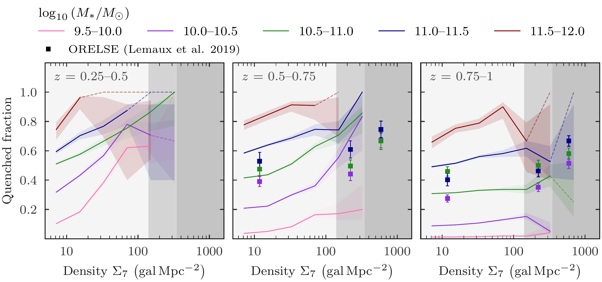

$\newcommand{\ensuremath}{}$
$\newcommand{\xspace}{}$
$\newcommand{\object}[1]{\texttt{#1}}$
$\newcommand{\farcs}{{.}''}$
$\newcommand{\farcm}{{.}'}$
$\newcommand{\arcsec}{''}$
$\newcommand{\arcmin}{'}$
$\newcommand{\ion}[2]{#1#2}$
$\newcommand{\textsc}[1]{\textrm{#1}}$
$\newcommand{\hl}[1]{\textrm{#1}}$
$\newcommand{\footnote}[1]{}$
$\newcommand{\msun}{\text{M}_{\odot}}$
$\newcommand{\orcid}[1]$
$\newcommand{\arraystretch}{1.5}$

# Euclid Quick Data Release (Q1): The evolution of the passive-density and morphology-density relations between $z=0.25$ and $z=1$

<mark>Appeared on: 2025-03-20</mark> -  _Paper submitted as part of the A&A Special Issue `Euclid Quick Data Release (Q1)', 16 pages, 12 figures_

E. Collaboration, et al. -- incl., <mark>K. Jahnke</mark>

**Abstract:** The extent to which the environment affects galaxy evolution has been under scrutiny by researchers for decades. With the first data from $\Euclid$ , we can begin to systematically study a wide range of environments and their effects as a function of redshift, using $63 \text{deg}^2$ of space-based data. In this paper, we present results from the $\Euclid$ Quick Data Release, where we measure the passive-density and morphology-density relations in the redshift range $z=0.25$ -- $1$ . We determine if a galaxy is passive using the specific star-formation rate, and we classify the morphologies of galaxies using the Sérsic index $n$ and the $u-r$ colours. We measure the local environmental density of each galaxy using the $N\text{th}$ -nearest neighbour method. This gives a measure of the local density in units of $\text{gal} \text{Mpc}^{-2}$ . We find that at fixed stellar mass, the quenched fraction (galaxies that have ceased star formation) increases with increasing local environmental density up to $z=0.75$ . This result is indicative of the separability of the effects from the stellar mass and the environment, at least at $z<0.75$ . At $z>0.75$ , we observe only weak environmental effects, with most galaxies with $M_\ast \gtrsim10^{11} M_\odot$ being quenched independently of environment.Up to $z=0.75$ , the early-type galaxy fraction increases with increasing density at fixed stellar mass, meaning the environment also transforms the morphology of the galaxy independently of stellar mass, up to $M_\ast \lesssim 10^{10.8} M_\odot$ . For $M_\ast \gtrsim10^{10.8} M_\odot$ , almost all galaxies are early-types, with minimal impact from the environment. At $z>0.75$ , the morphology depends mostly on stellar mass, with only low-mass galaxies being affected by the environment. Given that the morphology classifications use $u-r$ colours, these are correlated to the star-formation rate, and as such our morphology results should be taken with caution, yet future morphology classifications should help verify these results. To summarise, we successfully identify the passive-density and morphology-density relations at $z<0.75$ , but at $z>0.75$ the relations are less strong, only affecting certain mass bins. At $z>0.75$ , the uncertainties on both photometric redshift and stellar masses are large, and thus future $\Euclid$ data releases are key to confirm these trends.

**Figure 8. -** Fraction of galaxies classes as quenched as a function of stellar mass, binned by redshift. Shaded regions show $68 \%$ confidence intervals. Only bins where the total number of galaxies is greater than 10 are plotted. ORELSE quenched fractions \citep{Lemaux2019} are plotted in coloured squares. Their fractions are higher on average, likely because they purposely probe areas with larger galaxy densities than the Q1 fields. (*fig:qf_redshift*)

**Figure 9. -** Fraction of galaxies classed as quenched as a function of galaxy density, binned by stellar mass and redshift. The stellar mass bins listed in the legend are in units of $\logten (M_\ast/M_\odot)$. The grey shaded regions in the background refer to the three density bins used in \citet{Lemaux2019}, see text for details. The colour shaded regions show $68 \%$ confidence intervals. Dashed lines indicate density bins where the total number of galaxies is less than 5. (*fig:qf_dens*)

**Figure 10. -** Distribution of the quenched fraction as a function of both stellar mass and galaxy density, in bins of increasing redshift from left to right. The colour-bar indicates the mean quenched fraction in each bin. The separability of the impact of stellar mass and the environment on the quenched fractions is clearly visible up to $z=0.75$, after which the stellar mass dominates the quenching effects. (*fig:qf_dens_2d*)

