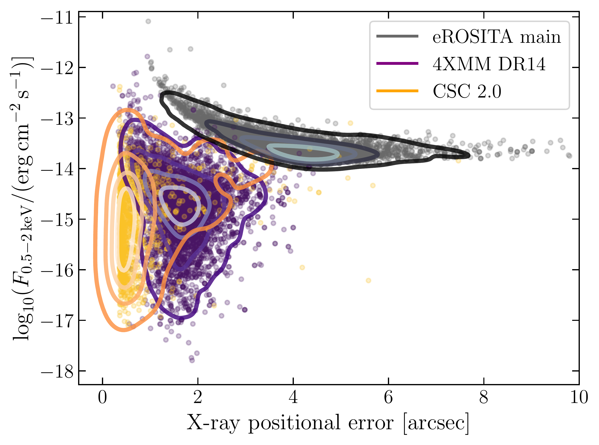
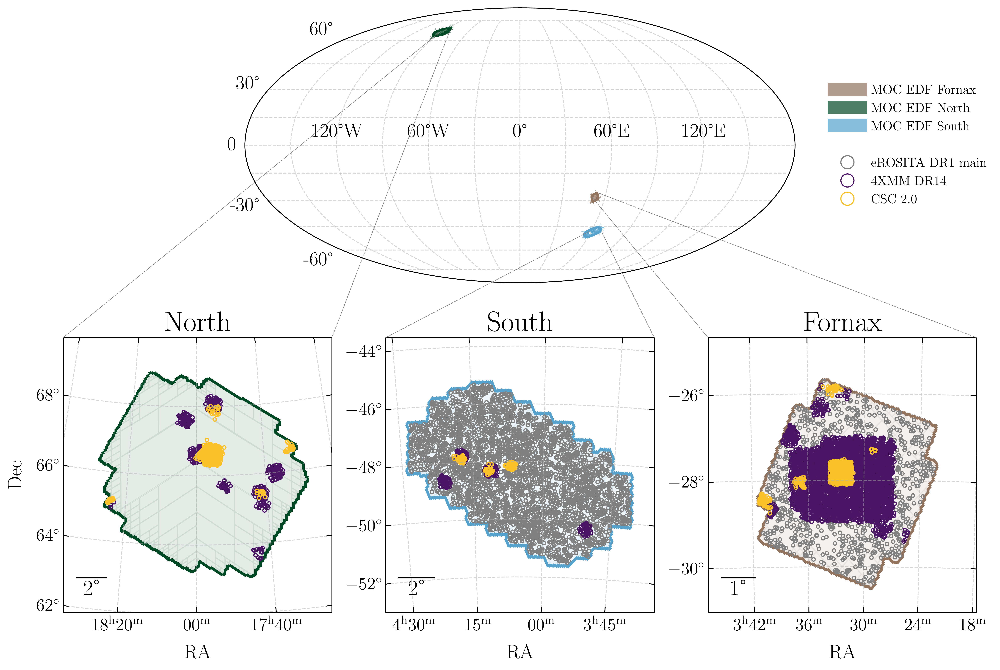

$\newcommand{\ensuremath}{}$
$\newcommand{\xspace}{}$
$\newcommand{\object}[1]{\texttt{#1}}$
$\newcommand{\farcs}{{.}''}$
$\newcommand{\farcm}{{.}'}$
$\newcommand{\arcsec}{''}$
$\newcommand{\arcmin}{'}$
$\newcommand{\ion}[2]{#1#2}$
$\newcommand{\textsc}[1]{\textrm{#1}}$
$\newcommand{\hl}[1]{\textrm{#1}}$
$\newcommand{\footnote}[1]{}$
$\newcommand{\orcid}[1]$

# Euclid Quick Data Release (Q1): Optical and near-infrared identification and classification of \\point-like X-ray selected sources

<mark>Appeared on: 2025-03-20</mark> -  _Paper submitted as part of the A&A Special Issue `Euclid Quick Data Release (Q1)', 24 pages, 22 figures_

E. Collaboration, et al. -- incl., <mark>K. Jahnke</mark>

**Abstract:** To better understand the role of active galactic nuclei (AGN) in galaxy evolution, it is crucial to achieve a complete and pure AGN census. X-ray surveys are key to this, but identifying their counterparts (CTPs) at other wavelengths remains challenging due to their larger positional uncertainties and limited availability of deeper, uniform ancillary data. $\Euclid$ is revolutionising this effort, offering extensive coverage of nearly the entire extragalactic sky, particularly in the near-infrared bands, where AGN are more easily detected. With the first Euclid Quick Data Release (Q1), we tested and validated methods for identifying, classifying, and determining the redshifts of $\Euclid$ CTPs to known point-like sources from major X-ray surveys, including $\XMMN$ , _Chandra_ , and eROSITA. Using Bayesian statistics, combined with machine learning (ML), as incorporated in the algorithm ${\tt NWAY}$ , we identify the CTPs to 11 286 X-ray sources from the three X-ray telescopes. For the large majority of 10 194 sources, the association is unique, with the remaining $\sim$ 10 \% of multi-CTP cases equally split between $\XMMN$ and eROSITA. Six percent of the $\Euclid$ CTPs are detected in more than one X-ray survey. ML is then used to distinguish between Galactic (8 \% ) and extragalactic (92 \% ) sources. We computed photo- $z$ s using deep learning for the 8617 sources detected in the 10th data release of the DESI Legacy Survey, reaching an accuracy and a fraction of outliers of about 5 \% . Based on their X-ray luminosities, over 99 \% of CTPs identified as extragalactic are classified as AGN, most of which appear unobscured according to their hardness ratios. With this paper, we release our catalogue, which includes identifiers, basic X-ray properties, the reliability of the associations, and additional property extensions such as Galactic/extragalactic classifications and photometric/spectroscopic redshifts. We also provide probabilities for sub-selecting the sample based on purity and completeness, allowing users to tailor the sample according to their specific needs.

**Figure 1. -** X-ray fluxes in the 0.5 -- 2 keV band plotted against positional uncertainties for sources from the 4XMM DR14, CSC 2.0, and eROSITA-DE/DR1 catalogues. (*fig:flux_poserr*)

**Figure 17. -** Sky coverage of the EDF fields and corresponding X-ray source distributions. _Top:_ Mollweide projection of the sky, indicating the locations of EDF-N, EDF-S, and EDF-F using their Multi-Order Coverage maps (MOCs). _Bottom:_ zoomed-in views of each EDF, overlaid with X-ray sources from the eROSITA-DE DR1 catalogue (grey), the \XMMN 4XMM DR14 catalog (purple), and the _Chandra_ Source Catalog 2.0 (orange), illustrating the overlap between \Euclid's deep fields and existing X-ray source catalogues. (*fig:1*)

**Figure 19. -** Photometric redshifts vs. spectroscopic redshifts for all CTPs matched to LS10. _Left:_ points are colour-coded according to the density of sources with $r \leq 21.5$. Respective statistics are denoted in the bottom right corner. The sources shaded red at the top left corner are considered catastrophic outliers, with visual inspection denoting them as faint, galaxy-dominated objects with increased uncertainties. _Right:_ the same distribution colour-coded by the $1\sigma$ error ($z_{\rm phot,1su} - z_{\rm phot,1sl}$). Sources closely following the identity line exhibit significantly lower errors, while outliers are associated with larger errors. This demonstrates how {\tt{PICZL}} effectively produces reliable error estimates, accurately reflecting the uncertainty in the photometric redshift measurements. The robustness of these error calculations underscores their importance for interpreting the results. (*fig:zp_zs*)

