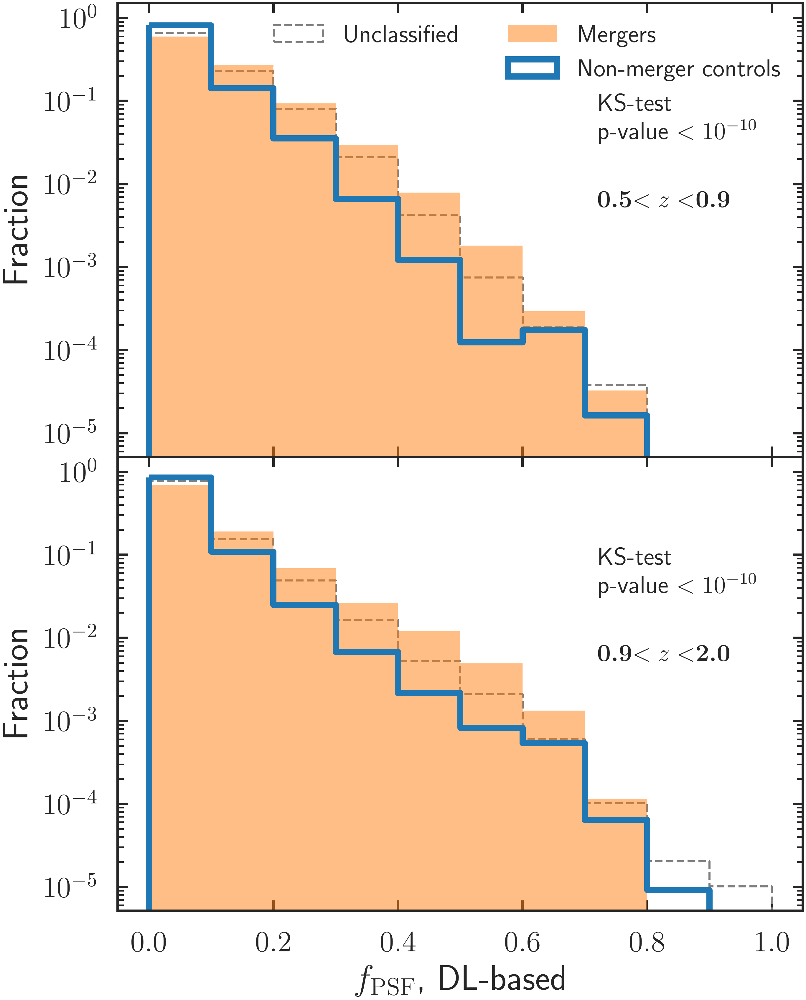
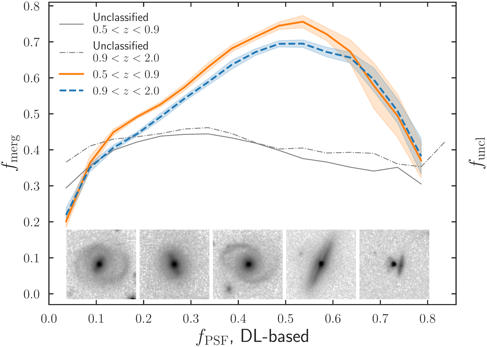

$\newcommand{\ensuremath}{}$
$\newcommand{\xspace}{}$
$\newcommand{\object}[1]{\texttt{#1}}$
$\newcommand{\farcs}{{.}''}$
$\newcommand{\farcm}{{.}'}$
$\newcommand{\arcsec}{''}$
$\newcommand{\arcmin}{'}$
$\newcommand{\ion}[2]{#1#2}$
$\newcommand{\textsc}[1]{\textrm{#1}}$
$\newcommand{\hl}[1]{\textrm{#1}}$
$\newcommand{\footnote}[1]{}$
$\newcommand{\orcid}[1]$
$\newcommand{\labelenumi}{\roman{enumi})}$
$\newcommand{\labelenumi}{\roman{enumi})}$

# Euclid Quick Data Release (Q1): First $\Euclid$ statistical study of galaxy mergers and their connection to active galactic nuclei

<mark>Appeared on: 2025-03-20</mark> -  _Paper submitted as part of the A&A Special Issue `Euclid Quick Data Release (Q1)', 23 pages, 21 figures_

E. Collaboration, et al. -- incl., <mark>K. Jahnke</mark>

**Abstract:** Galaxy major mergers are indicated as one of the principal pathways to trigger active galactic nuclei (AGN). We present the first detection of major mergers in the Euclid Deep Fields and analyse their connection with AGN, showcasing the statistical power of the $\Euclid$ data.We constructed a stellar-mass-complete ${($M_{\star}>10^{9.8} M_{\odot}$)}$ sample of galaxies from the first quick data release (Q1), in the redshift range $z=0.5$ --2.We selected AGN using X-ray detections, optical spectroscopy, mid-infrared (MIR) colours, and processing $\IE$ observations with an image decomposition algorithm. We used convolutional neural networks trained on cosmological hydrodynamic simulations to classify galaxies as mergers and non-mergers.We found a larger fraction of AGN in mergers compared to the non-merger controls for all AGN selections, with AGN excess factors ranging from 2 to 6. The largest excess is seen in the MIR-selected AGN. Likewise, a generally larger merger fraction ( $f_{\rm merg}$ ) is seen in active galaxies than in the non-active controls, with the excess depending on the AGN selection method. Furthermore, we analysed $f_{\rm merg}$ as a function of the AGN bolometric luminosity ( $L_{\rm bol}$ ) and the contribution of the point-source component to the total galaxy light ${in the \IE-band}$ ( $f_{\rm{PSF}}$ ) as a proxy for the relative AGN contribution fraction. We uncovered a rising $f_{\rm merg}$ , with increasing $f_{\rm{PSF}}$ up to $f_{\rm{PSF}}\simeq 0.55$ , after which we observed a decreasing trend. In the range $f_{\rm{PSF}} = 0.3$ --0.7, mergers appear to be the dominant AGN fuelling mechanism. We then derived the point-source luminosity ( $L_{\rm{PSF}}$ ) and showed that $f_{\rm merg}$ monotonically increases as a function of $L_{\rm{PSF}}$ at $z<0.9$ , with $f_{\rm merg}\geq50\%$ for $L_{\rm{PSF}}\simeq 2\times10^{43} {\rm erg s^{-1}}$ . Similarly, at $0.9\leq z \leq 2$ , $f_{\rm merg}$ rises as a function of $L_{\rm{PSF}}$ , though mergers do not dominate until $L_{\rm{PSF}} \simeq 10^{45} {\rm erg s^{-1}}$ .For the X-ray and spectroscopically detected AGN we derived the bolometric luminosity, $L_{\rm bol}$ , which has a positive correlation with $f_{\rm merg}$ for X-ray AGN, while there is a less pronounced trend for spectroscopically-selected AGN due to the smaller sample size.At $L_{\rm bol} > 10^{45} {\rm erg s^{-1}}$ , AGN mostly reside in mergers. We concluded that mergers are most strongly associated with the most powerful and dust-obscured AGN, typically linked to a fast-growing phase of the supermassive black hole, while other mechanisms, such as secular processes, might be the trigger of less luminous and dominant AGN.

**Figure 8. -** Merger fraction as a function of the PSF luminosity, $L_{\rm{PSF}}$, measured through photometry. The shaded areas show the uncertainties obtained through bootstrapping. The solid and dashed grey lines indicate the fraction of unclassified objects as a function of $L_{\rm PSF}$.
     (*fig:fmerg_Lagn_phot*)

**Figure 5. -** Normalised distributions of the PSF fraction for mergers and non-mergers, in the two redshift bins. The results of a two-sample KS test are reported in each panel. The $f_{\rm{PSF}}$-normalised distribution for unclassified galaxies is overlaid as a comparison.  (*fig:fagn_hist*)

**Figure 6. -** The merger fraction and PSF contribution fraction relationship for the two redshift bins considered. All AGN are included. Trend lines represent the running median, while the shaded areas are one standard deviation. Examples of \Euclid images of galaxies with increasing levels of $f_{\rm{PSF}}$ are shown at the bottom. Cutouts are $8$\arcsec$ \times 8$\arcsec$$, log-scaled in the $1{\rm st}$--$99{\rm th}$ percentile range. Grey lines indicate the fraction of unclassified objects as a function of $f_{\rm{PSF}}$.
     (*fig:fmerg_fagn*)

