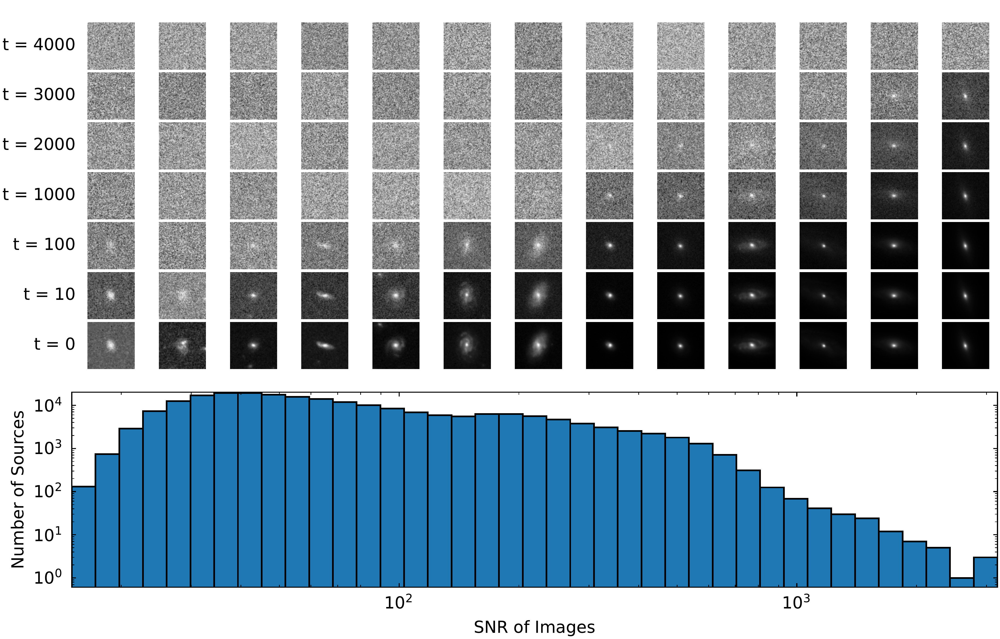

$\newcommand{\ensuremath}{}$
$\newcommand{\xspace}{}$
$\newcommand{\object}[1]{\texttt{#1}}$
$\newcommand{\farcs}{{.}''}$
$\newcommand{\farcm}{{.}'}$
$\newcommand{\arcsec}{''}$
$\newcommand{\arcmin}{'}$
$\newcommand{\ion}[2]{#1#2}$
$\newcommand{\textsc}[1]{\textrm{#1}}$
$\newcommand{\hl}[1]{\textrm{#1}}$
$\newcommand{\footnote}[1]{}$
$\newcommand{\orcid}[1]{\orcidlink{#1}}$
$\newcommand{\creflastconjunction}{, and }$

# Euclid Quick Data Release (Q1): Active galactic nuclei identification using diffusion-based inpainting of $\Euclid$ VIS images

<mark>Appeared on: 2025-03-20</mark> -  _Paper submitted as part of the A&A Special Issue `Euclid Quick Data Release (Q1)', 32 pages, 26 figures_

E. Collaboration, et al. -- incl., <mark>K. Jahnke</mark>

**Abstract:** Light emission from galaxies exhibit diverse brightness profiles, influenced by factors such as galaxy type, structural features and interactions with other galaxies. Elliptical galaxies feature more uniform light distributions, while spiral and irregular galaxies have complex, varied light profiles due to their structural heterogeneity and star-forming activity. In addition, galaxies with an active galactic nucleus (AGN) feature intense, concentrated emission from gas accretion around supermassive black holes, superimposed on regular galactic light, while quasi-stellar objects (QSO) are the extreme case of the AGN emission dominating the galaxy. The challenge of identifying AGN and QSO has been discussed many times in the literature, often requiring multi-wavelength observations. This paper introduces a novel approach to identify AGN and QSO from a single image.Diffusion models have been recently developed in the machine-learning literature to generate realistic-looking images of everyday objects. Utilising the spatial resolving power of the $\Euclid$ VIS images, we created a diffusion model trained on one million sources, without using any source pre-selection or labels. The model learns to reconstruct light distributions of normal galaxies, since the population is dominated by them. We condition the prediction of the central light distribution by masking the central few pixels of each source and reconstruct the light according to the diffusion model. We further use this prediction to identify sources that deviate from this profile by examining the reconstruction error of the few central pixels regenerated in each source's core.Our approach, solely using VIS imaging, features high completeness compared to traditional methods of AGN and QSO selection, including optical, near-infrared, mid-infrared, and X-rays.Our study offers practical insights for refining diffusion models and broadening their applications throughout the $\Euclid$ survey area, underscoring the utility of this approach in diverse astronomical contexts beyond just AGN identification.

**Figure 13. -** _Top:_ Respective noised images produced by the cosine-beta schedule at different timesteps. Each image is a sample from the respective signal-to-noise bin directly below it. Due to the scales of pixel values, the introduced noise has a more significant impact on the typically fainter, low S/N images, leading to the images converging to Gaussian noise much sooner into forward process. The relationship of S/N and rate of convergence results in the entirety of the top left of the grid of images being pure noise, indicating inefficient training for lower S/N images. This highlights the difficulty in applying off-the-shelf pipelines to the complexities of real-world astronomical data that feature high dynamic range and varying quality over images. _Bottom:_ Distribution of S/N of galaxy images. Even though the sample is dominated by lower S/N images, a non-negligible number of sources with S/N>1000 remains in the training set. (*fig:diffusion_noise_images*)

**Figure 21. -** Precision and Recall scores for the diffusion-based AGN predictions (solid line). As the various selections we compare against are not complete, sufficiently high recall allows us to see which traditional methods our selection overlaps with, indicating the types of sources our method is most appropriate for.  (*fig:scores_test*)

**Figure 3. -** MSE of a random batch at different epochs throughout training. The opacity of each line indicates how far into the training epochs the measurement is, with fainter lines at higher epochs. Each training pair exhibit different behaviour as training progresses, indicating the respective weighting each put on an image's pixel brightness. Because each model was trained on more than solely MSE, these measurements are only to highlight the raw pixel performance of image recreation at each stage of training. The black line indicates the final step during training. (*fig:mse_max_pixel_losses*)

