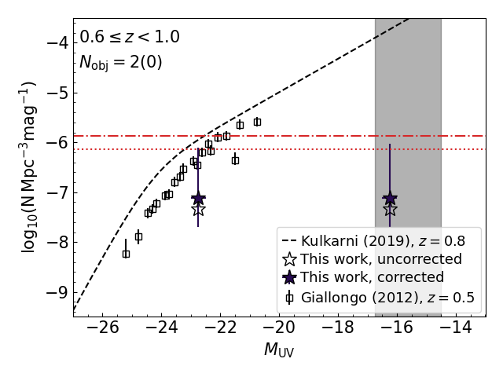
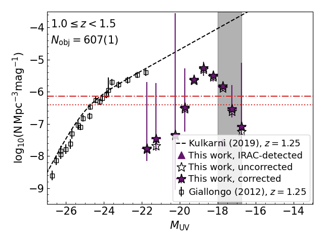
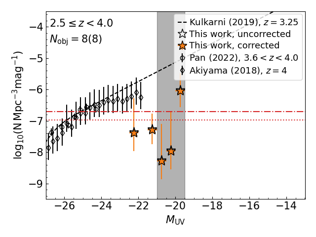
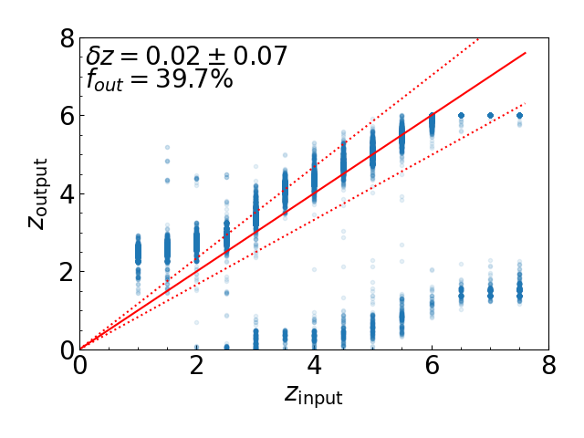

$\newcommand{\ensuremath}{}$
$\newcommand{\xspace}{}$
$\newcommand{\object}[1]{\texttt{#1}}$
$\newcommand{\farcs}{{.}''}$
$\newcommand{\farcm}{{.}'}$
$\newcommand{\arcsec}{''}$
$\newcommand{\arcmin}{'}$
$\newcommand{\ion}[2]{#1#2}$
$\newcommand{\textsc}[1]{\textrm{#1}}$
$\newcommand{\hl}[1]{\textrm{#1}}$
$\newcommand{\footnote}[1]{}$
$\newcommand{\LB}[1]{\textcolor{orange}{#1}}$
$\newcommand{\new}[1]{\textcolor{teal}{#1}}$
$\newcommand{\orcid}[1]$
$\newcommand{\arraystretch}{1.2}$

# Euclid Quick Data Release (Q1): Extending the quest for little red dots to $z<4$

<mark>Appeared on: 2025-03-20</mark> -  _Paper submitted as part of the A&A Special Issue `Euclid Quick Data Release (Q1)', 22 pages, 12 figures, 8 tables_

E. Collaboration, et al. -- incl., <mark>K. Jahnke</mark>, <mark>S. Belladitta</mark>

**Abstract:** Recent _James Webb_ Space Telescope (JWST) observations have revealed an interesting population of sources with a compact morphology and a characteristic `v-shaped' continuum, namely blue at rest-frame $\lambda<4000 Å$ and red at longer wavelengths. The nature of these sources, called `little red dots' (LRDs), is still highly debated, since it is unclear if they host active galactic nuclei (AGN) and their number seems to drastically drop at $z<4$ .  We take advantage of the $63 \rm \deg^2$ covered by the quick $\Euclid$ Quick Data Release (Q1) to extend the search for LRDs to brighter magnitudes and to lower redshifts than what has been possible with JWST. This is fundamental to have a broader view of the evolution of this peculiar galaxy population.  The selection is performed by fitting the available photometric data ( $\Euclid$ , the _Spitzer_ Infrared Array Camera (IRAC), and ground-based $griz$ data) with two power laws, to retrieve both the rest-frame optical and UV slopes consistently over a large redshift range (i.e, $z<7.6$ ). We then exclude extended objects and possible line emitters, and perform a careful visual inspection to remove any imaging artefacts. The final selection includes 3341 LRD candidates from $z=0.33$ to $z=3.6$ , with 29 detected also in IRAC.  The resulting rest-frame UV luminosity function, in contrast with previous JWST studies, shows that the number density of LRD candidates increases from high-redshift down to $z=1.5$ -- $2.5$ and decreases at even lower redshifts. However, less evolution is apparent focusing on the subsample of more robust LRD candidates having also IRAC detections, which however is affected by low statistics and limited by the IRAC resolution. The comparison with previous quasar (QSO) UV luminosity functions shows that LRDs are not the dominant AGN population at $z<4$ and $M_{\rm UV}<-21$ . Follow-up studies of these LRD candidates are pivotal to confirm their nature, probe their physical properties and check for their compatibility with JWST sources, given that the different spatial resolution and wavelength coverage of $\Euclid$ and JWST could select different samples of compact sources.

**Figure 12. -** UV luminosity function of the LRD candidates from $z=0$(top left) to $z=4$(bottom right). Empty stars indicate the values before any corrections, while the coloured stars show the density after correcting for completeness and redshift estimation. Coloured triangles show the conservative estimation derived considering only IRAC-detected sources. The black vertical shaded regions show the range of the 80\% completeness in the three fields. In the top left we report the number of objects inside the redshift bin and, in brackets, the number of IRAC-detected sources in the bin. Empty symbols show UV luminosity functions of QSOs from \citet[][and reference therein]{Giallongo2012}, [Akiyama, He and Ikeda (2018)](), and [Pan, et. al (2022)](). We also report the UV luminosity function of QSOs modelled by \citet[][black dashed line]{Kulkarni2019}. For a comparison, the red horizontal dash-dotted line shows the minimum density probed by HST CANDELS survey \citep[$0.29\deg^{2}$][]{Grogin2011}, while the red horizontal dotted line shows the minimum density probed by the JWST COSMOS-WEB survey \citep[0.54$\deg^{2}$][]{Casey2023}. (*fig:LF*)

**Figure 1. -** Redshifts in which the different \Euclid, IRAC, and ground-based filters trace the optical (red bars) or UV (blue bars) continuum. The grey shaded area indicates the redshift range in which we have at least four filters to derive the slopes necessary to select LRDs. The hatched area indicates the redshift range covered without IRAC.  (*fig:LRDs_bands*)

**Figure 7. -** Redshift recovery using the \Euclid pipeline (top) and with the double power-law fit improvement (bottom). In the upper right of each panel we report the fraction of outliers, defined as objects with $|\delta z|=|z_{\rm output}-z_{\rm input}|/(1+z_{\rm input})>0.15$, as well as the mean and standard deviation of $\delta z$, measured after removing the outliers. (*fig:zout*)

