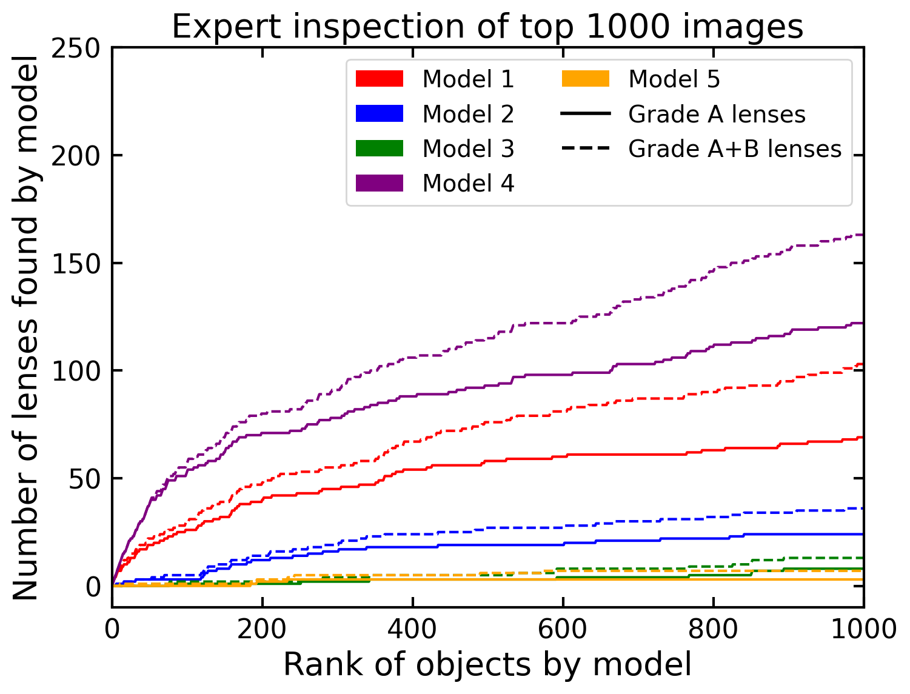
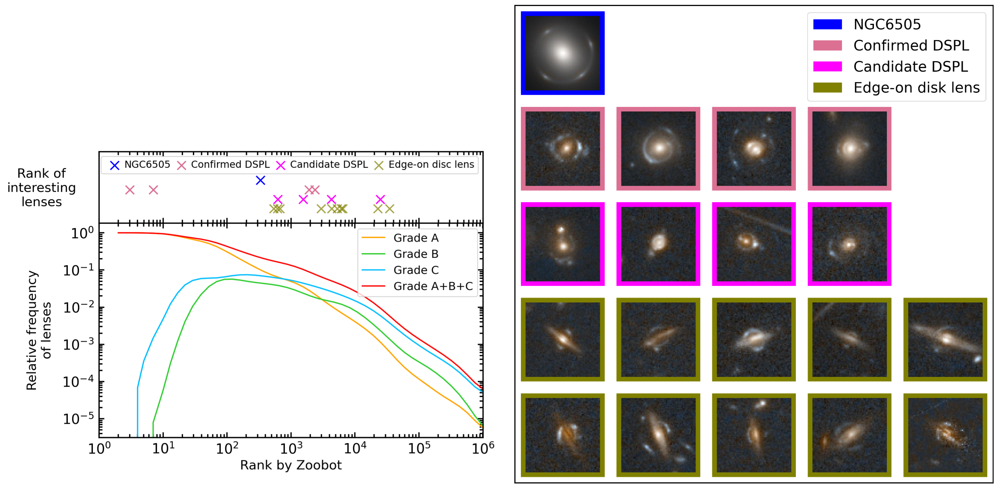

$\newcommand{\ensuremath}{}$
$\newcommand{\xspace}{}$
$\newcommand{\object}[1]{\texttt{#1}}$
$\newcommand{\farcs}{{.}''}$
$\newcommand{\farcm}{{.}'}$
$\newcommand{\arcsec}{''}$
$\newcommand{\arcmin}{'}$
$\newcommand{\ion}[2]{#1#2}$
$\newcommand{\textsc}[1]{\textrm{#1}}$
$\newcommand{\hl}[1]{\textrm{#1}}$
$\newcommand{\footnote}[1]{}$
$\newcommand{\zb}{\texttt{Zoobot}}$
$\newcommand{\orcid}[1]{\href{https://orcid.org/#1}{\orcidlink{#1}}}$
$\newcommand{\labelitemi}{\bullet}$

# Euclid Quick Data Release (Q1): The Strong Lensing Discovery Engine C -- Finding lenses with machine learning

<mark>Appeared on: 2025-03-20</mark> -  _Paper submitted as part of the A&A Special Issue `Euclid Quick Data Release (Q1)', 22 pages, 14 figures_

E. Collaboration, et al. -- incl., <mark>K. Jahnke</mark>

**Abstract:** Strong gravitational lensing has the potential to provide a powerful probe of astrophysics and cosmology, but fewer than 1000 strong lenses have been confirmed previously. With $\ang{;;0.16}$ resolution covering a third of the sky, the $\Euclid$ telescope will revolutionise strong lens finding, with $\num{170000}$ lenses forecasted to be discovered amongst its 1.5 billion galaxies. We present an analysis of the performance of five machine-learning models at finding strong gravitational lenses in the quick release of $\Euclid$ data (Q1), covering 63 deg $^{2}$ . The models are validated with citizen scientists and expert visual inspection. We focus on the best performing network: a fine-tuned version of the \texttt{Zoobot} pretrained model, originally trained to classify galaxy morphologies in heterogeneous astronomical imaging surveys. Of the one million Q1 objects that \texttt{Zoobot} was tasked to find strong lenses within, the top 1000 ranked objects contained 122 grade A lenses (almost certain lenses), and 41 grade B lenses (probable lenses). A deeper search with the five networks combined with visual inspection discovered 250 (247) grade A (B) lenses, of which 224 (182) are ranked in the top $\num{20000}$ by \texttt{Zoobot} . When extrapolated to the full $\Euclid$ survey, the highest ranked one million images will contain $\num{75000}$ grade A or B strong gravitational lenses.

**Figure 2. -** The forecasted performance of different versions of \texttt{Zoobot} when changing the number of layers that were fine-tuned. Numbers are based on the performance on the sample of known lenses in \Euclid and \textcolor{black}{cutouts from} random \textcolor{black}{EWS} tiles outside Q1, with the statistics extrapolated to predict the performance in Q1. (*fig:finetuned-layers*)

**Figure 4. -** Number of lenses found in the top\textcolor{black}{-}ranked objects according to models 1--5. This is shown for grade A lenses (confident strong lenses) and the combination of grade A and grade B lenses (likely strong lenses). (*fig:lenses-found-all-models*)

**Figure 14. -** (a) _Left panel, bottom_: density of grade A, B and C lenses found in Q1, as well as the three combined, as a function of \texttt{Zoobot} rank. _Above_: ranks of lenses of particular interest, including the only discovered lens around an NGC galaxy, \textcolor{black}{four} confirmed DSPLs, four candidate DSPLs, and 10 of the more visually obvious edge-on disc lenses. (b) _Right panel_: images of the interesting lenses corresponding to objects that are plotted on the left. The images are ordered in increasing rank order left to right (left to right on the penultimate row then left to right on the last row for the edge-on disc lenses). (*fig:lens-density*)

