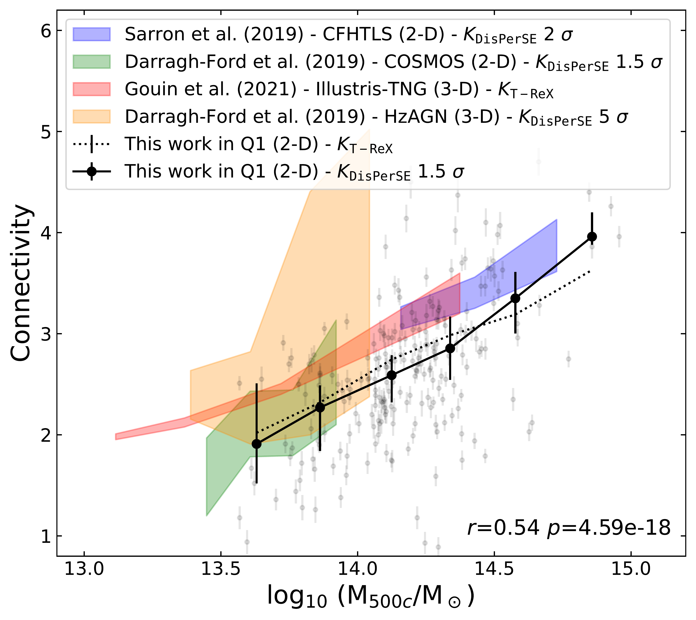
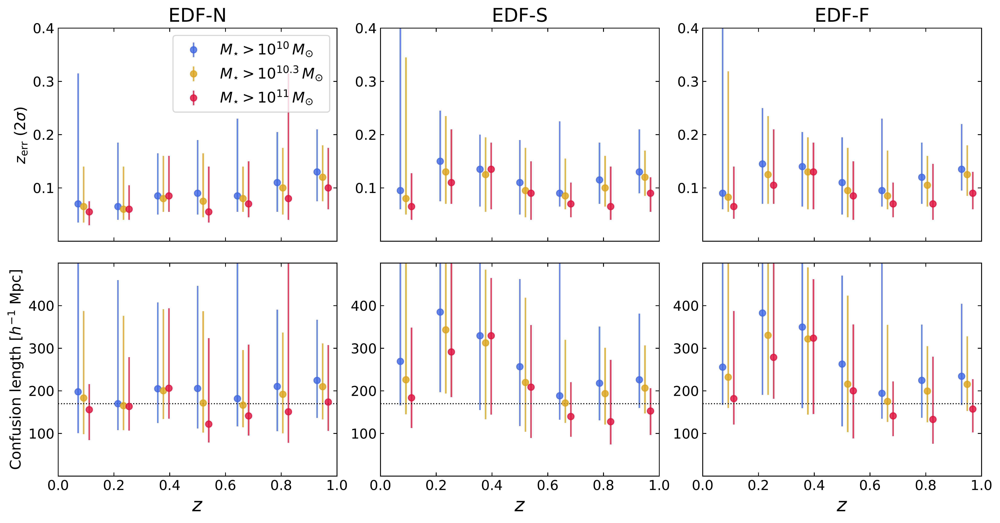

$\newcommand{\ensuremath}{}$
$\newcommand{\xspace}{}$
$\newcommand{\object}[1]{\texttt{#1}}$
$\newcommand{\farcs}{{.}''}$
$\newcommand{\farcm}{{.}'}$
$\newcommand{\arcsec}{''}$
$\newcommand{\arcmin}{'}$
$\newcommand{\ion}[2]{#1#2}$
$\newcommand{\textsc}[1]{\textrm{#1}}$
$\newcommand{\hl}[1]{\textrm{#1}}$
$\newcommand{\footnote}[1]{}$
$\newcommand{\disperse}{\mbox{{\sc \texttt{DisPerSE}}}\xspace}$
$\newcommand{\trex}{\mbox{{\sc \texttt{T-ReX}}}\xspace}$
$\newcommand{\N}[1]{\textcolor{violet}{#1}}$
$\newcommand{\cg}[1]{\textcolor{magenta}{#1}}$
$\newcommand{\js}[1]{\textcolor{orange}{#1}}$
$\newcommand{\sarron}[1]{\textcolor{magenta}{#1}}$
$\newcommand{\tb}[1]{\textcolor{gray}{#1}}$
$\newcommand{\cp}[1]{\textcolor{green}{#1}}$
$\newcommand{\pbb}[1]{\textbf{ \textcolor{salmon}{P. Boldrini: #1}}}$
$\newcommand{\orcid}[1]$

# Euclid Quick Data Release (Q1):  The role of cosmic connectivity in shaping galaxy clusters

<mark>Appeared on: 2025-03-20</mark> -  _Paper submitted as part of the A&A Special Issue 'Euclid Quick Data Release (Q1)', 13 pages, 9 figures_

E. Collaboration, et al. -- incl., <mark>K. Jahnke</mark>

**Abstract:** The matter distribution around galaxy clusters is distributed over several filaments, reflecting their positions as nodes in the large-scale cosmic web. The number of filaments connected to a cluster, namely its connectivity, is expected to affect the physical properties of clusters.Using the first $\Euclid$ galaxy catalogue from the $\Euclid$ Quick Release 1 (Q1), we investigate the connectivity of galaxy clusters and how it correlates with their physical and galaxy member properties.Around 220 clusters located within the three fields of Q1 (covering $\sim$ 63 $\mathrm{deg}^2$ ), are analysed in the redshift range $0.2 < z < 0.7$ . Due to the photometric redshift uncertainty, we reconstruct the cosmic web skeleton, and measure cluster connectivity, in 2-D projected slices with a thickness of 170 comoving $h^{-1} \rm Mpc$ and centred on each cluster redshift, by using two different filament finder algorithms on the most massive galaxies ( $M_\star > 10^{10.3} \si{\solarmass}$ ).In agreement with previous measurements, we recover the mass-connectivity relation independently of the filament detection algorithm, showing that the most massive clusters are, on average, connected to a larger number of cosmic filaments, consistent with hierarchical structure formation models. Furthermore, we explorepossible correlations between connectivities and two cluster properties: the fraction of early-type galaxies and the Sérsic index of galaxy members. Our result suggests that the clusters populated by early-type galaxies exhibit higher connectivity compared to clusters dominated by late-type galaxies.These preliminary investigations highlight our ability to quantify the impact of the cosmic web's connectivity on cluster properties with $\Euclid$ .

**Figure 5. -** The selected cluster distribution in mass-$z$ space, with clusters colour-coded according to the \Euclid field they fall in and by their native catalogues.  (*fig:clusters*)

**Figure 2. -**  The median mass--connectivity relation measured in Q1 at $0.2 < z < 0.7$(in black) compared with results obtained, from Horizon-AGN simulation in pink   ([Laigle and Gozaliasl 2019]())  and  IllustrisTNG in red  ([Gouin, Bonnaire and Aghanim 2021]()) , and with observational results, from CFHTLS   ([Sarron, et. al 2019]())  and COSMOS  ([Laigle and Gozaliasl 2019]()) . The sigma values in the legend refer to the persistence threshold applied with the $\disperse$ algorithm.
    The Pearson correlation between cluster connectivity and its mass is written in the bottom of the panel, with $r$ the correlation coefficient and the $p$-value. (*fig:K_mass*)

**Figure 6. -** *Top panels:* The median redshift error ($z_{\mathrm{err}} = 2 \sigma$) as function of the photometric redshift. We consider here three mass selections of galaxies: $M_{\star} > 10^{11} M_{\odot}$(red), $M_{\star} > 10^{10.3} M_{\odot}$(orange), and $M_{\star} > 10^{10} M_{\odot}$(blue points).
    *Bottom panels:* The median confusion length, e.g. the associated comoving distance to the redshift errors as function of redshift. The horizontal dotted line represents $170 h^{-1} \mathrm{Mpc}$, our choice for the thickness of redshift slices. (*fig:confusion_length*)

