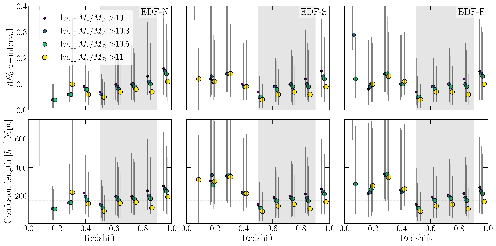
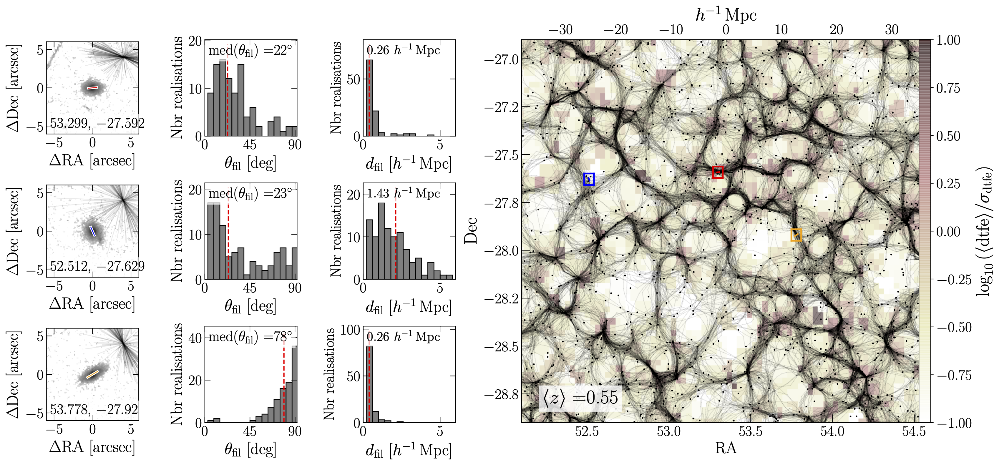

$\newcommand{\ensuremath}{}$
$\newcommand{\xspace}{}$
$\newcommand{\object}[1]{\texttt{#1}}$
$\newcommand{\farcs}{{.}''}$
$\newcommand{\farcm}{{.}'}$
$\newcommand{\arcsec}{''}$
$\newcommand{\arcmin}{'}$
$\newcommand{\ion}[2]{#1#2}$
$\newcommand{\textsc}[1]{\textrm{#1}}$
$\newcommand{\hl}[1]{\textrm{#1}}$
$\newcommand{\footnote}[1]{}$
$\newcommand{\VIS}{I_{\scriptscriptstyle\rm E} }$
$\newcommand{\VISdot}{I_{\scriptscriptstyle\rm E}}$
$\newcommand{\mstar}{\mbox{M_\star}\xspace}$
$\newcommand{\msunh}{\mbox{M_\odot/h}\xspace}$
$\newcommand{\msun}{\mbox{M_\odot}\xspace}$
$\newcommand{\halpha}{\mbox{H\alpha}\xspace}$
$\newcommand{\disperse}{\mbox{{\sc DisPerSE}}\xspace}$
$\newcommand{\deep}{\mbox{\mathcal{D}}\xspace}$
$\newcommand{\deepmass}{\mbox{\mathcal{D}_{M_\star}}\xspace}$
$\newcommand{\deepnoise}{\mbox{\mathcal{D}_{\rm noise}}\xspace}$
$\newcommand{\deepsamp}{\mbox{\mathcal{D}_{\rm 60\%}}\xspace}$
$\newcommand{\deepnoisesamp}{\mbox{\mathcal{D}_{\rm noise,60\%}}\xspace}$
$\newcommand{\deepwf}{\mbox{\mathcal{D}^{\rm w FoG}}\xspace}$
$\newcommand{\deepwof}{\mbox{\mathcal{D}^{\rm FoG,corr}}\xspace}$
$\newcommand{\deepnoisesampwf}{\mbox{\mathcal{D}^{\rm w FoG}_{\rm noise,60\%}}\xspace}$
$\newcommand{\deepnoisesampwof}{\mbox{\mathcal{D}^{\rm FoG,corr}_{\rm noise,60\%}}\xspace}$
$\newcommand{\deepmasssamp}{\mbox{\mathcal{D}_{M_\star,\rm 60\%}}\xspace}$
$\newcommand{\deepmassnoisesampwf}{\mbox{\mathcal{D}^{\rm w FoG}_{M_\star,\rm noise,60\%}}\xspace}$
$\newcommand{\deepmassnoisesampwof}{\mbox{\mathcal{D}^{\rm FoG,corr}_{M_\star,\rm noise,60\%}}\xspace}$
$\newcommand{\deepmasswf}{\mbox{\mathcal{D}^{\rm w FoG}_{M_\star}}\xspace}$
$\newcommand{\deepmasswof}{\mbox{\mathcal{D}^{\rm FoG,corr}_{M_\star}}\xspace}$
$\newcommand{\flag}{\mbox{Flagship}\xspace}$
$\newcommand{\gaea}{\mbox{GAEA}\xspace}$
$\newcommand{\laigle}[1]{{\color{pink}{ \textbf\small{#1}}}}$
$\newcommand{\Kat}[1]{{\color{applegreen}{{\bf #1}}}}$
$\newcommand{\Flo}[1]{{\color{magenta}{{[FD: \bf #1]}}}}$
$\newcommand{\orcid}[1]$

# Euclid Quick Data Release (Q1): Galaxy shapes and alignments in the cosmic web

<mark>Appeared on: 2025-03-20</mark> -  _Paper submitted as part of the A&A Special Issue `Euclid Quick Data Release (Q1)', 22 pages, 19 figures_

E. Collaboration, et al. -- incl., <mark>K. Jahnke</mark>

**Abstract:** Galaxy morphologies and shape orientations are expected to correlate with their large-scale environment, since they grow by accreting matter from the cosmic web and are subject to interactions with other galaxies. Cosmic filaments are extracted in projection from the Euclid Quick Data Release 1 (covering 63.1 $\mathrm{deg}^2$ ) at $0.5<z<0.9$ in tomographic slices of 170 comoving $h^{-1}\mathrm{Mpc}$ using photometric redshifts. Galaxy morphologies are accurately retrieved thanks to the excellent resolution of VIS data. The distribution of massive galaxies ( $M_* > 10^{10} M_\odot$ ) in the projected cosmic web is analysed as a function of morphology measured from VIS data. Specifically, the 2D alignment of galaxy shapes with large-scale filaments is quantified as a function of Sérsic indices and masses. We find the known trend that more massive galaxies are closer to filament spines. At fixed stellar masses, morphologies correlate both with densities and  distances to large-scale filaments. In addition, the large volume of this data set allows us to detect a signal indicating that there is a preferential alignment of the major axis of massive early-type galaxies along projected cosmic filaments. Overall, these results demonstrate our capabilities to carry out detailed studies of galaxy environments with $\Euclid$ , which will be extended to higher redshift and lower stellar masses with the future Euclid Deep Survey.

**Figure 2. -** Sérsic index versus mass distribution for galaxies in the selected-sample, colour-coded by the median angle between galaxy major axes and the closest filament $\theta_{\rm fil}$. All three fields are combined here and only galaxies with a median distance to filament smaller than 2$\Delta_{\rm skl}$ are kept. $\Delta_{\rm skl}$ is the mean uncertainty on filament position (see Sect. \ref{sec:tool}).
   (*fig:2dalign*)

**Figure 4. -** *Top panels*: smallest redshift interval containing $70$\% of the probability derived from the {\tt Phosphoros} PDF($z$) as a function of redshift and masses for galaxies in EDF-N (left), EDF-S (middle), and EDF-F (right), as described in Sect. \ref{sec:reldes}. In each redshift bin, the markers indicate the mean of the $70$\%$z$-interval, and the error bars indicate the 16th and 84th percentiles. A $5 \sigma$ clipping is applied before computing these statistics. Because we rely on the {\tt NNPZ} stellar masses to select galaxies, we also impose for consistency that the  {\tt NNPZ} median redshift fall in the $70$\%$z$-interval.  *Bottom panels*: the corresponding uncertainty in $h^{-1}{\rm Mpc}$, which characterises the typical confusion length of galaxies along the line of sight. The black dashed line indicates the thickness for tomographic slices that we consider in this study, calibrated to encompass photometric redshift errors of galaxies more massive than $10^{10.3}M_\odot$ at $0.5<z<0.9$. The grey shaded area indicates the redshift range considered in this study.
 (*fig:confusion_length*)

**Figure 5. -** Zoom into the slice from the EDF-F at $z=0.55$ with three selected galaxy cutouts from the MER mosaic (left subpanels), with their positions in the slice marked with coloured squares. In the top right corner of each cutout, we displayed the orientation of the closest segment in each of the realisations (the distance to the galaxy on the stamp is not representative of the real distance). The coordinates of the galaxies are indicated in the bottom of the cutout. The slice thickness is $170$ $h^{-1}{\rm Mpc}$. One hundred realisations from the \texttt{DisPerSE} skeleton extracted in 2D are overplotted, color-coded by $\log_{10}\left[\langle{\rm dtfe}\rangle/\sigma_{\rm dtfe}\right]$, which is the density estimation from the Delaunay tesselation (in one of the realisations) in the background (normalised by the standard deviation). Dots represent galaxies in one realisation of the slice, with their size scaling with galaxy masses.  The subpanels in the two middle columns display the distribution of galaxy projected angles and distances between the galaxy main axis and the closest filament in each of the 100 realisations. We made use of the ESA Datalabs resources  (Datalabscite)  to extract galaxy stamps shown here.
 (*fig:method*)

