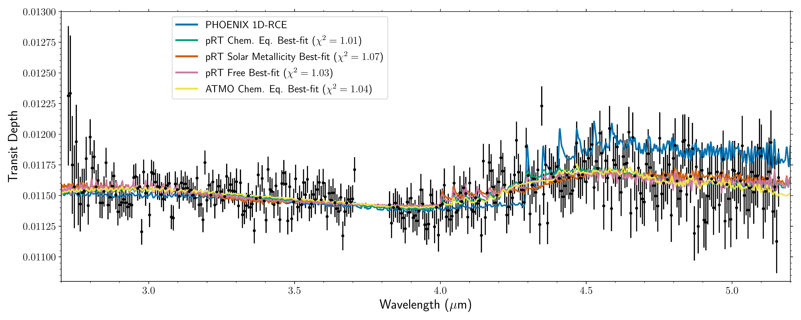
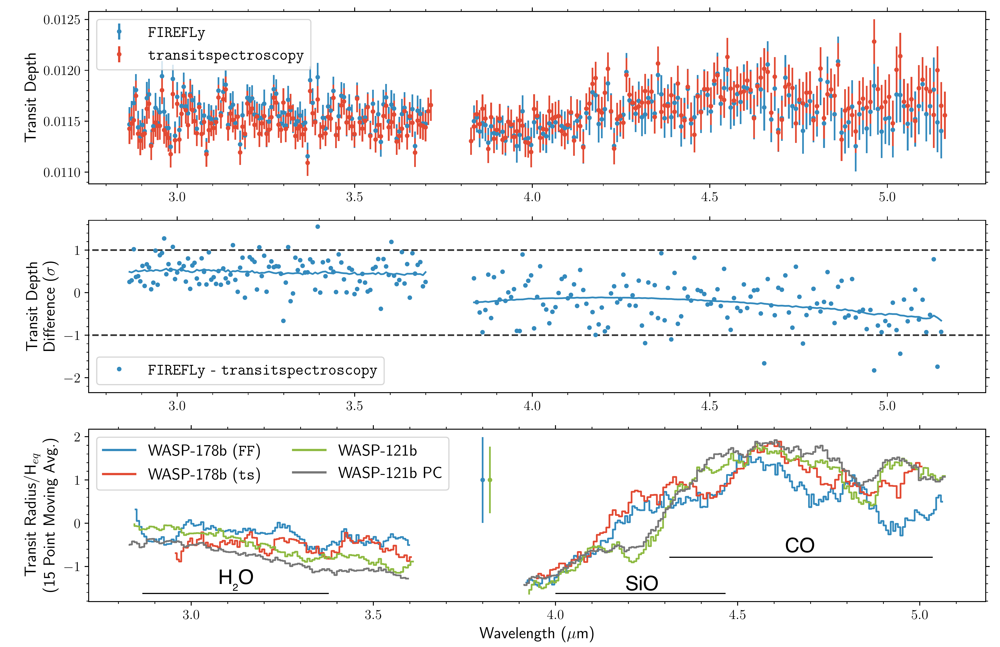

$\newcommand{\ensuremath}{}$
$\newcommand{\xspace}{}$
$\newcommand{\object}[1]{\texttt{#1}}$
$\newcommand{\farcs}{{.}''}$
$\newcommand{\farcm}{{.}'}$
$\newcommand{\arcsec}{''}$
$\newcommand{\arcmin}{'}$
$\newcommand{\ion}[2]{#1#2}$
$\newcommand{\textsc}[1]{\textrm{#1}}$
$\newcommand{\hl}[1]{\textrm{#1}}$
$\newcommand{\footnote}[1]{}$
$\newcommand{\url}[1]{\href{#1}{#1}}$
$\newcommand{\dodoi}[1]{doi:~\href{http://doi.org/#1}{\nolinkurl{#1}}}$
$\newcommand{\doeprint}[1]{\href{http://ascl.net/#1}{\nolinkurl{http://ascl.net/#1}}}$
$\newcommand{\doarXiv}[1]{\href{https://arxiv.org/abs/#1}{\nolinkurl{https://arxiv.org/abs/#1}}}$
$\newcommand{\vdag}{(v)^\dagger}$
$\newcommand$
$\newcommand$
$\newcommand$
$\newcommand\natexlab{#1}$

# Refractory and Volatile Species in the UV-to-IR Transmission Spectrum of Ultra-hot Jupiter WASP-178b with HST and JWST

<mark>Appeared on: 2025-03-20</mark> -  _34 pages, 16 figures, Accepted to AJ_

J. D. Lothringer, et al. -- incl., <mark>C. Gapp</mark>

**Abstract:** $\noindent$ The atmospheres of ultra-hot Jupiters are unique compared to other planets because of the presence of both refractory and volatile gaseous species, enabling a new lens to constrain a planet's composition, chemistry, and formation. WASP-178b is one such ultra-hot Jupiter that was recently found to exhibit enormous NUV absorption between 0.2 and 0.4 $\mu$ m from some combination of Fe+, Mg, and SiO. Here, we present new infrared observations of WASP-178b with HST/WFC3 and JWST/NIRSpec/G395H, providing novel measurements of the volatile species $H_2$ O and CO in WASP-178b's atmosphere. Atmospheric retrievals find a range of compositional interpretations depending on which dataset is retrieved, the type of chemistry assumed, and the temperature structure parametrization used due to the combined effects of thermal dissociation, the lack of volatile spectral features besides $H_2$ O and CO, and the relative weakness of $H_2$ O and CO themselves. Taken together with a new state-of-the-art characterization of the host star, our retrieval analyses suggests a solar to super-solar [ O/H ] and [ Si/H ] , but sub-solar [ C/H ] , perhaps suggesting rock-laden atmospheric enrichment near the $H_2$ O iceline. To obtain meaningful abundance constraints for this planet, it was essential to combine the JWST IR data with short-wavelength HST observations, highlighting the ongoing synergy between the two facilities.

**Figure 6. -** Top: Best-fit spectra from the \pRT\added{ (pRT)} and \texttt{ATMO} retrievals fitting only the JWST/NIRSpec/G395H spectrum. Bottom: Best-fit spectra from \pRT  fitting the entire 0.2-5.1 $\mu$m HST+JWST spectrum. Black points show the spectrum with the offsets fitted in the free chemistry retrieval, while grey points show the spectrum with the offsets corresponding to the chemical equilibrium retrieval. While the self-consistent \added{PHOENIX radiative-convective equilibrium }model shows the correct features, it underpredicts the NUV absorption and overpredicts magnitude of the IR features. The flexibility of the retrievals allows them to fit the data well (i.e., $\chi^2/N < 1.2$). (*fig:spec_fits*)

**Figure 5. -** Top: Transmission spectrum of WASP-178b from the \texttt{FIREFLy} and \texttt{transitspectroscopy} reductions. Middle: Transit depth difference between the \texttt{FIREFLy} and \texttt{transitspectroscopy} reductions, in units of the transit depth uncertainty. Solid lines show a second order polynomial fit to NRS1 and NRS2. Bottom: The \texttt{FIREFLy} reduction compared to two versions of the transit spectrum of ultra-hot Jupiter WASP-121b from \cite{gapp:2025}, after normalizing to each planet's equilibrium scale height and taking a 15-point moving average. The points with errorbars indicate the average measurement uncertainty. (*fig:spec_compare*)

**Figure 7. -** Abundance profiles for $H_2$O, CO, SiO, and $CO_2$(clock-wise from upper-left) from the various retrieval scenarios. The abundance profile for WASP-121b from the \texttt{ATMO} chemical equilibrium retrieval is shown for comparison. Also shown are the normalized contribution functions (black) from the \texttt{pRT} chemical equilibrium retrieval, showing approximately where in the atmosphere each molecule is being measured. For SiO, the solid black contribution function shows where the 4.1 $\mu$m feature probes, while the dashed line shows where the NUV feature probes. The profile for the \texttt{ATMO} chemical equilibrium retrieval of SiO (dashed yellow) represents the 1-$\sigma$ upper-limit. (*fig:vmrs*)

