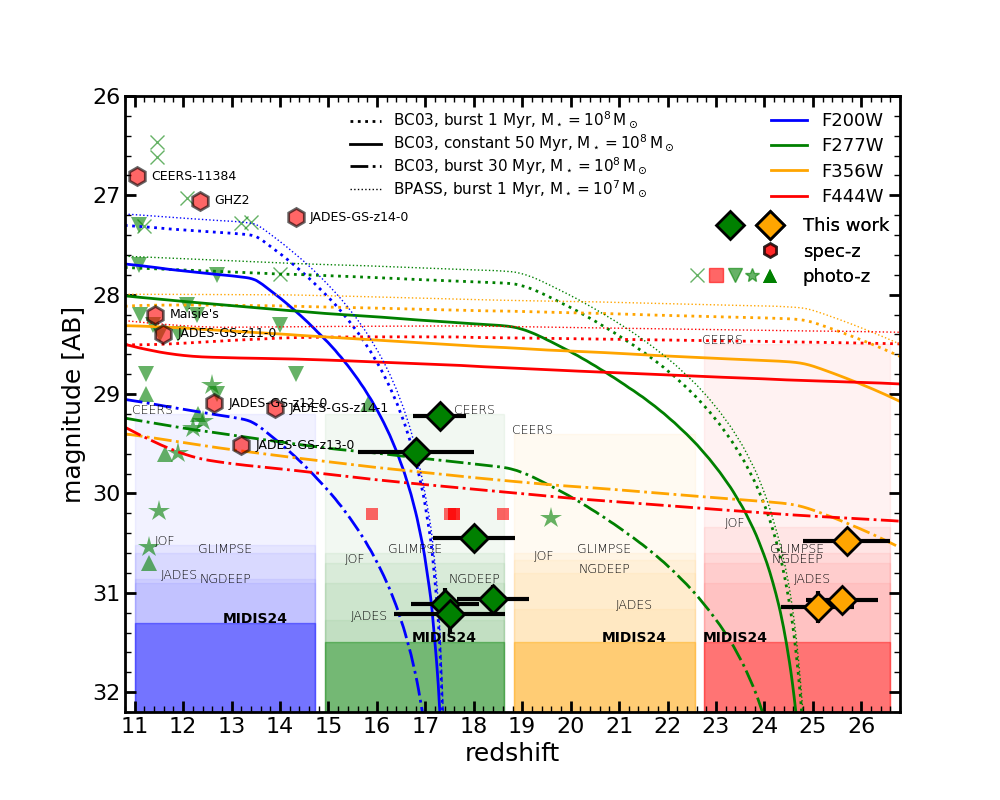
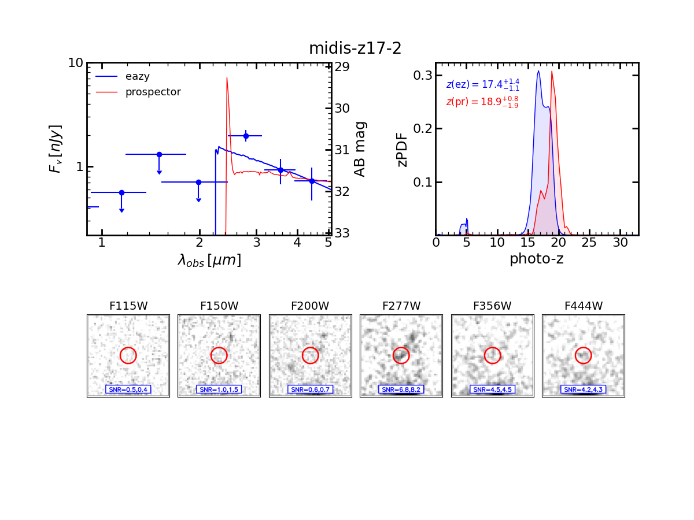

$\newcommand{\ensuremath}{}$
$\newcommand{\xspace}{}$
$\newcommand{\object}[1]{\texttt{#1}}$
$\newcommand{\farcs}{{.}''}$
$\newcommand{\farcm}{{.}'}$
$\newcommand{\arcsec}{''}$
$\newcommand{\arcmin}{'}$
$\newcommand{\ion}[2]{#1#2}$
$\newcommand{\textsc}[1]{\textrm{#1}}$
$\newcommand{\hl}[1]{\textrm{#1}}$
$\newcommand{\footnote}[1]{}$
$\newcommand{\vdag}{(v)^\dagger}$
$\newcommand$
$\newcommand$

# The rise of the galactic empire: luminosity functions  at $\boldmath{$z\sim17$}$ and $\boldmath{$z\sim25$}$ estimated with the MIDIS$+$NGDEEP ultra-deep JWST/NIRCam dataset

<mark>Appeared on: 2025-03-21</mark> -  _Submitted to ApJ. Comments welcome_

P. G. Pérez-González, et al. -- incl., <mark>F. Walter</mark>

**Abstract:** We present a sample of six F200W and three F277W dropout sources identified as $16<z<25$ galaxy candidates based on the deepest JWST/NIRCam data to date, provided by the MIRI Deep Imaging Survey (MIDIS) and the Next Generation Deep Extragalactic Exploratory Public survey  (NGDEEP), reaching 5 $\sigma$ depths of $\sim31.5$ mag (AB) at $\geq2$  $\mu$ m. We estimate ultraviolet (UV) luminosity functions and densities at $z\sim17$ and $z\sim25$ . We find that the number density of galaxies with absolute magnitudes $-19<M_\mathrm{UV}<-18$ (AB) at $z\sim17$ ( $z\sim25$ )is a factor of 4 (25) smaller than at $z\sim12$ ; a similar evolution is observed for the luminosity density. Compared to state-of-the-art galaxy simulations, we find the need for an enhanced UV-photon production at $z=17-25$ in $\mathrm{M}_\mathrm{DM}=10^{8.5-9.5}$ M $_\odot$ dark matter halos, maybe provided by an increase in the star formation efficiency at early times and/or by intense bursts fed by very low metallicity or primordial gas.There are few robust theoretical predictions for the evolution of galaxies above $z\sim 20$ in the literature, however, the continuing rapid drop in the halo mass function suggests more rapid evolution than we observe if photon production efficiencies remained constant.Our $z>16$ galaxy candidates present mass-weighted ages around 30 Myr, and attenuations $\mathrm{A(V)}<0.1$ mag.  Their average stellar mass is $\mathrm{M}_\bigstar\sim10^{7} \mathrm{M}_\odot$ , implying a star formation efficiency (stellar-to-baryon mass fraction) around 10 \% .  We find three galaxies with very blue UV spectral slopes ( $\beta\sim-3$ ) compatible with low metallicity or Pop III and young ( $\lesssim10$ Myr) stars and/or high escape fractions of ionizing photons, the rest presenting slopes $\beta\sim-2.5$ similar to $z=10-12$ samples.

**Figure 9. -** Stellar mass-to-light ratios as a function of halo mass for redshifts $z\sim9$ to $z\sim25$. The left y-axis give UV luminosity densities in solar units (assuming an AB absolute magnitude for the Sun $M^{UV}_\odot=17.30$,  ([ and Willmer 2018]()) ), the right y-axis in CGS units. The vertical axes could also be read in terms of dark matter mass-to-light ratios considering the baryon-to-dark matter density ratio ($\sim19$\%) and the star formation efficiency, defined as stellar mass divided by baryon mass, assumed to be 15\% in the plot. The curved lines provide results based on an abundance matching comparison between luminosity functions from this work and [Pérez-González, Costantin and Langeroodi (2023)]() and dark matter mass functions from [Yung, Somerville and Nguyen (2024)](). Thick segments show the calculations based on the range of absolute magnitudes actually probed by those works, while the thin lines show results based on extrapolated Schechter fits. We differentiate between the faint/light ends of the luminosity and mass functions, which might be well characterized by the current data with a faint-end slope (where we use a continuous line) and the bright/massive ends, whose behavior is more complex and unconstrained for most redshifts above $z=10$(where we used a dotted line). Oblique lines show the UV absolute magnitudes corresponding to the dark matter masses according to the abundance matching exercise, running from -17 to -20 every one magnitude (the extreme values are marked).  Horizontal lines show mass-to-light ratios for a compilation of relevant stellar populations models from [Zackrisson, et. al (2011)](), with metallicities spanning expected values from 1/5 Z$_\odot$ to Pop-III stars, and different IMFs including [ and Kroupa (2001)]() and top-heavy parametrizations. Lines in black and light gray show predictions for 30 and 1 Myr old instantaneous bursts. We note that the models with the most extreme top-heavy IMF do not extend to 30 Myr, those massive stars die earlier. This effect also affects the relative mass-to-light ratios between the Kroupa and top-heavy IMFs for 30 Myr (reversed compared to 1 Myr predictions). (*fig:m/l*)

**Figure 2. -** Compilation of spectroscopically confirmed galaxies (red hexagons,  ([Dickinson and Finkelstein 2023](), [Curtis-Lake, Carniani and Cameron 2023](), [Castellano, Napolitano and Fontana 2024](), [Carniani and Hainline 2024]()) ) and photometric samples (including  ([Leung, Bagley and Finkelstein 2023]())  -green pointing-up triangles-,  ([Finkelstein, Leung and Bagley 2024]())  -pointing-down triangle-,  ([Pérez-González, Costantin and Langeroodi 2023]())  -green stars-,  ([Kokorev, Atek and Chisholm 2024]())  -red squares-, and  ([Casey, Akins and Shuntov 2024]())  -green crosses-) of galaxies at $z>11$. The $16<z<25$ galaxy candidates presented in this work are plotted with green and orange diamonds, the color representing the band used in the plot, the one closer to and redward of the Lyman break. We also show their magnitude and photometric redshift uncertainties. Lines show the expected magnitudes as a function of redshift of a very young (1 Myr old) starburst with stellar mass $M_\star=10^8 M_\odot$ according to the [Bruzual and Charlot (2003)]() models (thick dotted line) and a less massive $M_\star=10^7 M_\odot$ starburst according to the [Eldridge, Stanway and Xiao (2017)]() BPASS models (thin dotted line). The expected magnitudes for a more extended star formation history (50 Myr constant star formation population) and a dormant galaxy (which experienced an instantaneous burst 30 Myr before the observation) are also shown (thick continuous and dashed-dotted lines, respectively). All models assume no dust. Shaded regions show the 5$\sigma$ depths of the major galaxy surveys used in the identification of $z>11$ galaxy candidates. The darkest regions refer to the dataset used in this paper (MIDIS24, which stands for the 2024 depth, including NGDEEP). The color for all data points, lines, and shaded regions indicates the NIRCam band considered.  (*fig:depths*)

**Figure 10. -** One of the galaxies selected in the $z\sim17$ sample. The figure shows the same information depicted for an example galaxy in the main text (Figure \ref{fig:sed_examples}). (*fig:z17_2*)

