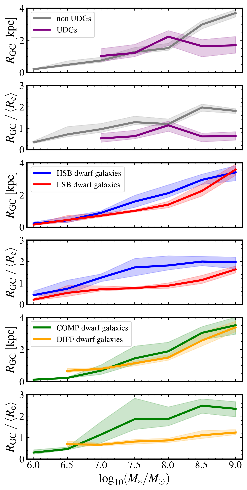
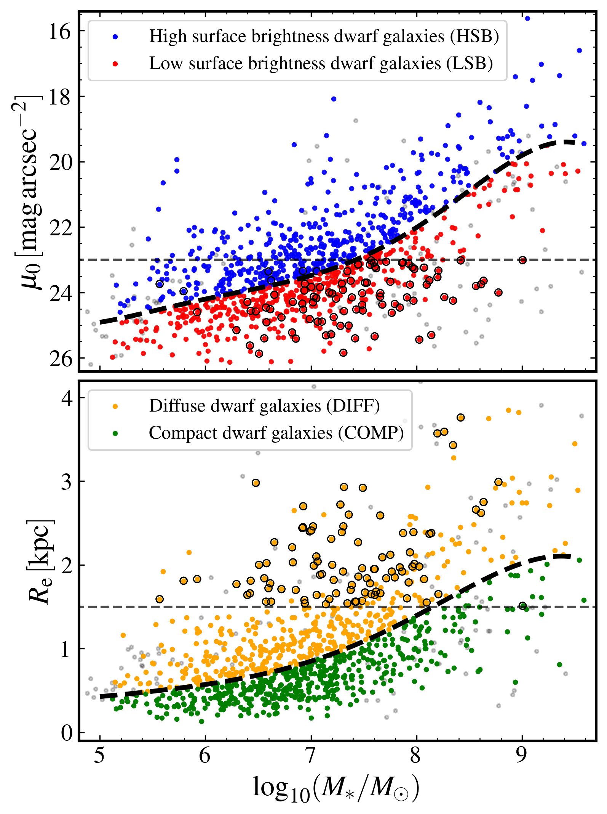

$\newcommand{\ensuremath}{}$
$\newcommand{\xspace}{}$
$\newcommand{\object}[1]{\texttt{#1}}$
$\newcommand{\farcs}{{.}''}$
$\newcommand{\farcm}{{.}'}$
$\newcommand{\arcsec}{''}$
$\newcommand{\arcmin}{'}$
$\newcommand{\ion}[2]{#1#2}$
$\newcommand{\textsc}[1]{\textrm{#1}}$
$\newcommand{\hl}[1]{\textrm{#1}}$
$\newcommand{\footnote}[1]{}$
$\newcommand{\orcid}[1]{\orcidlink{#1}}$

# $\Euclid$: Early Release Observations -- Interplay between dwarf galaxies and their globular clusters in the Perseus galaxy cluster$\thanks{This paper is published on       behalf of the Euclid Consortium}$

<mark>Appeared on: 2025-03-21</mark> -  _23 pages, 17 figures, Submitted to A&A_

T. Saifollahi, et al. -- incl., <mark>M. Schirmer</mark>, <mark>K. Jahnke</mark>

**Abstract:** We present an analysis of globular clusters (GCs) of dwarf galaxies in the Perseus galaxy cluster to explore the relationship between dwarf galaxy properties and their GCs, which offer important clues on the origin and subsequent evolution of dwarf galaxies. Our focus is on GC numbers ( $N_{\rm GC}$ ) and GC half-number radii ( $R_{\rm GC}$ ) around dwarf galaxies, and their relations with host galaxy stellar masses ( $M_{\ast}$ ), central surface brightnesses ( $\mu_0$ ), and effective radii ( $R_{\rm e}$ ). Interestingly, we find that at a given stellar mass, $R_{\rm GC}$ is almost independent of the host galaxy $\mu_0$ and $R_{\rm e}$ , while $R_{\rm GC}/R_{\rm e}$ depends on $\mu_0$ and $R_{\rm e}$ ; lower surface brightness and diffuse dwarf galaxies show $R_{\rm GC}/R_{\rm e}\approx 1$ while higher surface brightness and compact dwarf galaxies show $R_{\rm GC}/R_{\rm e} \approx $ $1.5$ -- $2$ . This means that for dwarf galaxies of similar stellar mass, the GCs have a similar median extent; however, their distribution is different from the field stars of their host. Additionally, low surface brightness and diffuse dwarf galaxies on average have a higher $N_{\rm GC}$ than high surface brightness and compact dwarf galaxies at any given stellar mass. We also find that UDGs (ultra-diffuse galaxies) and non-UDGs in the sample have similar $R_{\rm GC}$ , while UDGs have smaller $R_{\rm GC}/R_{\rm e}$ (typically less than 1) and 3--4 times higher $N_{\rm GC}$ than non-UDGs. Furthermore, examining nucleated versus not-nucleated dwarf galaxies, we find that for $M_{\ast} > 10^{8} \si{M_{\odot}}$ , nucleated dwarf galaxies seem to have smaller $R_{\rm GC}$ and $R_{\rm GC}/R_{\rm e}$ , with no significant differences seen between their $N_{\rm GC}$ , except at $M_{\ast} < 10^{8} \si{M_{\odot}}$ where the nucleated dwarf galaxies tend to have a higher $N_{\rm GC}$ . Lastly, we explore the stellar-to-halo mass ratio (SHMR) of dwarf galaxies (halo mass based on $N_{\rm GC}$ ) and conclude that the Perseus cluster dwarf galaxies follow the expected SHMR at $z=0$ extrapolated down to $M_{\ast} = 10^{6} \si{M_{\odot}}$ .

**Figure 3. -** GC half-number radius ($R_{\rm GC}$, top panel), and ratio between the GC half-number radius and the average of the host-galaxies effective radius ($R_{\rm GC} / \langle R_{\rm e} \rangle$, bottom panel), as functions of the stellar mass of the host galaxies ($M_{\ast}$) for all dwarf galaxies in the sample. The values are estimated from stacked GC radial profiles that we fit with a Sérsic function, with a Sérsic index fixed to $n=1$(see text). The shaded region around each line represent the 68\% percentiles of the estimated average value. The dashed lines show the trends one would expect from a simple extension of the equations in \citet{lim2024}, that were derived for GCs in massive galaxies, to our lower mass regime (an extrapolation beyond the range examined by these authors).  (*dwarfs-stacked-rgc-all*)

**Figure 4. -** Similar to Fig. \ref{dwarfs-stacked-rgc-all} for different dwarf galaxy categories. The two top panels represent the estimations for UDGs and non-UDGs (in purple and grey), the two middle panels for LSB and HSB dwarf galaxies (in red and blue), and the bottom two panels for DIFF and COMP dwarf galaxies (in orange and green). (*dwarfs-stacked-rgc*)

**Figure 2. -** Division of the dwarf galaxy sample into high surface brightness dwarf galaxies (HSB, blue points), low surface brightness dwarf galaxies (LSB, red points), compact dwarf galaxies (COMP, green points), and diffuse dwarf galaxies (DIFF, orange points) based on their central surface brightness ($\mu_0$) and effective radius ($R_{\rm e}$). A distance of 72 Mpc was assumed to convert angular to physical scale. This division is stellarmass dependent and is indicated with the black dashed curve. Coloured points represent the dwarf galaxies that have been used for the analysis in this paper. Those dwarf galaxies that also satisfy the UDG criteria in $\mu_{0, \IE}$ and $R_{\rm e}$(shown with dashed horizontal lines) are indicated with the black circles around the coloured circles. Grey points show those dwarf galaxies that have been removed from the sample after initial assessment (as was mentioned in Sect. \ref{sc:Data-dwarf-cat}). (*dwarfs-division*)

